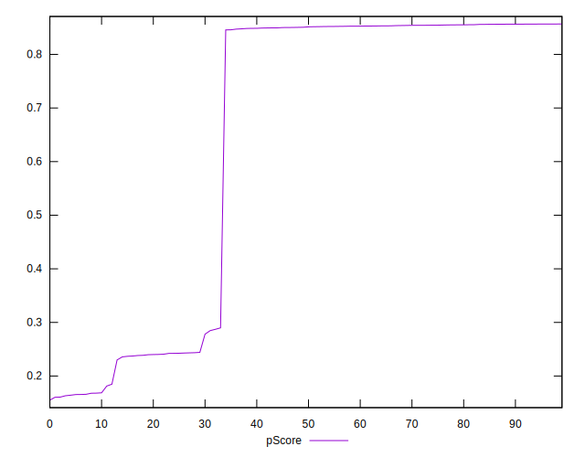
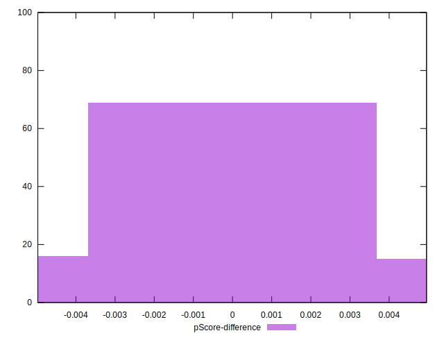

# //first-meaningful-paint/samples/astro-inner

[→ Parent](../..)


## Raw


```yaml
p90min: 2557.836
p90max: 6038.971999999999
p90range: 3481.135999999999
p90mean: 3550.9934898936167
median: 2584.25615
p90stdev: 1403.4181825599735
mad: 24.054999999999836
stdevBySn: 31.63210499000011
lfitCenter: 3338.018741109461
lfitStdev: 1408.0050450657013
mfitCenter: 3338.018741109461
mfitStdev: 1764.67263016808
mfitConfidence: 176.467263016808
p90skewness: 0.7811231874678959
p90eccentricity: 0.9999999999999999
p90discretization: 1
outlandishness: 1.0262187613527998

```


## Score


```yaml
p90min: 0.16
p90max: 0.86
p90range: 0.7
p90mean: 0.6452127659574471
median: 0.85
p90stdev: 0.29713428701158234
mad: 0.010000000000000009
stdevBySn: 0.011926000000000011
lfitCenter: 0.6893668604007507
lfitStdev: 0.3012508743751735
mfitCenter: 0.6893668604007507
mfitStdev: 0.37756198011297964
mfitConfidence: 0.03775619801129797
p90skewness: -0.7424200994545169
p90eccentricity: 0.9999999999999991
p90discretization: 10.444444444444445
outlandishness: 0.975010532031054

```


## Raw Estimate


## Score Estimate


## P Score


```yaml
p90min: 0.16316503750647027
p90max: 0.8566498546721508
p90range: 0.6934848171656806
p90mean: 0.6451994051927316
median: 0.8510395595978012
p90stdev: 0.2970664017512662
mad: 0.005146243634268743
stdevBySn: 0.006716842465693524
lfitCenter: 0.6897203261805199
lfitStdev: 0.3013162771253903
mfitCenter: 0.6897203261805199
mfitStdev: 0.37764395030452813
mfitConfidence: 0.03776439503045281
p90skewness: -0.7431342218511512
p90eccentricity: 1
p90discretization: 1
outlandishness: 0.9745867112175212

```


## Score Difference


```yaml
p90min: 0
p90max: 0
p90range: 0
p90mean: 0
median: 0
p90stdev: 0
mad: 0
stdevBySn: 0
lfitCenter: 0
lfitStdev: 0
mfitCenter: 0
mfitStdev: 0
mfitConfidence: 0
p90skewness: .nan
p90eccentricity: .nan
p90discretization: 94
outlandishness: .nan

```


## P Score Difference


```yaml
p90min: -0.004817038391064066
p90max: 0.004708634356094643
p90range: 0.009525672747158709
p90mean: -0.00015810042305417795
median: 0.00003290415133842817
p90stdev: 0.0029992216008610795
mad: 0.0031365425739458275
stdevBySn: 0.0037499032242538214
lfitCenter: -0.00015958733341308391
lfitStdev: 0.002793630489612519
mfitCenter: -0.00015958733341308391
mfitStdev: 0.0035012965905901463
mfitConfidence: 0.00035012965905901463
p90skewness: 0.021826644328079587
p90eccentricity: 0.9999999999999992
p90discretization: 1
outlandishness: 0.9203485712467231

```

