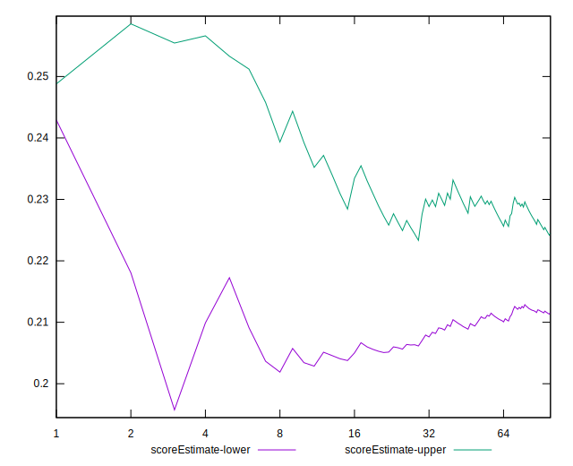

# //first-meaningful-paint/samples/astro

[→ Parent](../..)


## Raw


```yaml
p90min: 4579.576999999999
p90max: 5697.603999999999
p90range: 1118.027
p90mean: 5517.25913829787
median: 5649.667499999999
p90stdev: 242.35866342651158
mad: 27.42150000000356
stdevBySn: 40.43927710000055
lfitCenter: 5546.532094520444
lfitStdev: 207.7670707865876
mfitCenter: 5546.532094520444
mfitStdev: 260.39740734748347
mfitConfidence: 26.039740734748346
p90skewness: -1.813469211403957
p90eccentricity: 1.0000000000000004
p90discretization: 1
outlandishness: 0.9917216544794824

```


## Score


```yaml
p90min: 0.2
p90max: 0.37
p90range: 0.16999999999999998
p90mean: 0.22297872340425517
median: 0.21
p90stdev: 0.0348806410745926
mad: 0.009999999999999981
stdevBySn: 0.011925999999999978
lfitCenter: 0.21947733624866775
lfitStdev: 0.028646707187231012
mfitCenter: 0.21947733624866775
mfitStdev: 0.035903323141421625
mfitConfidence: 0.0035903323141421627
p90skewness: 2.087538808329037
p90eccentricity: 1.0000000000000022
p90discretization: 13.428571428571429
outlandishness: 1.0354810188253887

```


## Raw Estimate


## Score Estimate


## P Score


```yaml
p90min: 0.19964565216238
p90max: 0.3735710855850774
p90range: 0.1739254334226974
p90mean: 0.22377536991322708
median: 0.20532338444539106
p90stdev: 0.03502433761307001
mad: 0.003265391622965963
stdevBySn: 0.004821407101320522
lfitCenter: 0.2198056765059054
lfitStdev: 0.028879282580859655
mfitCenter: 0.2198056765059054
mfitStdev: 0.036194813170541434
mfitConfidence: 0.0036194813170541433
p90skewness: 2.182016459580794
p90eccentricity: 0.9999999999999999
p90discretization: 1
outlandishness: 1.0343906105739993

```


## Score Difference


```yaml
p90min: 0
p90max: 0
p90range: 0
p90mean: 0
median: 0
p90stdev: 0
mad: 0
stdevBySn: 0
lfitCenter: 0
lfitStdev: 0
mfitCenter: 0
mfitStdev: 0
mfitConfidence: 0
p90skewness: .nan
p90eccentricity: .nan
p90discretization: 94
outlandishness: .nan

```


## P Score Difference


```yaml
p90min: -0.004786214988335535
p90max: 0.00484238758013722
p90range: 0.009628602568472755
p90mean: 0.000736061200171437
median: 0.0018186527048379142
p90stdev: 0.003198433979121765
mad: 0.0022887261561793937
stdevBySn: 0.0032362656457227967
lfitCenter: 0.0009654080216344244
lfitStdev: 0.0029442546131081397
mfitCenter: 0.0009654080216344244
mfitStdev: 0.0036900759341779213
mfitConfidence: 0.00036900759341779215
p90skewness: -0.48029728741817546
p90eccentricity: 0.9999999999999996
p90discretization: 1
outlandishness: 0.8806201270246546

```

