# //interactive/samples/astro-cached

[→ Parent](../..)


## Raw


```yaml
p90min: 14257.501
p90max: 14411.808
p90range: 154.3070000000007
p90mean: 14331.085668617015
median: 14324.819749999999
p90stdev: 34.47163576933759
mad: 12.495249999999942
stdevBySn: 23.184740300001273
lfitCenter: 14331.779356360317
lfitStdev: 27.06029327486215
mfitCenter: 14331.779356360317
mfitStdev: 33.91504815541505
mfitConfidence: 3.391504815541505
p90skewness: 0.6303492488891753
p90eccentricity: 0.9999999999999999
p90discretization: 1
outlandishness: 1.0007975751604856

```

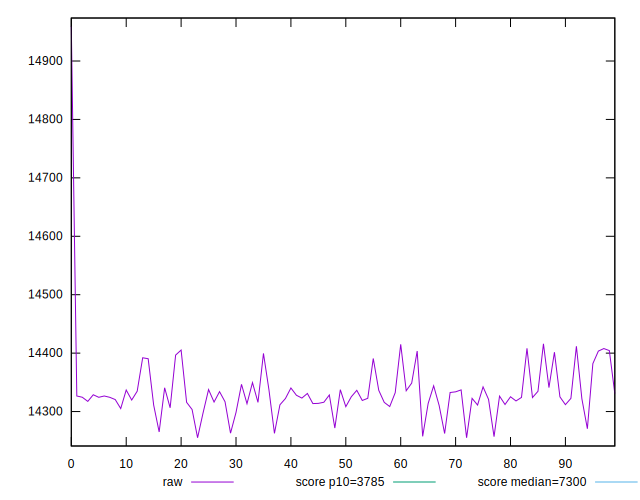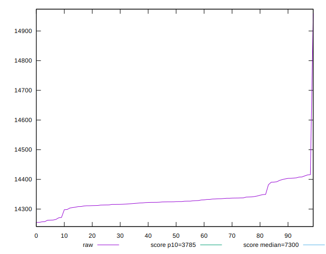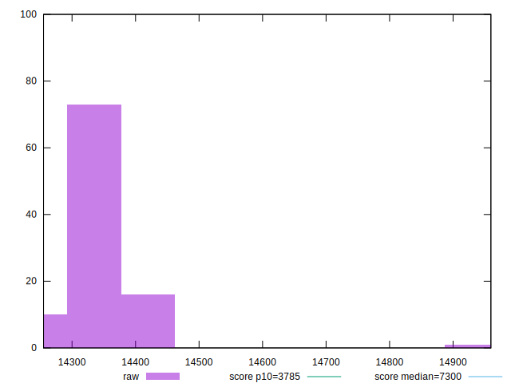
## Score


```yaml
p90min: 0.09
p90max: 0.1
p90range: 0.010000000000000009
p90mean: 0.09074468085106373
median: 0.09
p90stdev: 0.0026253112083517204
mad: 0
stdevBySn: 0
lfitCenter: 0.09047996949081331
lfitStdev: 0.0012564094396212483
mfitCenter: 0.09047996949081331
mfitStdev: 0.0015746757145184615
mfitConfidence: 0.00015746757145184616
p90skewness: 3.2417635938925407
p90eccentricity: 1
p90discretization: 47
outlandishness: 1.0034261417876909

```

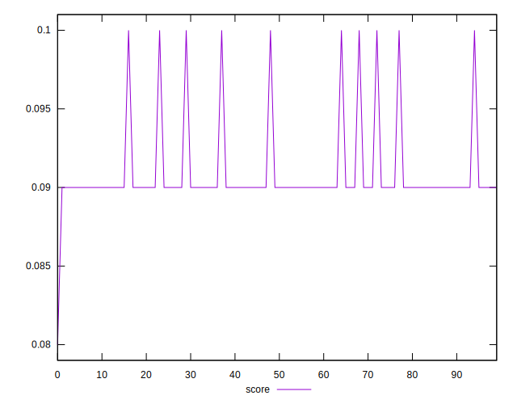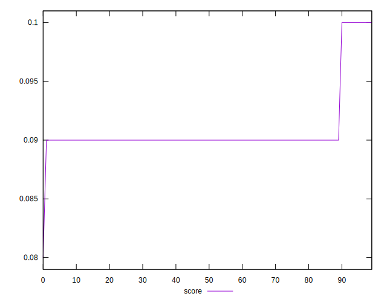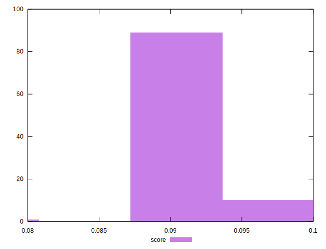
## Raw Estimate

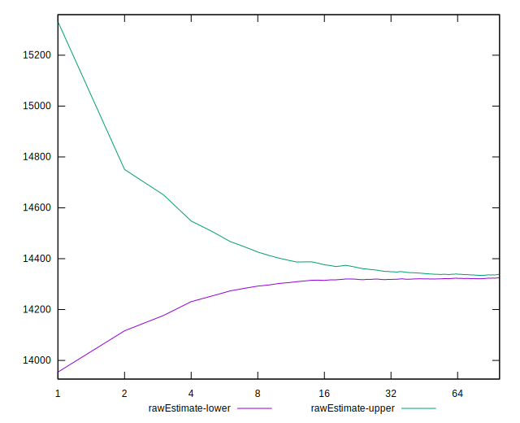
## Score Estimate

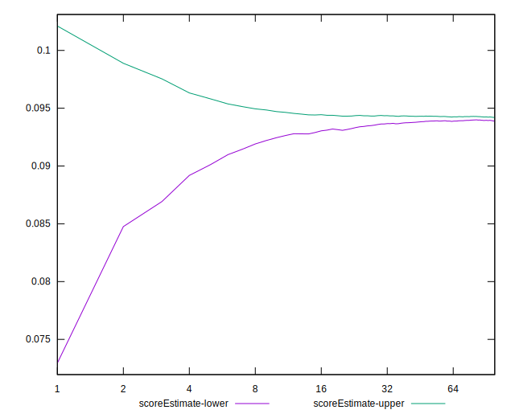
## P Score


```yaml
p90min: 0.09223776978713694
p90max: 0.09575979688809083
p90range: 0.003522027100953895
p90mean: 0.094066732760006
median: 0.09420660847833626
p90stdev: 0.0007853810720368421
mad: 0.00028543958731550023
stdevBySn: 0.0005305837158542656
lfitCenter: 0.09405484735392615
lfitStdev: 0.0006082711487694478
mfitCenter: 0.09405484735392615
mfitStdev: 0.0007623548308410026
mfitConfidence: 0.00007623548308410026
p90skewness: -0.6012496530354771
p90eccentricity: 0.9999999999999996
p90discretization: 1
outlandishness: 0.9974679761252013

```

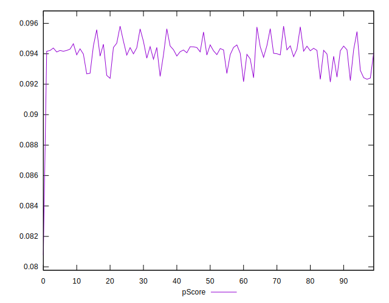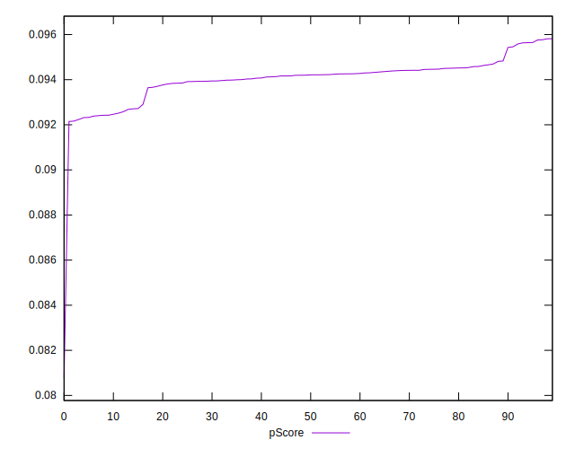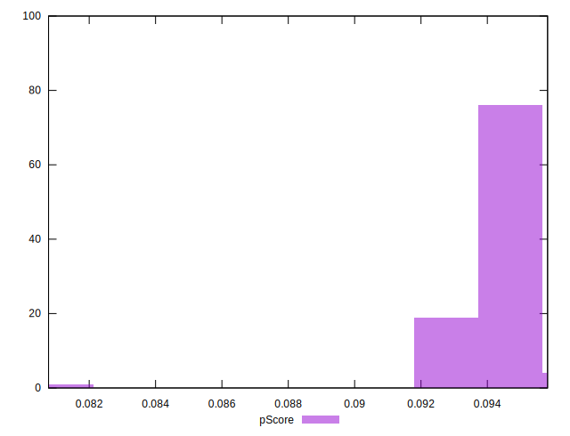
## Score Difference


```yaml
p90min: 0
p90max: 0
p90range: 0
p90mean: 0
median: 0
p90stdev: 0
mad: 0
stdevBySn: 0
lfitCenter: 0
lfitStdev: 0
mfitCenter: 0
mfitStdev: 0
mfitConfidence: 0
p90skewness: .nan
p90eccentricity: .nan
p90discretization: 94
outlandishness: .nan

```


## P Score Difference


```yaml
p90min: -0.004367869424368481
p90max: 0.004658479206339411
p90range: 0.009026348630707892
p90mean: 0.0032335479979350725
median: 0.0040700684271209875
p90stdev: 0.0022598639735700752
mad: 0.0003415442119418799
stdevBySn: 0.0005305837158542656
lfitCenter: 0.0034762991501519143
lfitStdev: 0.0013829745987572668
mfitCenter: 0.0034762991501519143
mfitStdev: 0.0017333016179148356
mfitConfidence: 0.00017333016179148355
p90skewness: -2.684806218772065
p90eccentricity: 0.9999999999999999
p90discretization: 1
outlandishness: 0.8882763363231361

```

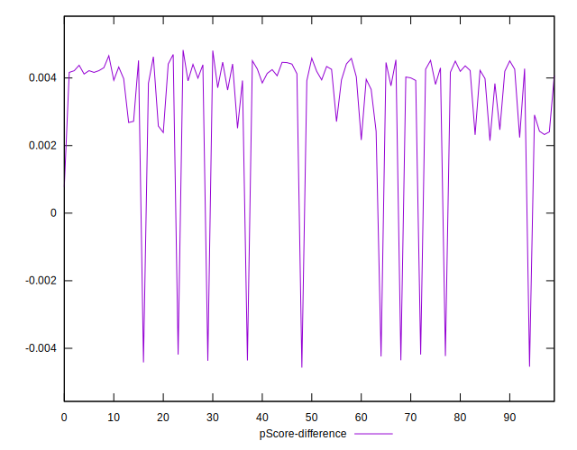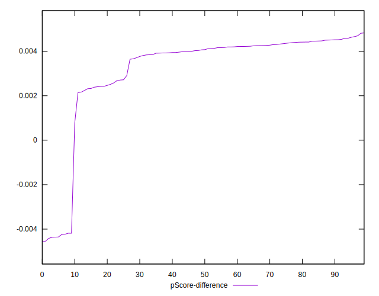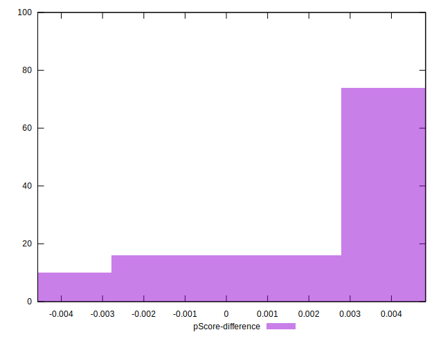