# //interactive/samples/astro-inner-cached

[→ Parent](../..)


## Raw


```yaml
p90min: 9181.511849999999
p90max: 9344.517500000002
p90range: 163.0056500000028
p90mean: 9258.138941079636
median: 9260.23575
p90stdev: 43.41966300260235
mad: 11.705500000000029
stdevBySn: 21.749148050002205
lfitCenter: 9269.61722688887
lfitStdev: 46.62693635940154
mfitCenter: 9269.61722688887
mfitStdev: 58.43819857775107
mfitConfidence: 5.843819857775108
p90skewness: 0.12110998197732802
p90eccentricity: 0.9999999999999996
p90discretization: 1
outlandishness: 1.005277371526242

```

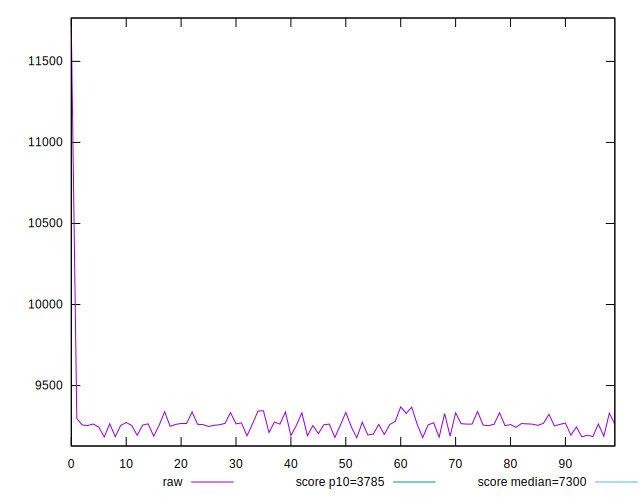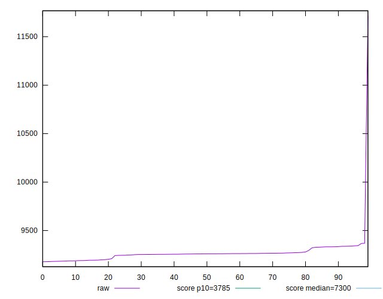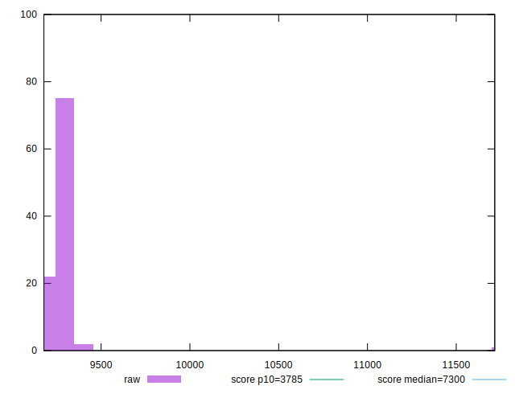
## Score


```yaml
p90min: 0.31
p90max: 0.33
p90range: 0.020000000000000018
p90mean: 0.32191489361702125
median: 0.32
p90stdev: 0.00419640062198214
mad: 0
stdevBySn: 0
lfitCenter: 0.32058813237161815
lfitStdev: 0.003271859582450564
mfitCenter: 0.32058813237161815
mfitStdev: 0.004100667874122748
mfitConfidence: 0.00041006678741227476
p90skewness: 1.1273051605775257
p90eccentricity: 0.9999999999999991
p90discretization: 31.333333333333332
outlandishness: 0.9912288356604511

```

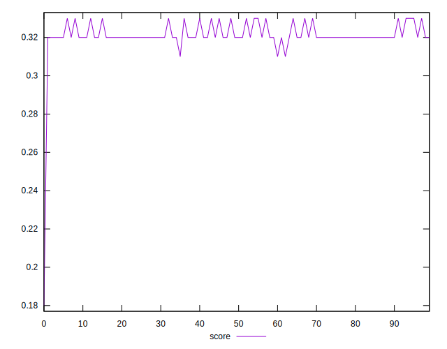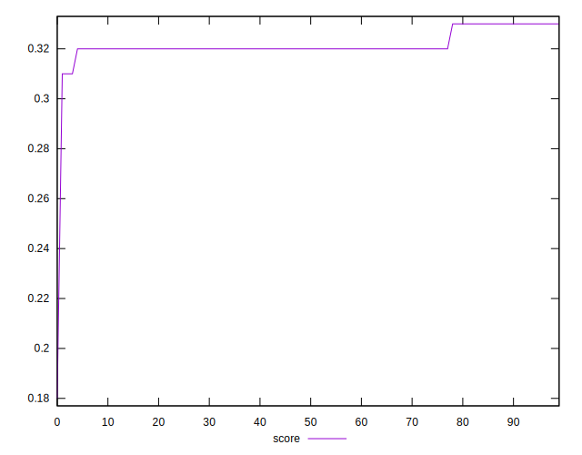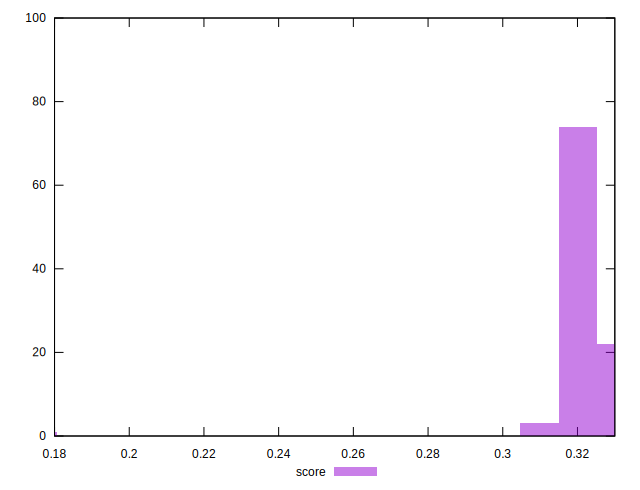
## Raw Estimate

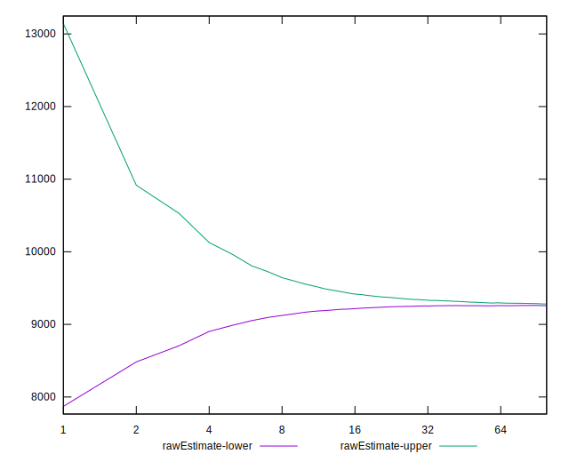
## Score Estimate

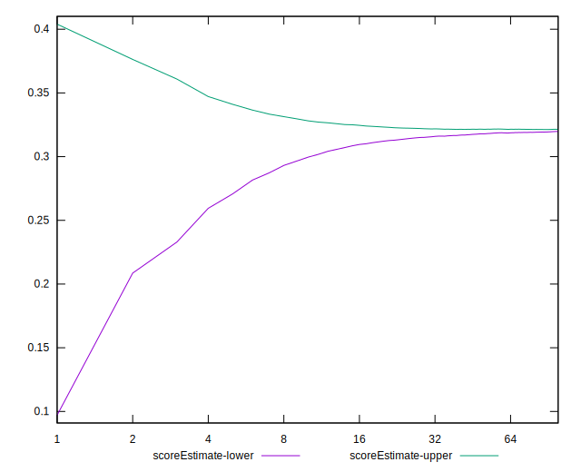
## P Score


```yaml
p90min: 0.31498757554456436
p90max: 0.32728371873162854
p90range: 0.012296143187064179
p90mean: 0.3214666921022079
median: 0.32129376104778073
p90stdev: 0.0032768671461198945
mad: 0.0008834514367216106
stdevBySn: 0.0016425470464515167
lfitCenter: 0.32079174745777866
lfitStdev: 0.0031047236927753095
mfitCenter: 0.32079174745777866
mfitStdev: 0.0038911941005291663
mfitConfidence: 0.00038911941005291664
p90skewness: -0.09786513916668074
p90eccentricity: 1.0000000000000002
p90discretization: 1
outlandishness: 0.9911962582644275

```

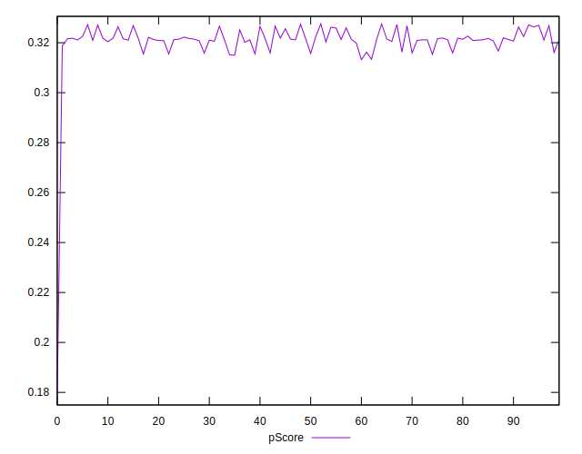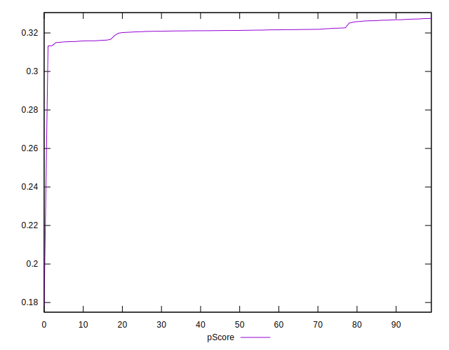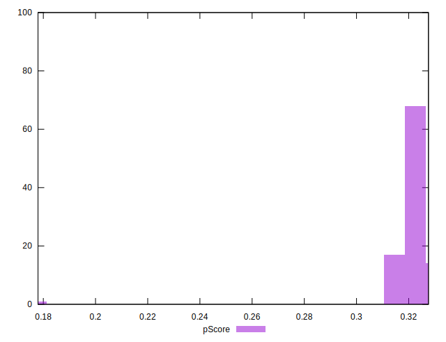
## Score Difference


```yaml
p90min: 0
p90max: 0
p90range: 0
p90mean: 0
median: 0
p90stdev: 0
mad: 0
stdevBySn: 0
lfitCenter: 0
lfitStdev: 0
mfitCenter: 0
mfitStdev: 0
mfitConfidence: 0
p90skewness: .nan
p90eccentricity: .nan
p90discretization: 94
outlandishness: .nan

```


## P Score Difference


```yaml
p90min: -0.0045534139124343564
p90max: 0.002660724010574045
p90range: 0.007214137923008401
p90mean: -0.0004494980072923957
median: 0.0009168058405979729
p90stdev: 0.0024075543859616395
mad: 0.0009564589283240221
stdevBySn: 0.0016103743594693782
lfitCenter: -0.00019534296257224656
lfitStdev: 0.00244242571226179
mfitCenter: -0.00019534296257224656
mfitStdev: 0.0030611266776008174
mfitConfidence: 0.00030611266776008175
p90skewness: -0.5189545145996765
p90eccentricity: 1.0000000000000004
p90discretization: 1
outlandishness: 1.008887271294996

```

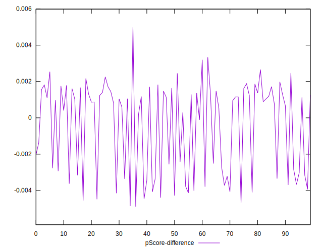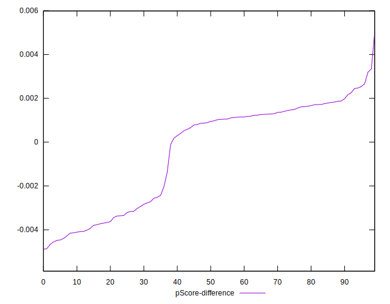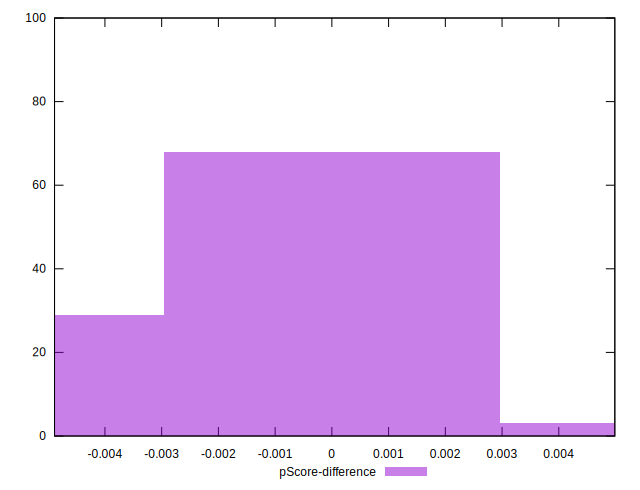