# //interactive/samples/astro-inner

[→ Parent](../..)


## Raw


```yaml
p90min: 9517.148000000003
p90max: 9775.505000000001
p90range: 258.35699999999815
p90mean: 9596.504720212772
median: 9588.8305
p90stdev: 44.14394716964121
mad: 25.649749999999585
stdevBySn: 41.802717050000645
lfitCenter: 9596.815879937167
lfitStdev: 38.09252069387366
mfitCenter: 9596.815879937167
mfitStdev: 47.74189475965503
mfitConfidence: 4.774189475965503
p90skewness: 1.2707842914696383
p90eccentricity: 1.0000000000000002
p90discretization: 1
outlandishness: 1.0014366826626786

```

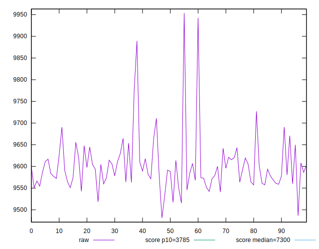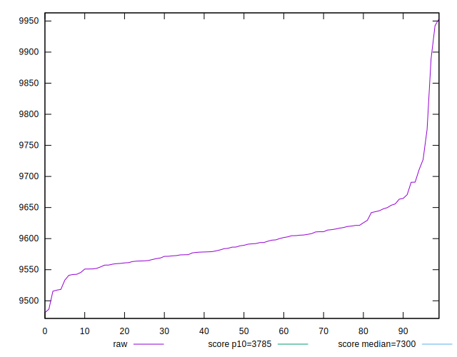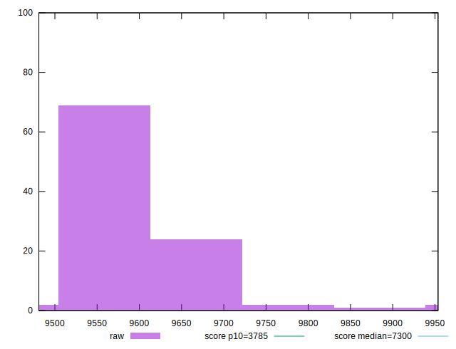
## Score


```yaml
p90min: 0.28
p90max: 0.3
p90range: 0.019999999999999962
p90mean: 0.298085106382979
median: 0.3
p90stdev: 0.004196400621982136
mad: 0
stdevBySn: 0
lfitCenter: 0.29853641446344914
lfitStdev: 0.0033369793839531274
mfitCenter: 0.29853641446344914
mfitStdev: 0.004182283442047215
mfitConfidence: 0.0004182283442047215
p90skewness: -1.9910641268337455
p90eccentricity: 0.9999999999999999
p90discretization: 31.333333333333332
outlandishness: 0.9960780856031761

```

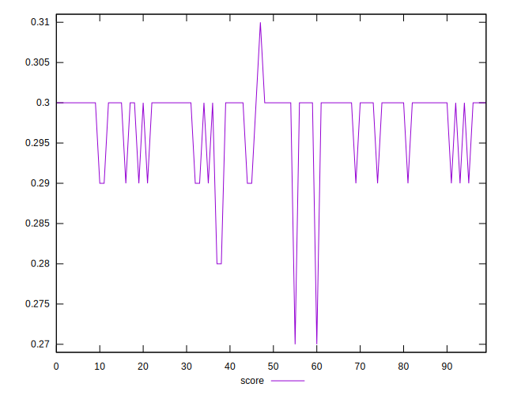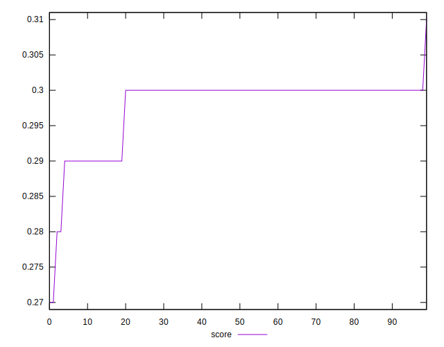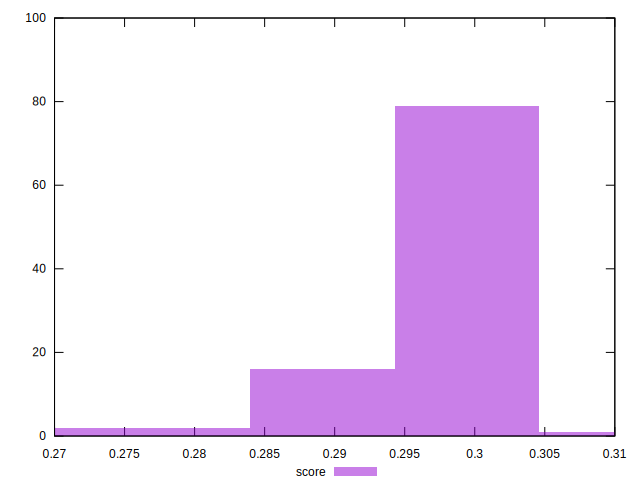
## Raw Estimate

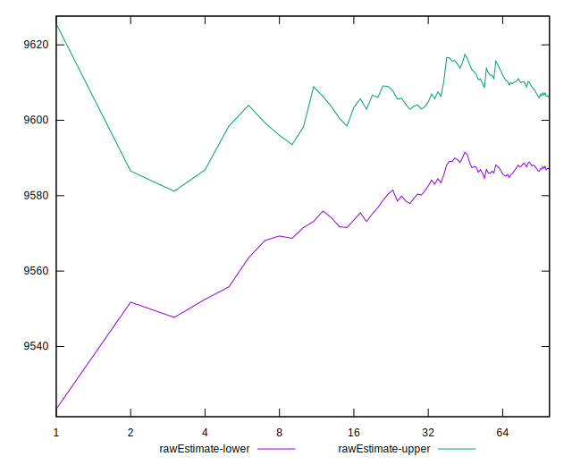
## Score Estimate

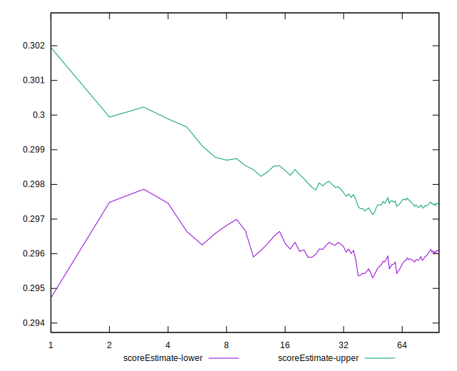
## P Score


```yaml
p90min: 0.28442773856648346
p90max: 0.3024112769797725
p90range: 0.017983538413289035
p90mean: 0.2967961815776982
median: 0.29732192388045064
p90stdev: 0.003087034781323213
mad: 0.001807333752180007
stdevBySn: 0.0029405263372887388
lfitCenter: 0.2967812097709313
lfitStdev: 0.0026578726376011866
mfitCenter: 0.2967812097709313
mfitStdev: 0.0033311493552415487
mfitConfidence: 0.00033311493552415486
p90skewness: -1.230972096418726
p90eccentricity: 0.9999999999999989
p90discretization: 1
outlandishness: 0.9969115912039799

```

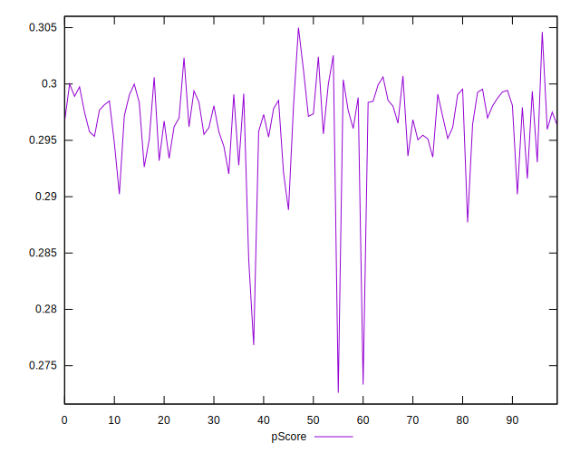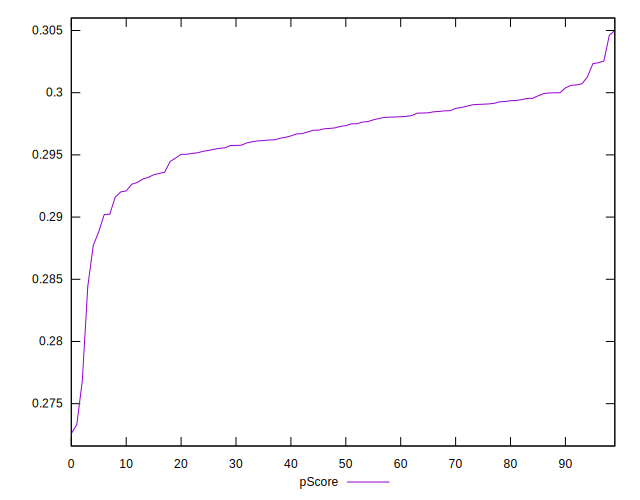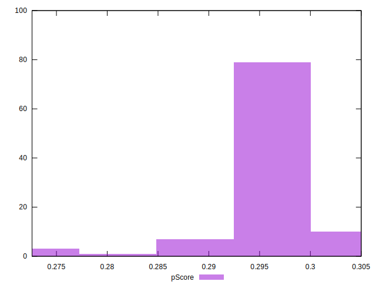
## Score Difference


```yaml
p90min: 0
p90max: 0
p90range: 0
p90mean: 0
median: 0
p90stdev: 0
mad: 0
stdevBySn: 0
lfitCenter: 0
lfitStdev: 0
mfitCenter: 0
mfitStdev: 0
mfitConfidence: 0
p90skewness: .nan
p90eccentricity: .nan
p90discretization: 94
outlandishness: .nan

```


## P Score Difference


```yaml
p90min: -0.0048773865578949915
p90max: 0.00442773856648343
p90range: 0.009305125124378422
p90mean: -0.0012253982064829364
median: -0.001522741535115446
p90stdev: 0.0023559280789400925
mad: 0.0016908343532529568
stdevBySn: 0.00267972014238016
lfitCenter: -0.0013057523273639485
lfitStdev: 0.0019095541189496285
mfitCenter: -0.0013057523273639485
mfitStdev: 0.002393271175656825
mfitConfidence: 0.00023932711756568248
p90skewness: 0.5201153690180154
p90eccentricity: 0.9999999999999996
p90discretization: 1
outlandishness: 0.8999566338114834

```

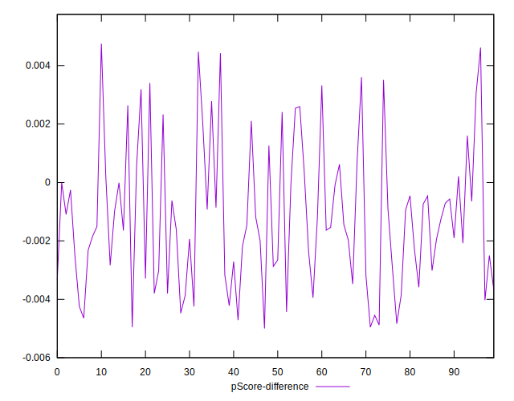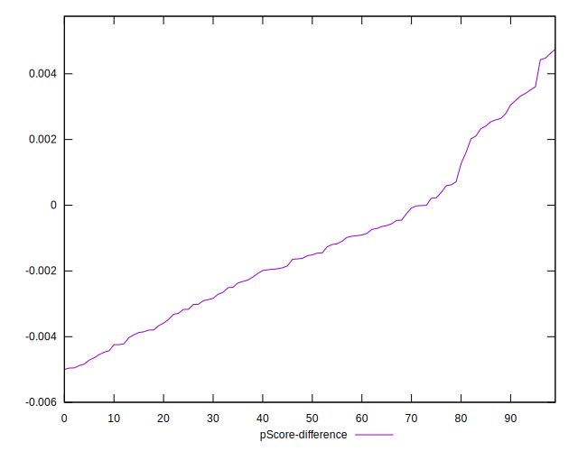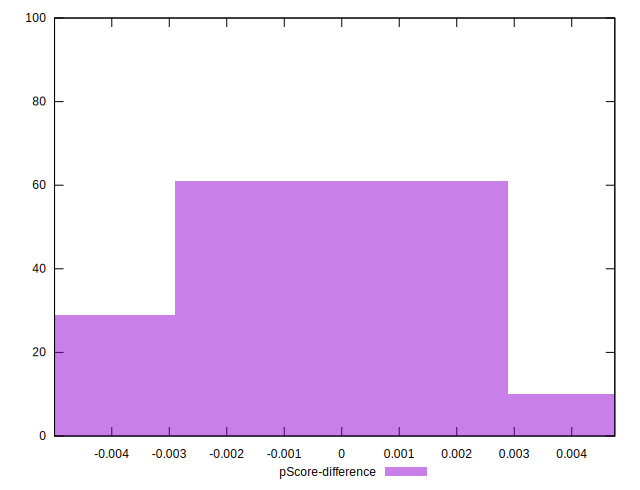