# //interactive/samples/astro

[→ Parent](../..)


## Raw


```yaml
p90min: 14730.706000000002
p90max: 15121.0955
p90range: 390.3894999999975
p90mean: 14907.171372340428
median: 14904.22275
p90stdev: 71.69647790994416
mad: 50.41949999999997
stdevBySn: 82.00004542500017
lfitCenter: 14909.973155185886
lfitStdev: 63.161660187160216
mfitCenter: 14909.973155185886
mfitStdev: 79.16140172854105
mfitConfidence: 7.916140172854105
p90skewness: 0.2628439129260244
p90eccentricity: 1
p90discretization: 1
outlandishness: 1.0009413614397344

```

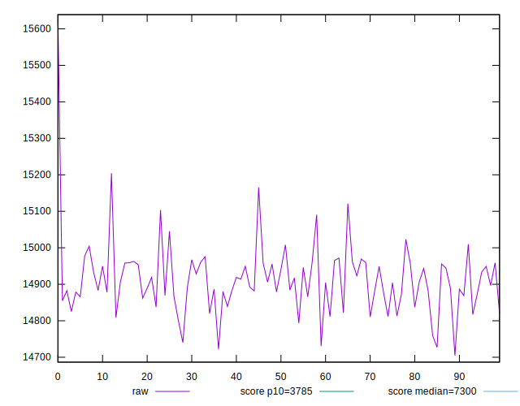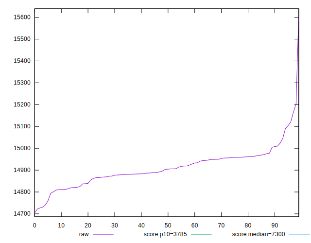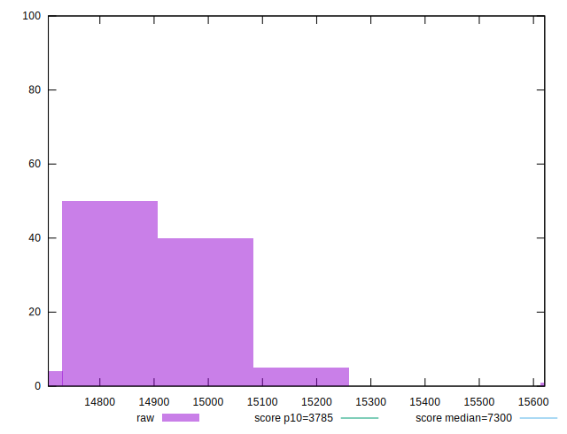
## Score


```yaml
p90min: 0.08
p90max: 0.09
p90range: 0.009999999999999995
p90mean: 0.08021276595744685
median: 0.08
p90stdev: 0.0014430489325798464
mad: 0
stdevBySn: 0
lfitCenter: 0.08019896259358587
lfitStdev: 0.0006031301148429306
mfitCenter: 0.08019896259358587
mfitStdev: 0.0007559115003339965
mfitConfidence: 0.00007559115003339965
p90skewness: 6.634888026970222
p90eccentricity: 0.9999999999999963
p90discretization: 47
outlandishness: 1.0046738835846307

```

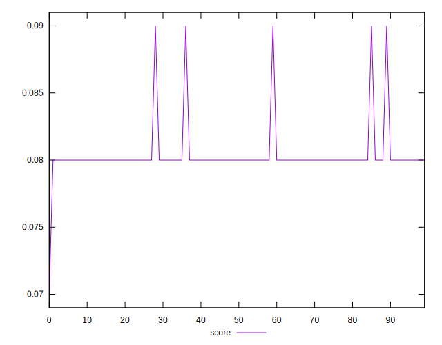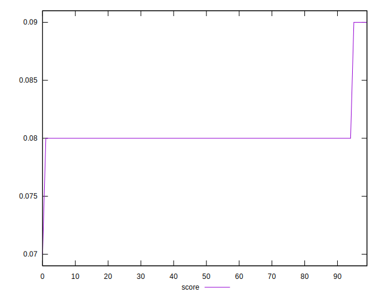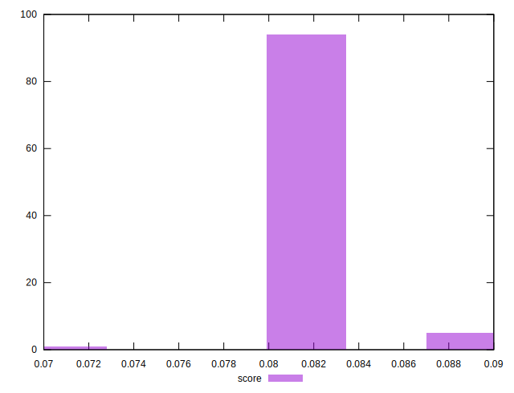
## Raw Estimate

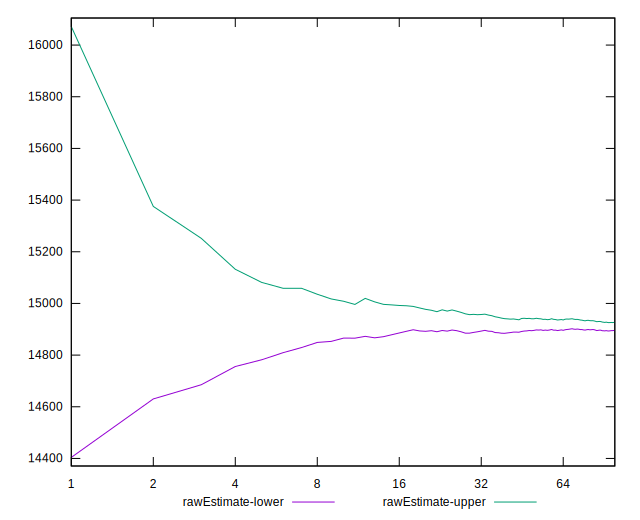
## Score Estimate

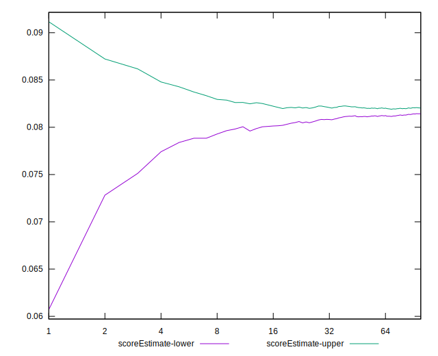
## P Score


```yaml
p90min: 0.07768195290037377
p90max: 0.08537420268513801
p90range: 0.007692249784764238
p90mean: 0.08181690326955518
median: 0.08186260742238574
p90stdev: 0.0014158543602804693
mad: 0.000997425535672003
stdevBySn: 0.0016103327235924244
lfitCenter: 0.08176506447119976
lfitStdev: 0.0012391686038757362
mfitCenter: 0.08176506447119976
mfitStdev: 0.0015530675313177337
mfitConfidence: 0.00015530675313177338
p90skewness: -0.19357621874656034
p90eccentricity: 1
p90discretization: 1
outlandishness: 0.997037505538535

```

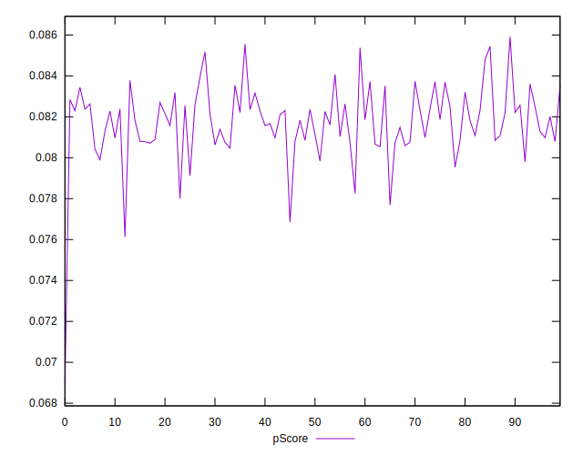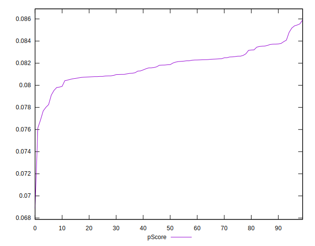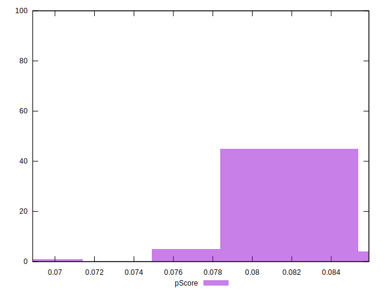
## Score Difference


```yaml
p90min: 0
p90max: 0
p90range: 0
p90mean: 0
median: 0
p90stdev: 0
mad: 0
stdevBySn: 0
lfitCenter: 0
lfitStdev: 0
mfitCenter: 0
mfitStdev: 0
mfitConfidence: 0
p90skewness: .nan
p90eccentricity: .nan
p90discretization: 94
outlandishness: .nan

```


## P Score Difference


```yaml
p90min: -0.004445406758195186
p90max: 0.003779601041501726
p90range: 0.008225007799696912
p90mean: 0.001391011262387796
median: 0.0016381968942150854
p90stdev: 0.0016908209663600478
mad: 0.0008621185705428858
stdevBySn: 0.0016103327235924244
lfitCenter: 0.001448872376411794
lfitStdev: 0.0012916101416986555
mfitCenter: 0.001448872376411794
mfitStdev: 0.0016187932521199001
mfitConfidence: 0.00016187932521199001
p90skewness: -1.3520332184025934
p90eccentricity: 1
p90discretization: 1
outlandishness: 0.8675520658263923

```

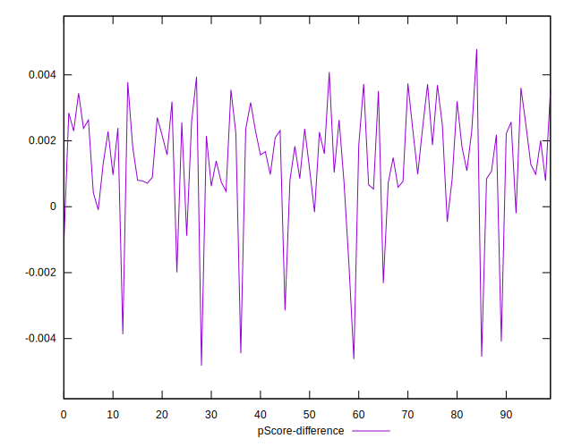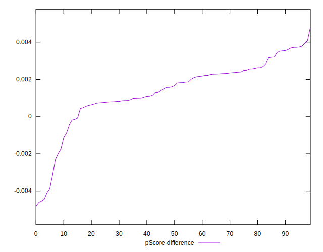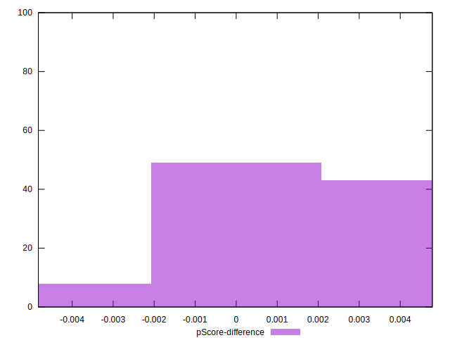