# //largest-contentful-paint/samples/astro-cached

[→ Parent](../..)


## Raw


```yaml
p90min: 14943.402750000003
p90max: 15309.044999999998
p90range: 365.64224999999533
p90mean: 15193.127200531912
median: 15217.962000000001
p90stdev: 81.55538582854699
mad: 69.75500000000011
stdevBySn: 88.41191024999563
lfitCenter: 15172.760497755793
lfitStdev: 105.9854128329839
mfitCenter: 15172.760497755793
mfitStdev: 132.8330163864606
mfitConfidence: 13.28330163864606
p90skewness: -0.48272080439953136
p90eccentricity: 0.9999999999999997
p90discretization: 1
outlandishness: 0.9934041103998396

```

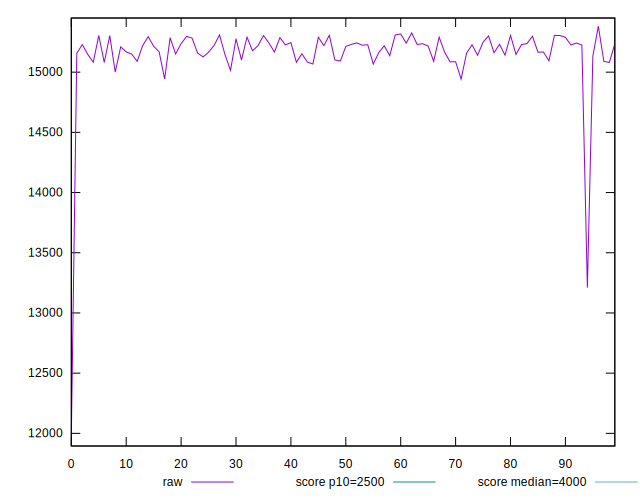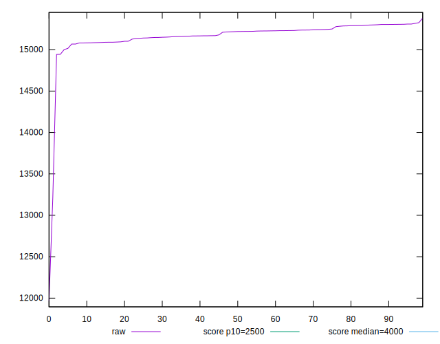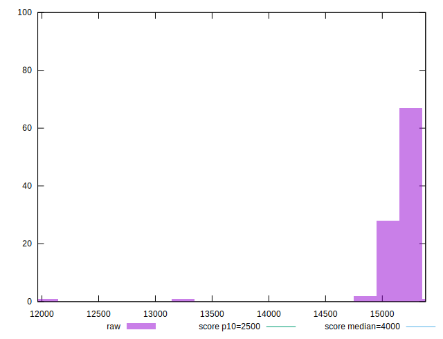
## Score


```yaml
p90min: 0
p90max: 0
p90range: 0
p90mean: 0
median: 0
p90stdev: 0
mad: 0
stdevBySn: 0
lfitCenter: 0
lfitStdev: 0
mfitCenter: 0
mfitStdev: 0
mfitConfidence: 0
p90skewness: .nan
p90eccentricity: .nan
p90discretization: 94
outlandishness: .nan

```


## Raw Estimate

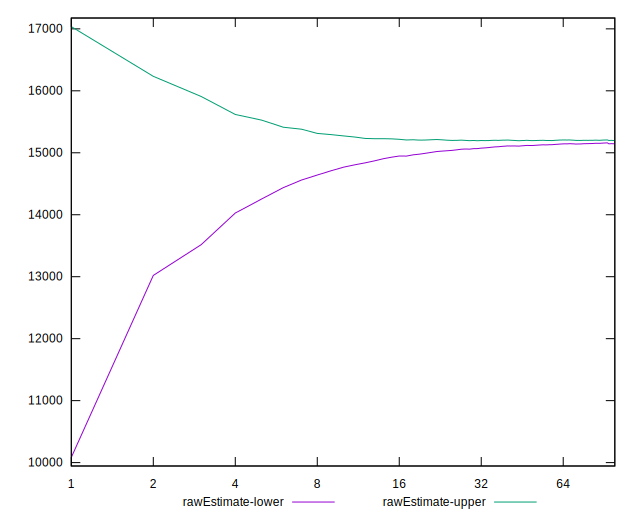
## Score Estimate

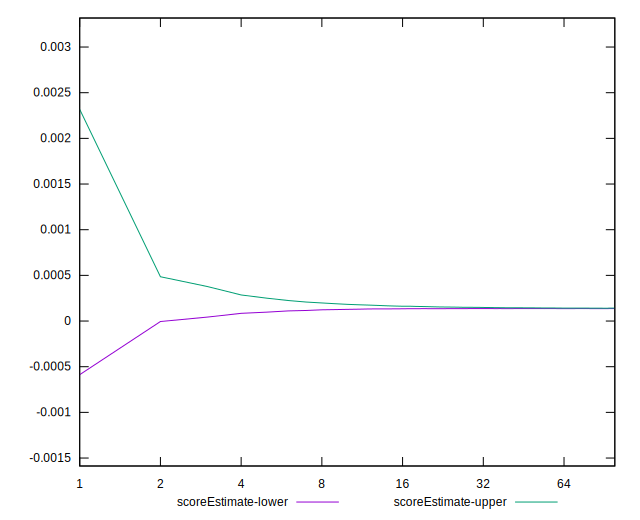
## P Score


```yaml
p90min: 0.00012632879757229487
p90max: 0.00016304304646458379
p90range: 0.000036714248892288914
p90mean: 0.00013717098037522338
median: 0.00013459209379940162
p90stdev: 0.000007908986132564956
mad: 0.0000065441225493845234
stdevBySn: 0.000008462542704192905
lfitCenter: 0.00014466178360894957
lfitStdev: 0.000021248835967414843
mfitCenter: 0.00014466178360894957
mfitStdev: 0.00002663146654625682
mfitConfidence: 0.000002663146654625682
p90skewness: 0.6168464625308577
p90eccentricity: 0.9999999999999999
p90discretization: 1
outlandishness: 1.260026447927152

```

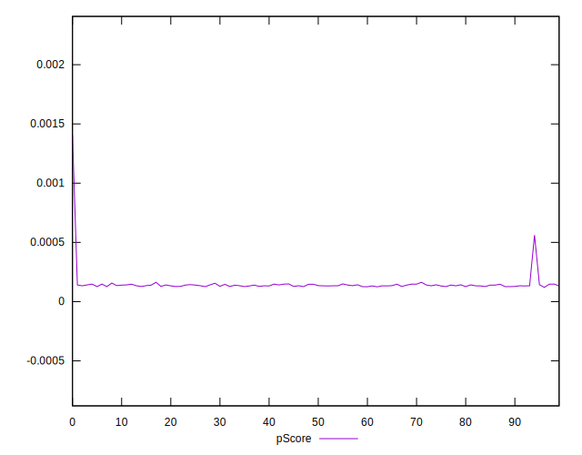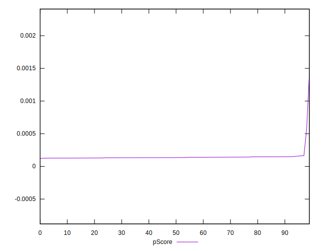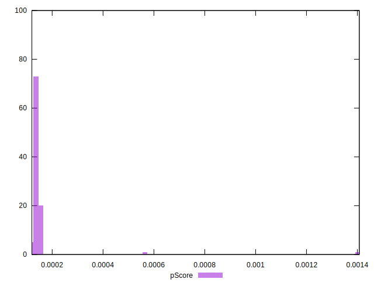
## Score Difference


```yaml
p90min: 0
p90max: 0
p90range: 0
p90mean: 0
median: 0
p90stdev: 0
mad: 0
stdevBySn: 0
lfitCenter: 0
lfitStdev: 0
mfitCenter: 0
mfitStdev: 0
mfitConfidence: 0
p90skewness: .nan
p90eccentricity: .nan
p90discretization: 94
outlandishness: .nan

```


## P Score Difference


```yaml
p90min: 0.00012632879757229487
p90max: 0.00016304304646458379
p90range: 0.000036714248892288914
p90mean: 0.00013717098037522338
median: 0.00013459209379940162
p90stdev: 0.000007908986132564956
mad: 0.0000065441225493845234
stdevBySn: 0.000008462542704192905
lfitCenter: 0.00014466178360894957
lfitStdev: 0.000021248835967414843
mfitCenter: 0.00014466178360894957
mfitStdev: 0.00002663146654625682
mfitConfidence: 0.000002663146654625682
p90skewness: 0.6168464625308577
p90eccentricity: 0.9999999999999999
p90discretization: 1
outlandishness: 1.260026447927152

```

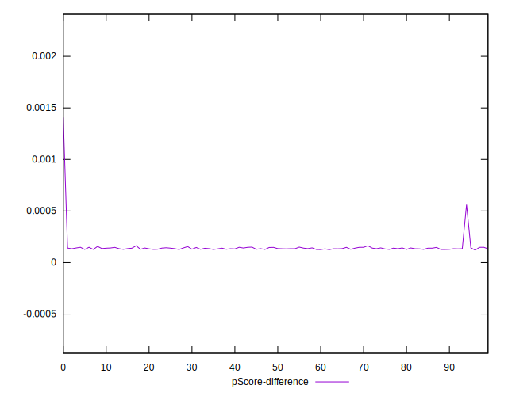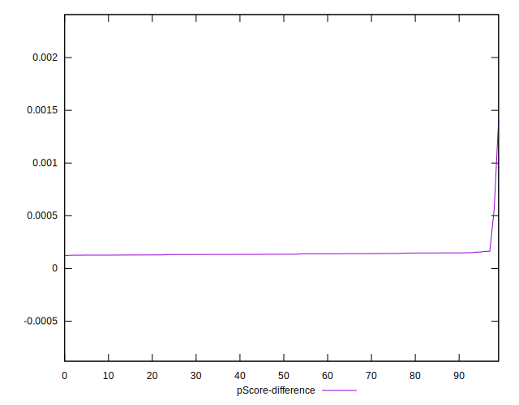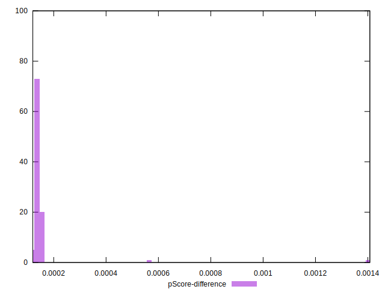