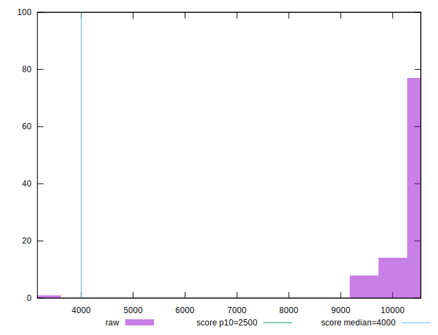

# //largest-contentful-paint/samples/astro-inner-cached

[→ Parent](../..)


## Raw


```yaml
p90min: 9384.974999999999
p90max: 10505.624500000002
p90range: 1120.6495000000032
p90mean: 10305.776217143468
median: 10359.9705
p90stdev: 225.93260665096744
mad: 64.39674999999716
stdevBySn: 94.24634796999861
lfitCenter: 10291.450868043728
lfitStdev: 189.7597817812242
mfitCenter: 10291.450868043728
mfitStdev: 237.82861743962587
mfitConfidence: 23.782861743962588
p90skewness: -2.839936058013604
p90eccentricity: 1.0000000000000004
p90discretization: 1
outlandishness: 0.9836371269949816

```


## Score


```yaml
p90min: 0
p90max: 0.01
p90range: 0.01
p90mean: 0.00223404255319149
median: 0
p90stdev: 0.004165270627755723
mad: 0
stdevBySn: 0
lfitCenter: 0.004958642071556288
lfitStdev: 0.010488594049491037
mfitCenter: 0.004958642071556288
mfitStdev: 0.013145503216017911
mfitConfidence: 0.001314550321601791
p90skewness: 1.3281045550208699
p90eccentricity: 1.0000000000000013
p90discretization: 47
outlandishness: 18.852136961451247

```


## Raw Estimate


## Score Estimate


## P Score


```yaml
p90min: 0.004232613765393134
p90max: 0.010026359661159334
p90range: 0.0057937458957662
p90mean: 0.005022312047193603
median: 0.004731467058590899
p90stdev: 0.00113088188398189
mad: 0.00023005117181060242
stdevBySn: 0.0003405114645088026
lfitCenter: 0.008356163721754536
lfitStdev: 0.008672395170888941
mfitCenter: 0.008356163721754536
mfitStdev: 0.01086923548299887
mfitConfidence: 0.0010869235482998869
p90skewness: 3.241718584971553
p90eccentricity: 0.9999999999999999
p90discretization: 1
outlandishness: 6.1672165016676

```


## Score Difference


```yaml
p90min: 0
p90max: 0
p90range: 0
p90mean: 0
median: 0
p90stdev: 0
mad: 0
stdevBySn: 0
lfitCenter: 0
lfitStdev: 0
mfitCenter: 0
mfitStdev: 0
mfitConfidence: 0
p90skewness: .nan
p90eccentricity: .nan
p90discretization: 94
outlandishness: .nan

```


## P Score Difference


```yaml
p90min: -0.004921260386151585
p90max: 0.004948004849830212
p90range: 0.009869265235981797
p90mean: 0.002949315675683964
median: 0.004506162788122908
p90stdev: 0.0032496819796332906
mad: 0.00026166375454106383
stdevBySn: 0.00035652728596933755
lfitCenter: 0.0034428160008048735
lfitStdev: 0.0023757545681181947
mfitCenter: 0.0034428160008048735
mfitStdev: 0.0029775667900105683
mfitConfidence: 0.0002977566790010568
p90skewness: -1.639855211475427
p90eccentricity: 1
p90discretization: 1
outlandishness: 0.8835957191823469

```

