# //largest-contentful-paint/samples/astro-inner

[→ Parent](../..)


## Raw


```yaml
p90min: 9303.5195
p90max: 10237.20815
p90range: 933.68865
p90mean: 9854.65794893617
median: 9863.06925
p90stdev: 236.12692933084483
mad: 168.99424999999974
stdevBySn: 266.78536537500105
lfitCenter: 9850.319391406034
lfitStdev: 206.32718925675766
mfitCenter: 9850.319391406034
mfitStdev: 258.5927834682722
mfitConfidence: 25.85927834682722
p90skewness: -0.2664320839520545
p90eccentricity: 0.9999999999999992
p90discretization: 1
outlandishness: 0.9978738162458701

```

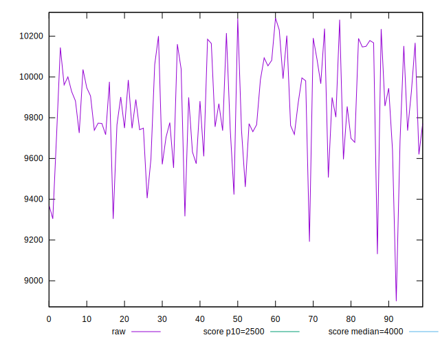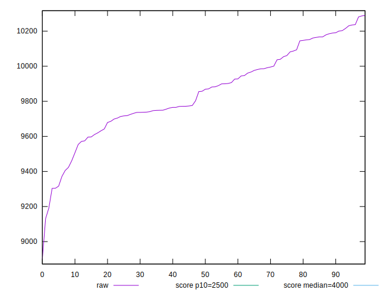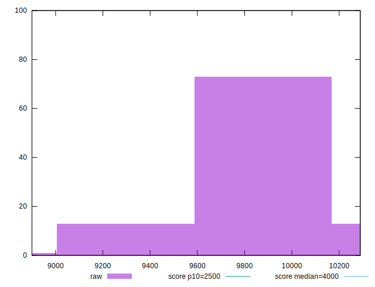
## Score


```yaml
p90min: 0.01
p90max: 0.01
p90range: 0
p90mean: 0.010000000000000007
median: 0.01
p90stdev: 6.938893903907228e-18
mad: 0
stdevBySn: 0
lfitCenter: 0.009953463986474514
lfitStdev: 0.00011610565185019128
mfitCenter: 0.009953463986474514
mfitStdev: 0.00014551685503250155
mfitConfidence: 0.000014551685503250155
p90skewness: -1
p90eccentricity: 1
p90discretization: 94
outlandishness: 0.9800999999999997

```

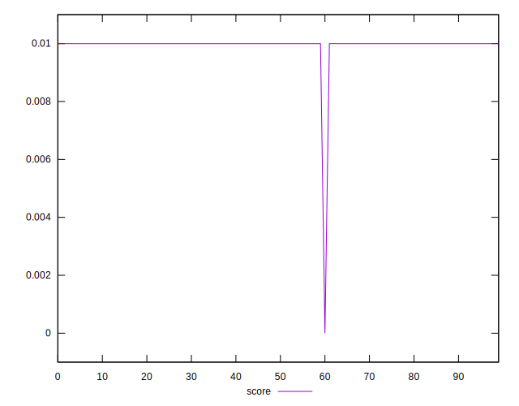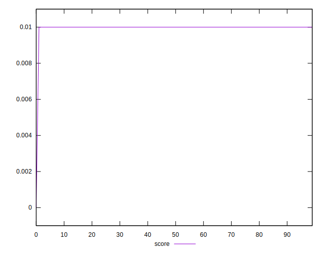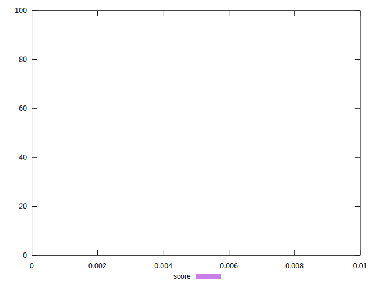
## Raw Estimate

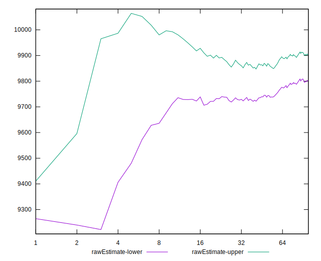
## Score Estimate

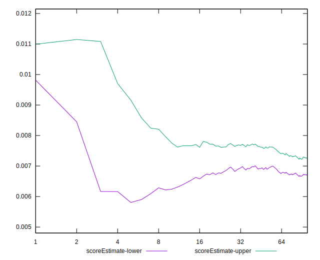
## P Score


```yaml
p90min: 0.005198207418779688
p90max: 0.010679125088480235
p90range: 0.005480917669700547
p90mean: 0.007095584571215331
median: 0.006930666846324346
p90stdev: 0.0013276411684522672
mad: 0.0008916598775712548
stdevBySn: 0.0013613283004629605
lfitCenter: 0.007103299429449257
lfitStdev: 0.001150934887239946
mfitCenter: 0.007103299429449257
mfitStdev: 0.001442482966758933
mfitConfidence: 0.0001442482966758933
p90skewness: 0.6863227885455626
p90eccentricity: 0.9999999999999997
p90discretization: 1
outlandishness: 1.0309855437225748

```

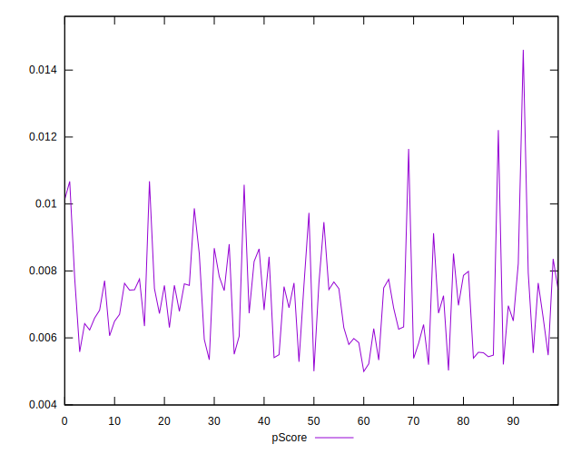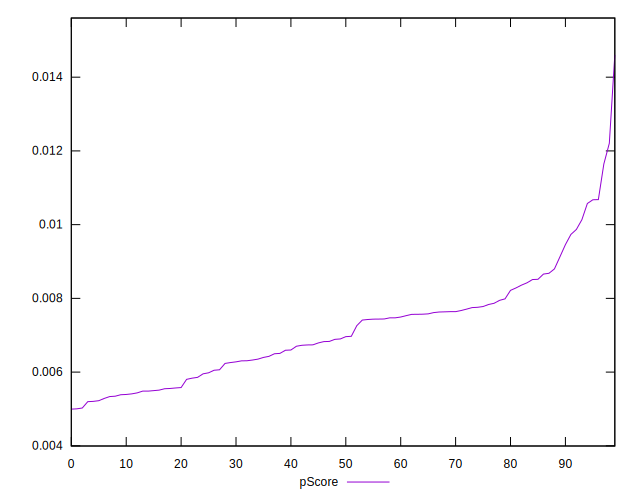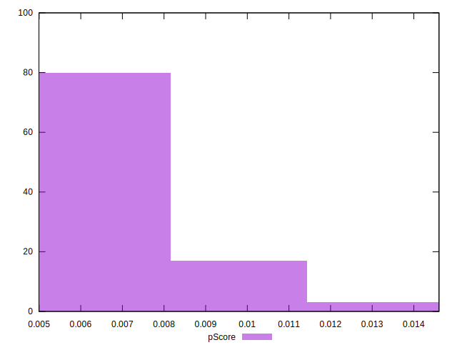
## Score Difference


```yaml
p90min: 0
p90max: 0
p90range: 0
p90mean: 0
median: 0
p90stdev: 0
mad: 0
stdevBySn: 0
lfitCenter: 0
lfitStdev: 0
mfitCenter: 0
mfitStdev: 0
mfitConfidence: 0
p90skewness: .nan
p90eccentricity: .nan
p90discretization: 94
outlandishness: .nan

```


## P Score Difference


```yaml
p90min: -0.004793913748704684
p90max: 0.0016451589223725003
p90range: 0.006439072671077184
p90mean: -0.0028358308383209176
median: -0.0030334981657812645
p90stdev: 0.0013927767534043817
mad: 0.0009017030541640381
stdevBySn: 0.0013737829524250685
lfitCenter: -0.0028251789162354957
lfitStdev: 0.0011887189565701719
mfitCenter: -0.0028251789162354957
mfitStdev: 0.0014898382750634651
mfitConfidence: 0.0001489838275063465
p90skewness: 0.8443122663672349
p90eccentricity: 0.9999999999999996
p90discretization: 1
outlandishness: 0.9033608028953949

```

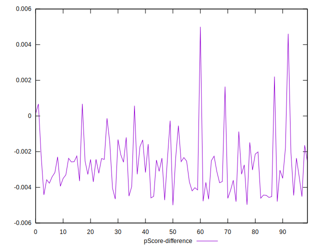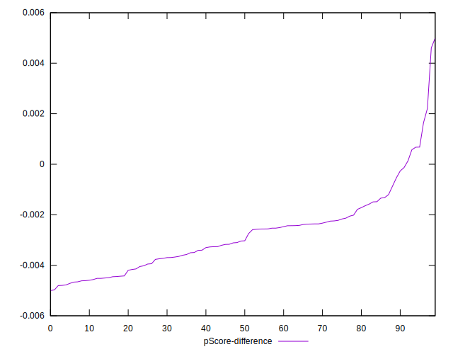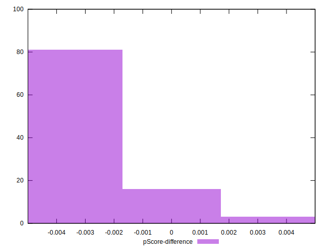