# //largest-contentful-paint/samples/astro

[→ Parent](../..)


## Raw


```yaml
p90min: 11320.8405
p90max: 12310.6405
p90range: 989.7999999999993
p90mean: 11903.577265957447
median: 11997.952749999999
p90stdev: 259.41721966350906
mad: 161.74625000000106
stdevBySn: 251.5756903500013
lfitCenter: 11930.147481353511
lfitStdev: 252.39377765456723
mfitCenter: 11930.147481353511
mfitStdev: 316.32869002323747
mfitConfidence: 31.632869002323748
p90skewness: -0.7198037602116822
p90eccentricity: 1.0000000000000002
p90discretization: 1
outlandishness: 1.0009921299796682

```

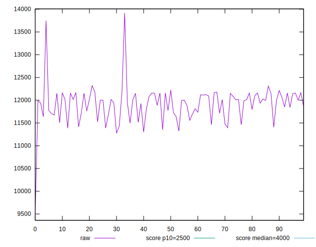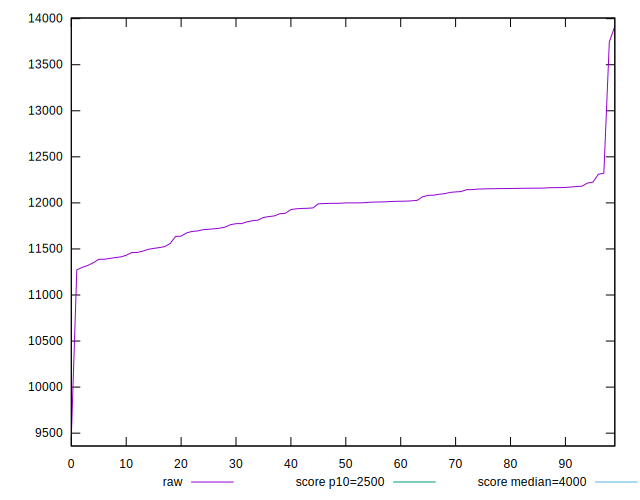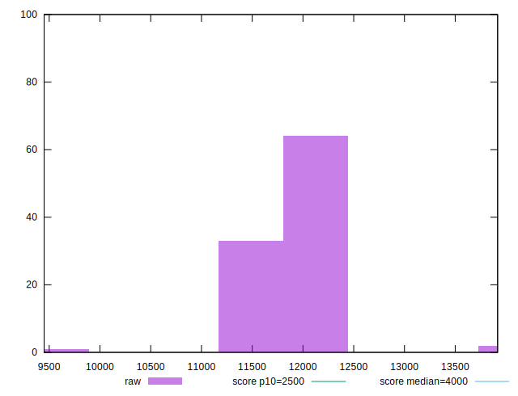
## Score


```yaml
p90min: 0
p90max: 0
p90range: 0
p90mean: 0
median: 0
p90stdev: 0
mad: 0
stdevBySn: 0
lfitCenter: 0.00004653601352548583
lfitStdev: 0.00011610565185019101
mfitCenter: 0.00004653601352548583
mfitStdev: 0.0001455168550325012
mfitConfidence: 0.00001455168550325012
p90skewness: .nan
p90eccentricity: .nan
p90discretization: 94
outlandishness: .inf

```

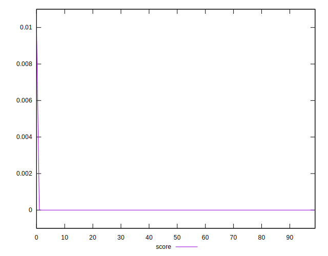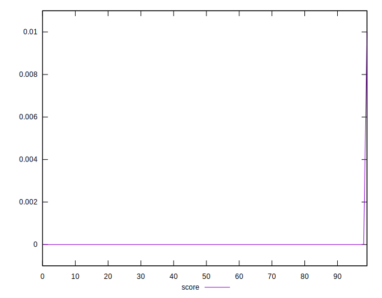
## Raw Estimate

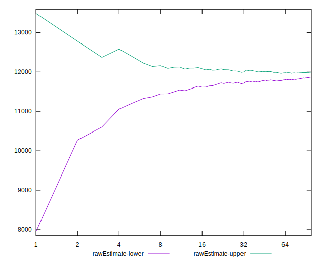
## Score Estimate

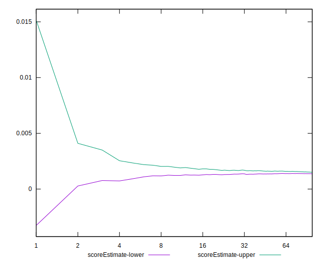
## P Score


```yaml
p90min: 0.0010874885468721285
p90max: 0.0022791219816132857
p90range: 0.0011916334347411572
p90mean: 0.0015017492958514234
median: 0.0013718282086060407
p90stdev: 0.0003113398002814498
mad: 0.00015750338566758448
stdevBySn: 0.00024708357954881214
lfitCenter: 0.0014990605756117876
lfitStdev: 0.00032742931560757936
mfitCenter: 0.0014990605756117876
mfitStdev: 0.0004103717906354515
mfitConfidence: 0.000041037179063545154
p90skewness: 0.9579174554419497
p90eccentricity: 1
p90discretization: 1
outlandishness: 1.0953675017540876

```

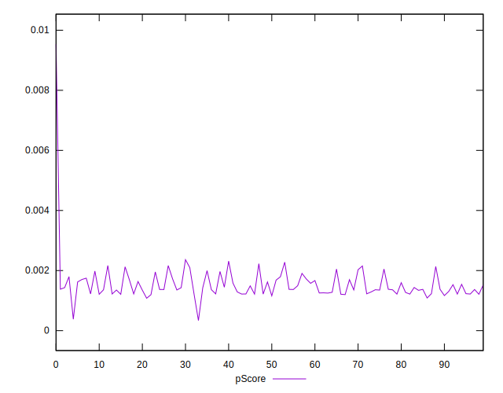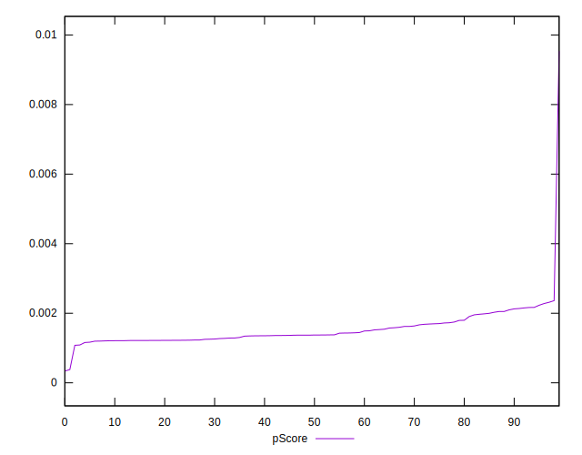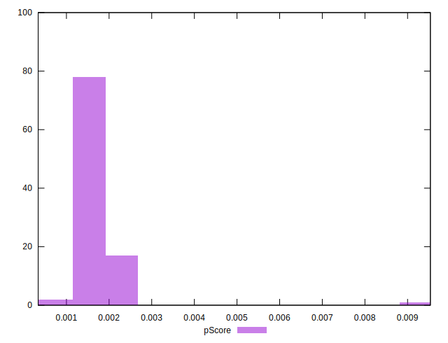
## Score Difference


```yaml
p90min: 0
p90max: 0
p90range: 0
p90mean: 0
median: 0
p90stdev: 0
mad: 0
stdevBySn: 0
lfitCenter: 0
lfitStdev: 0
mfitCenter: 0
mfitStdev: 0
mfitConfidence: 0
p90skewness: .nan
p90eccentricity: .nan
p90discretization: 94
outlandishness: .nan

```


## P Score Difference


```yaml
p90min: 0.0010784807278393371
p90max: 0.0022296591199247873
p90range: 0.0011511783920854501
p90mean: 0.001488976516555956
median: 0.0013697320198122198
p90stdev: 0.0003037209798560649
mad: 0.00015593441695405108
stdevBySn: 0.00024708357954881214
lfitCenter: 0.00144718240614775
lfitStdev: 0.00026904684242601566
mfitCenter: 0.00144718240614775
mfitStdev: 0.0003372002115519263
mfitConfidence: 0.00003372002115519263
p90skewness: 0.950896863669502
p90eccentricity: 0.9999999999999999
p90discretization: 1
outlandishness: 0.9769657760147734

```

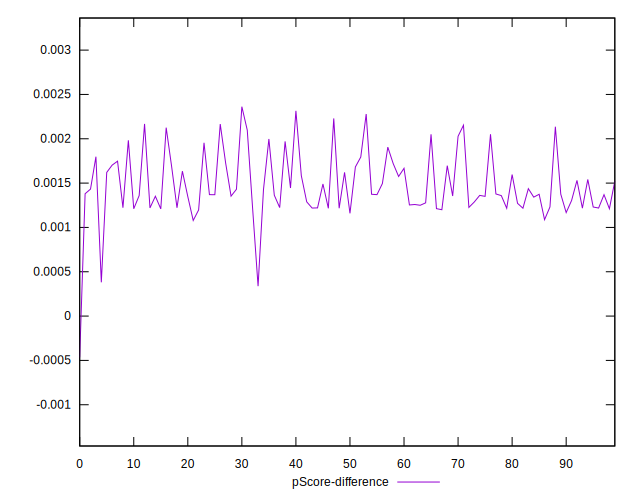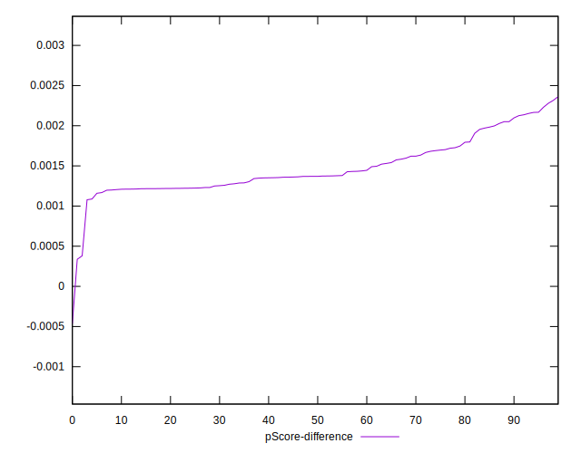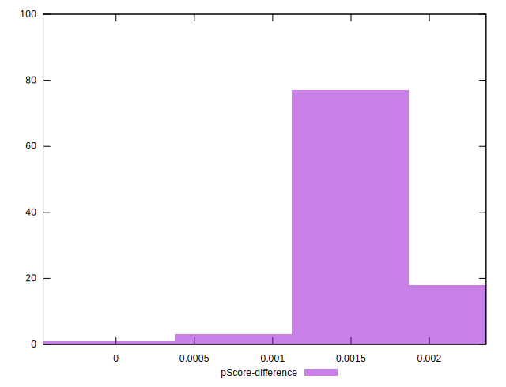