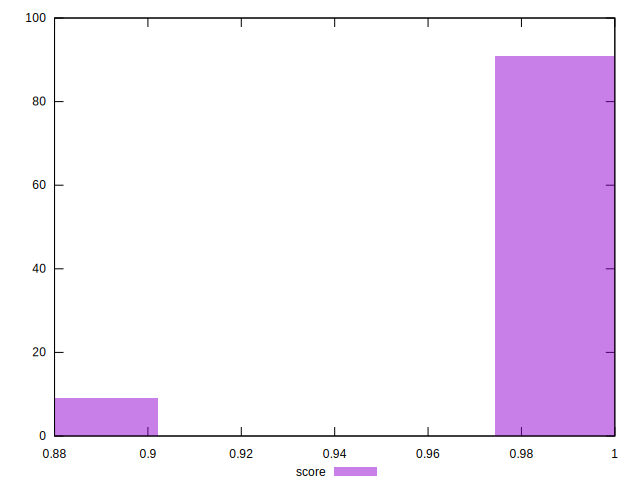

# //legacy-javascript/samples/astro-cached

[→ Parent](../..)


## Raw


```yaml
p90min: 0
p90max: 150
p90range: 150
p90mean: 9.574468085106384
median: 0
p90stdev: 36.66742114811512
mad: 0
stdevBySn: 0
lfitCenter: 7.007507228087137
lfitStdev: 16.744626593791583
mfitCenter: 7.007507228087137
mfitStdev: 20.986277255185367
mfitConfidence: 2.098627725518537
p90skewness: 3.568591947091785
p90eccentricity: 0.9999999999999949
p90discretization: 47
outlandishness: 1.9880999999999998

```


## Score


```yaml
p90min: 0.88
p90max: 1
p90range: 0.12
p90mean: 0.9923404255319149
median: 1
p90stdev: 0.02933393691849206
mad: 0
stdevBySn: 0
lfitCenter: 0.9943939942175305
lfitStdev: 0.013395701275033034
mfitCenter: 0.9943939942175305
mfitStdev: 0.016789021804148
mfitConfidence: 0.0016789021804148
p90skewness: -3.5685919470917744
p90eccentricity: 0.9999999999999978
p90discretization: 47
outlandishness: 0.9936806840615611

```


## Raw Estimate


## Score Estimate


## P Score


```yaml
p90min: 0.875
p90max: 1
p90range: 0.125
p90mean: 0.9920212765957447
median: 1
p90stdev: 0.030556184290095906
mad: 0
stdevBySn: 0
lfitCenter: 0.9941604106432608
lfitStdev: 0.01395385549482626
mfitCenter: 0.9941604106432608
mfitStdev: 0.017488564379321062
mfitConfidence: 0.0017488564379321062
p90skewness: -3.5685919470917966
p90eccentricity: 0.9999999999999968
p90discretization: 47
outlandishness: 0.9934156998181544

```


## Score Difference


```yaml
p90min: 0
p90max: 0
p90range: 0
p90mean: 0
median: 0
p90stdev: 0
mad: 0
stdevBySn: 0
lfitCenter: 0
lfitStdev: 0
mfitCenter: 0
mfitStdev: 0
mfitConfidence: 0
p90skewness: .nan
p90eccentricity: .nan
p90discretization: 94
outlandishness: .nan

```


## P Score Difference


```yaml
p90min: -0.0050000000000000044
p90max: 0
p90range: 0.0050000000000000044
p90mean: -0.0003191489361702131
median: 0
p90stdev: 0.0012222473716038366
mad: 0
stdevBySn: 0
lfitCenter: -0.00023358357426957147
lfitStdev: 0.0005581542197930533
mfitCenter: -0.00023358357426957147
mfitStdev: 0.0006995425751728461
mfitConfidence: 0.00006995425751728461
p90skewness: -3.5685919470918024
p90eccentricity: 0.9999999999999978
p90discretization: 47
outlandishness: 1.9880999999999998

```

