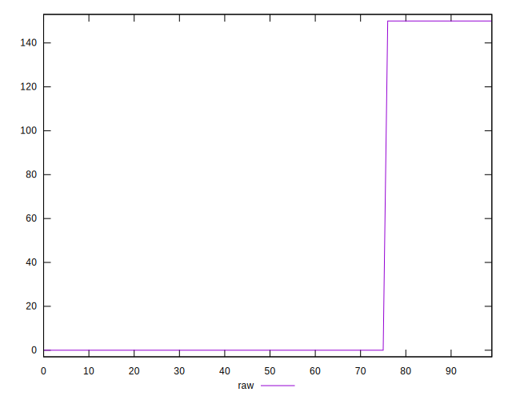

# //legacy-javascript/samples/astro-inner-cached

[→ Parent](../..)


## Raw


```yaml
p90min: 0
p90max: 150
p90range: 150
p90mean: 33.51063829787234
median: 0
p90stdev: 62.47905941633588
mad: 0
stdevBySn: 0
lfitCenter: 23.422696262937333
lfitStdev: 49.544038287356294
mfitCenter: 23.422696262937333
mfitStdev: 62.094243667725934
mfitConfidence: 6.209424366772593
p90skewness: 1.3281045550208674
p90eccentricity: 0.9999999999999992
p90discretization: 47
outlandishness: 1.1540897959183674

```


## Score


```yaml
p90min: 0.88
p90max: 1
p90range: 0.12
p90mean: 0.973191489361702
median: 1
p90stdev: 0.04998324753306868
mad: 0
stdevBySn: 0
lfitCenter: 0.9812618429896504
lfitStdev: 0.03963523062988485
mfitCenter: 0.9812618429896504
mfitStdev: 0.04967539493418052
mfitConfidence: 0.004967539493418052
p90skewness: -1.3281045550208541
p90eccentricity: 1.000000000000001
p90discretization: 47
outlandishness: 0.9959114896864827

```


## Raw Estimate


## Score Estimate


## P Score


```yaml
p90min: 0.875
p90max: 1
p90range: 0.125
p90mean: 0.9720744680851063
median: 1
p90stdev: 0.052065882846946486
mad: 0
stdevBySn: 0
lfitCenter: 0.9804810864475524
lfitStdev: 0.041286698572796744
mfitCenter: 0.9804810864475524
mfitStdev: 0.051745203056438066
mfitConfidence: 0.005174520305643806
p90skewness: -1.3281045550208705
p90eccentricity: 1.0000000000000022
p90discretization: 47
outlandishness: 0.9957364283695855

```


## Score Difference


```yaml
p90min: 0
p90max: 0
p90range: 0
p90mean: 0
median: 0
p90stdev: 0
mad: 0
stdevBySn: 0
lfitCenter: 0
lfitStdev: 0
mfitCenter: 0
mfitStdev: 0
mfitConfidence: 0
p90skewness: .nan
p90eccentricity: .nan
p90discretization: 94
outlandishness: .nan

```


## P Score Difference


```yaml
p90min: -0.0050000000000000044
p90max: 0
p90range: 0.0050000000000000044
p90mean: -0.0011170212765957456
median: 0
p90stdev: 0.002082635313877863
mad: 0
stdevBySn: 0
lfitCenter: -0.0007807565420979117
lfitStdev: 0.001651467942911877
mfitCenter: -0.0007807565420979117
mfitStdev: 0.002069808122257532
mfitConfidence: 0.0002069808122257532
p90skewness: -1.328104555020869
p90eccentricity: 1.0000000000000016
p90discretization: 47
outlandishness: 1.1540897959183674

```

