# //legacy-javascript/samples/astro-inner

[→ Parent](../..)


## Raw


```yaml
p90min: 150
p90max: 150
p90range: 0
p90mean: 150
median: 150
p90stdev: 0
mad: 0
stdevBySn: 0
lfitCenter: 147.84949808079395
lfitStdev: 5.313226922223794
mfitCenter: 147.84949808079395
mfitStdev: 6.659142423089117
mfitConfidence: 0.6659142423089117
p90skewness: .nan
p90eccentricity: .nan
p90discretization: 94
outlandishness: 0.9409

```

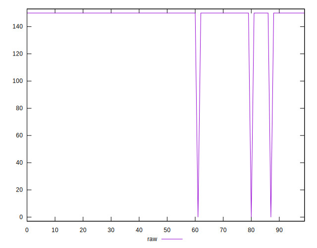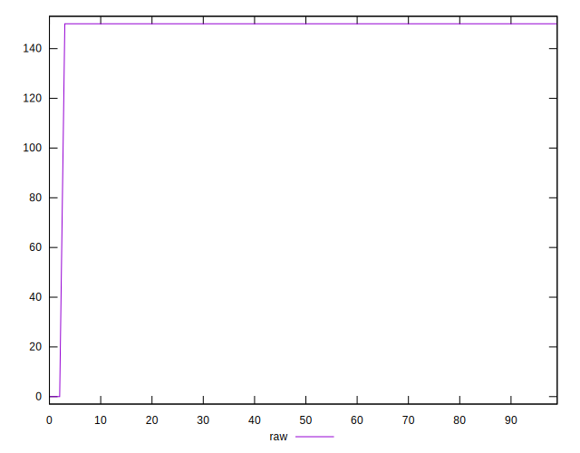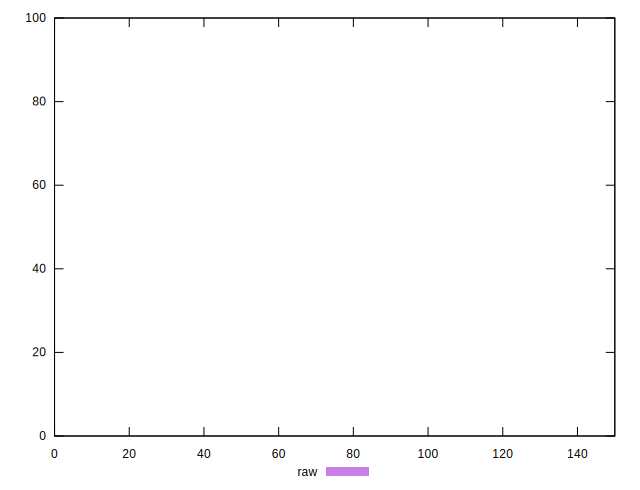
## Score


```yaml
p90min: 0.88
p90max: 0.88
p90range: 0
p90mean: 0.8799999999999998
median: 0.88
p90stdev: 2.220446049250313e-16
mad: 0
stdevBySn: 0
lfitCenter: 0.8817204015353647
lfitStdev: 0.004250581537778838
mfitCenter: 0.8817204015353647
mfitStdev: 0.005327313938471046
mfitConfidence: 0.0005327313938471046
p90skewness: 1
p90eccentricity: 1
p90discretization: 94
outlandishness: 1.008198553719008

```

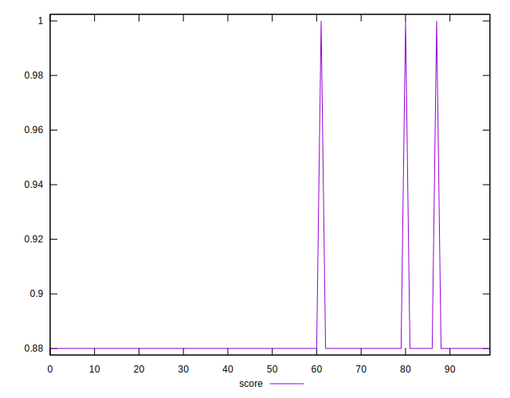
## Raw Estimate

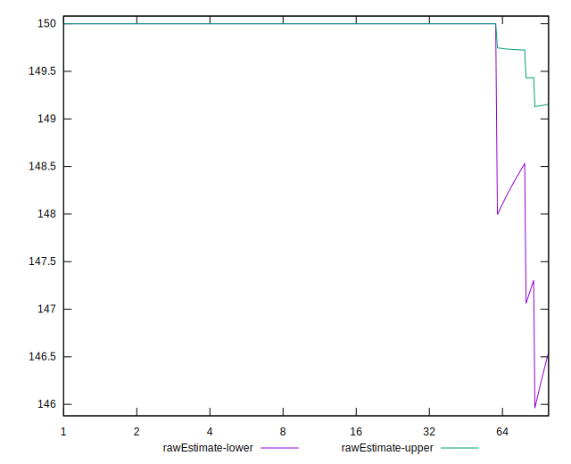
## Score Estimate

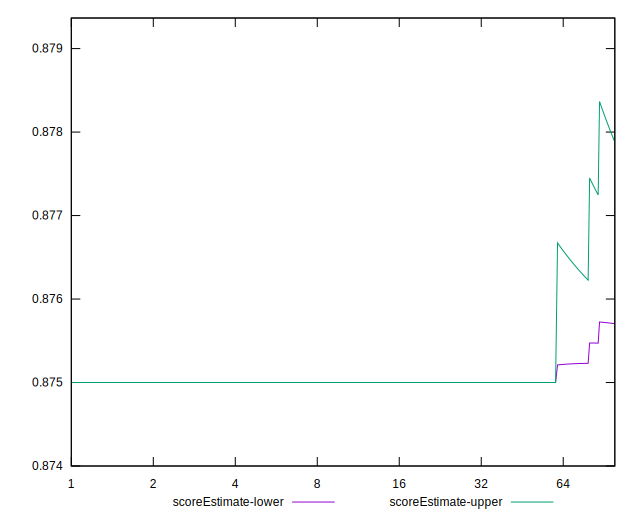
## P Score


```yaml
p90min: 0.875
p90max: 0.875
p90range: 0
p90mean: 0.875
median: 0.875
p90stdev: 0
mad: 0
stdevBySn: 0
lfitCenter: 0.876792084932672
lfitStdev: 0.004427689101853543
mfitCenter: 0.876792084932672
mfitStdev: 0.005549285352574742
mfitConfidence: 0.0005549285352574742
p90skewness: .nan
p90eccentricity: .nan
p90discretization: 94
outlandishness: 1.0085897959183672

```

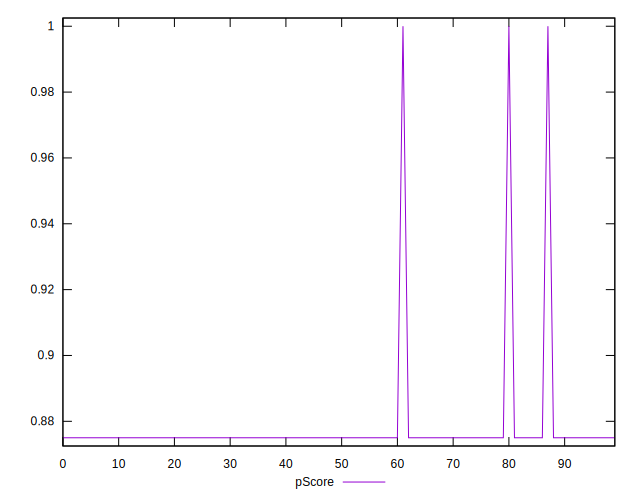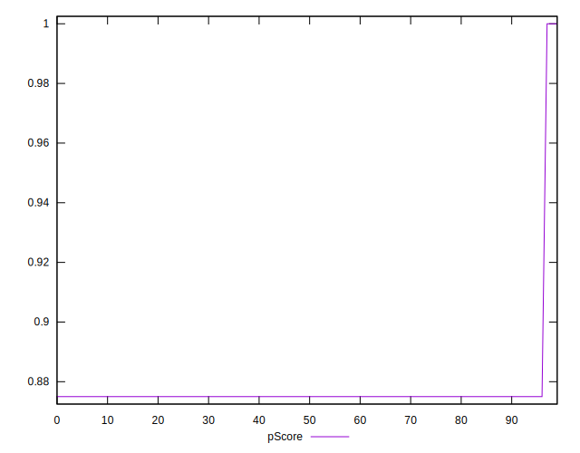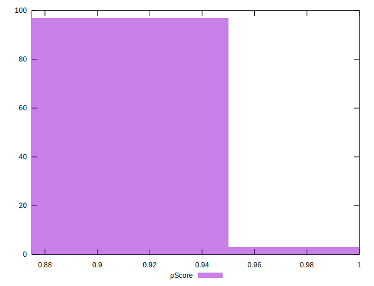
## Score Difference


```yaml
p90min: 0
p90max: 0
p90range: 0
p90mean: 0
median: 0
p90stdev: 0
mad: 0
stdevBySn: 0
lfitCenter: 0
lfitStdev: 0
mfitCenter: 0
mfitStdev: 0
mfitConfidence: 0
p90skewness: .nan
p90eccentricity: .nan
p90discretization: 94
outlandishness: .nan

```


## P Score Difference


```yaml
p90min: -0.0050000000000000044
p90max: -0.0050000000000000044
p90range: 0
p90mean: -0.0050000000000000044
median: -0.0050000000000000044
p90stdev: 0
mad: 0
stdevBySn: 0
lfitCenter: -0.004928316602693135
lfitStdev: 0.00017710756407412752
mfitCenter: -0.004928316602693135
mfitStdev: 0.0002219714141029719
mfitConfidence: 0.00002219714141029719
p90skewness: .nan
p90eccentricity: .nan
p90discretization: 94
outlandishness: 0.9409000000000002

```

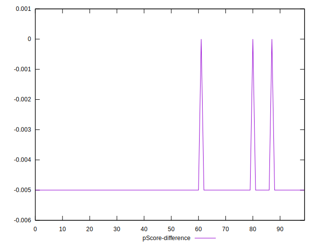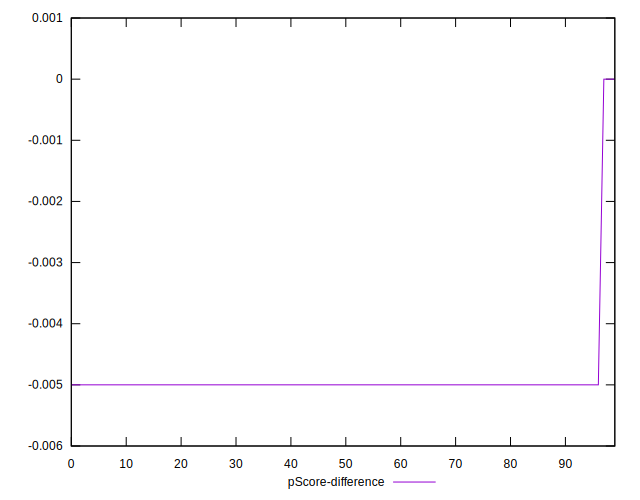