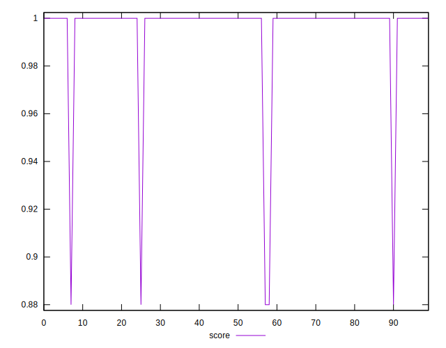
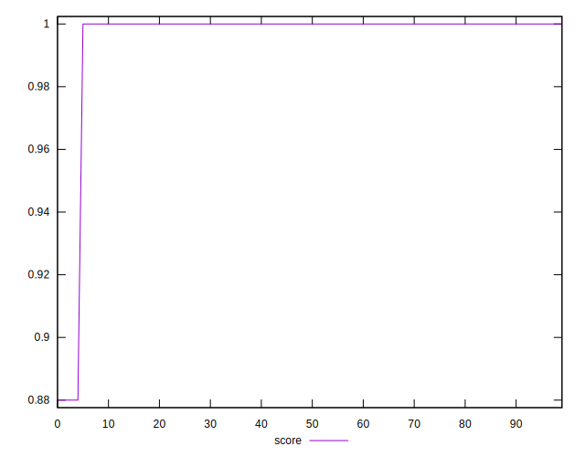

# //legacy-javascript/samples/astro

[→ Parent](../..)


## Raw


```yaml
p90min: 0
p90max: 150
p90range: 150
p90mean: 3.1914893617021276
median: 0
p90stdev: 21.645733988697703
mad: 0
stdevBySn: 0
lfitCenter: 3.6824791066704403
lfitStdev: 9.003996160873228
mfitCenter: 3.6824791066704403
mfitStdev: 11.284835692112187
mfitConfidence: 1.1284835692112187
p90skewness: 6.63488802697034
p90eccentricity: 0.9999999999999958
p90discretization: 47
outlandishness: 5.522500000000001

```


## Score


```yaml
p90min: 0.88
p90max: 1
p90range: 0.12
p90mean: 0.9974468085106382
median: 1
p90stdev: 0.017316587190958126
mad: 0
stdevBySn: 0
lfitCenter: 0.9970540167146638
lfitStdev: 0.00720319692869845
mfitCenter: 0.9970540167146638
mfitStdev: 0.009027868553689583
mfitConfidence: 0.0009027868553689583
p90skewness: -6.634888026970363
p90eccentricity: 0.9999999999999984
p90discretization: 47
outlandishness: 0.9931006785897336

```


## Raw Estimate


## Score Estimate


## P Score


```yaml
p90min: 0.875
p90max: 1
p90range: 0.125
p90mean: 0.9973404255319149
median: 1
p90stdev: 0.018038111657248057
mad: 0
stdevBySn: 0
lfitCenter: 0.9969312674111082
lfitStdev: 0.007503330134060793
mfitCenter: 0.9969312674111082
mfitStdev: 0.009404029743426533
mfitConfidence: 0.0009404029743426533
p90skewness: -6.634888026970385
p90eccentricity: 0.9999999999999991
p90discretization: 47
outlandishness: 0.9928129599999999

```


## Score Difference


```yaml
p90min: 0
p90max: 0
p90range: 0
p90mean: 0
median: 0
p90stdev: 0
mad: 0
stdevBySn: 0
lfitCenter: 0
lfitStdev: 0
mfitCenter: 0
mfitStdev: 0
mfitConfidence: 0
p90skewness: .nan
p90eccentricity: .nan
p90discretization: 94
outlandishness: .nan

```


## P Score Difference


```yaml
p90min: -0.0050000000000000044
p90max: 0
p90range: 0.0050000000000000044
p90mean: -0.00010638297872340435
median: 0
p90stdev: 0.0007215244662899229
mad: 0
stdevBySn: 0
lfitCenter: -0.00012274930355568145
lfitStdev: 0.00030013320536244104
mfitCenter: -0.00012274930355568145
mfitStdev: 0.000376161189737073
mfitConfidence: 0.000037616118973707304
p90skewness: -6.634888026970377
p90eccentricity: 0.9999999999999984
p90discretization: 47
outlandishness: 5.522500000000001

```

