# //mainthread-work-breakdown/samples/astro-cached

[→ Parent](../..)


## Raw


```yaml
p90min: 1879.3079999999989
p90max: 2042.199999999999
p90range: 162.89200000000005
p90mean: 1945.9669787234025
median: 1940.559999999999
p90stdev: 39.762737231590116
mad: 29.0379999999991
stdevBySn: 47.45355400000145
lfitCenter: 1944.98283354781
lfitStdev: 34.458551233269866
mfitCenter: 1944.98283354781
mfitStdev: 43.187389455524574
mfitConfidence: 4.318738945552457
p90skewness: 0.3755570611354359
p90eccentricity: 0.9999999999999997
p90discretization: 1
outlandishness: 1.001242484144513

```

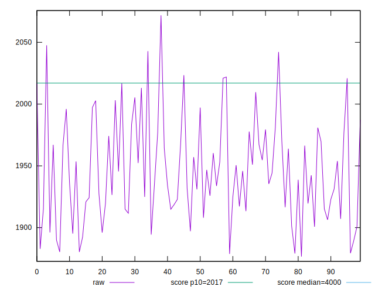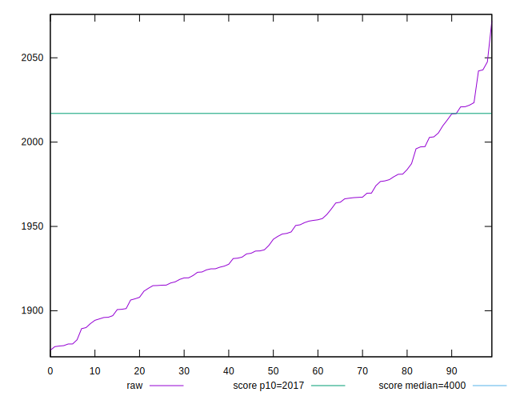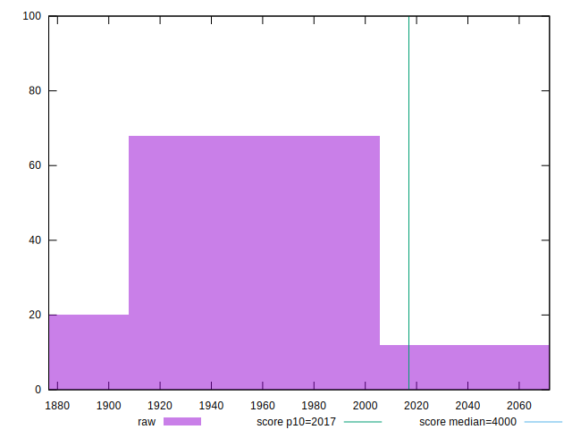
## Score


```yaml
p90min: 0.9
p90max: 0.92
p90range: 0.020000000000000018
p90mean: 0.9114893617021268
median: 0.91
p90stdev: 0.006835054640088947
mad: 0.010000000000000009
stdevBySn: 0.011926000000000011
lfitCenter: 0.9112487645084002
lfitStdev: 0.005453896207745685
mfitCenter: 0.9112487645084002
mfitStdev: 0.006835445227497177
mfitConfidence: 0.0006835445227497178
p90skewness: -0.19763066992719827
p90eccentricity: 1.000000000000002
p90discretization: 31.333333333333332
outlandishness: 0.9993651801461328

```

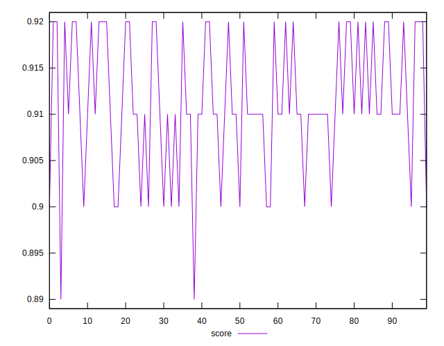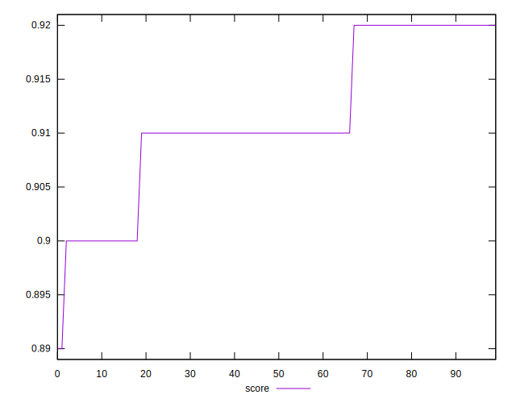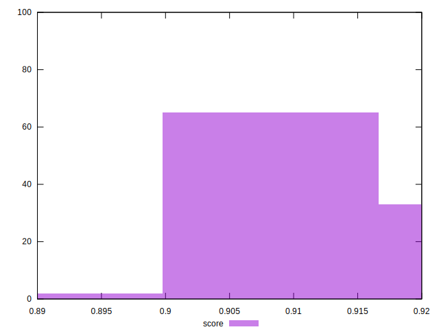
## Raw Estimate

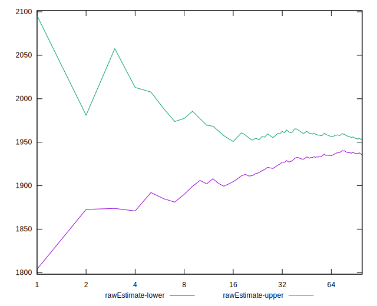
## Score Estimate

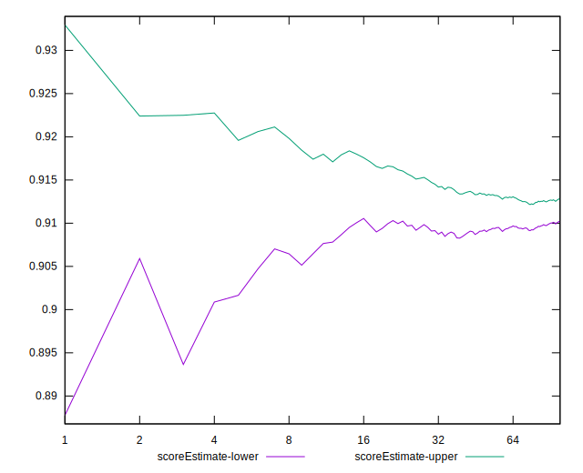
## P Score


```yaml
p90min: 0.8958603230241455
p90max: 0.9213040459342472
p90range: 0.025443722910101663
p90mean: 0.911181243423945
median: 0.9121101334022057
p90stdev: 0.006179272676334877
mad: 0.004468572950665939
stdevBySn: 0.0073289523212964995
lfitCenter: 0.9113531524165256
lfitStdev: 0.005343783557032602
mfitCenter: 0.9113531524165256
mfitStdev: 0.006697439485522319
mfitConfidence: 0.0006697439485522319
p90skewness: -0.4283440857015424
p90eccentricity: 1.0000000000000002
p90discretization: 1
outlandishness: 0.999538318345572

```

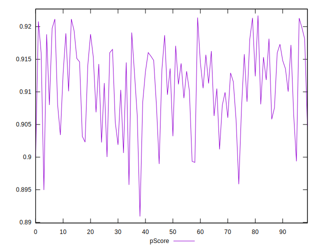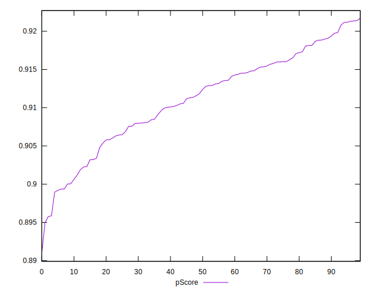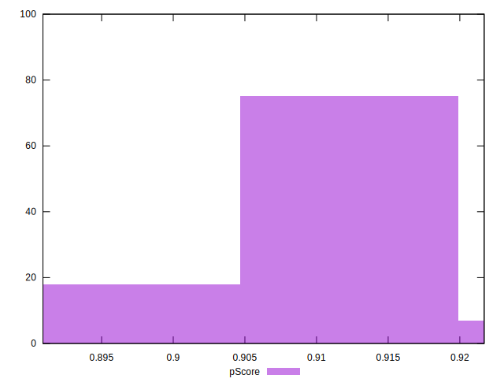
## Score Difference


```yaml
p90min: 0
p90max: 0
p90range: 0
p90mean: 0
median: 0
p90stdev: 0
mad: 0
stdevBySn: 0
lfitCenter: 0
lfitStdev: 0
mfitCenter: 0
mfitStdev: 0
mfitConfidence: 0
p90skewness: .nan
p90eccentricity: .nan
p90discretization: 94
outlandishness: .nan

```


## P Score Difference


```yaml
p90min: -0.004641451377286887
p90max: 0.004793558019683397
p90range: 0.009435009396970284
p90mean: -0.000247410882581033
median: -0.00022049234253179728
p90stdev: 0.00268387308790667
mad: 0.0022091163719245577
stdevBySn: 0.0031115012452730853
lfitCenter: -0.0002584890988080674
lfitStdev: 0.0023187537768943026
mfitCenter: -0.0002584890988080674
mfitStdev: 0.002906126892459609
mfitConfidence: 0.0002906126892459609
p90skewness: 0.09251065044532623
p90eccentricity: 1.000000000000001
p90discretization: 1
outlandishness: 0.8575973719090911

```

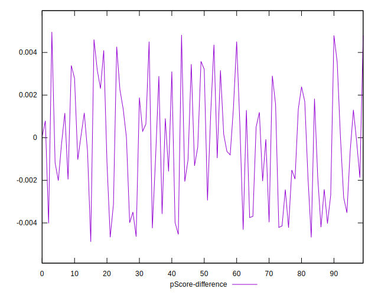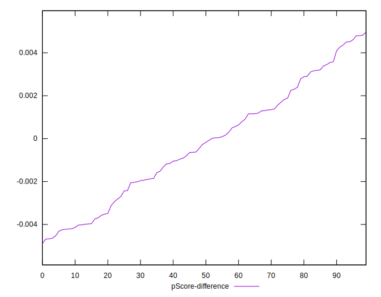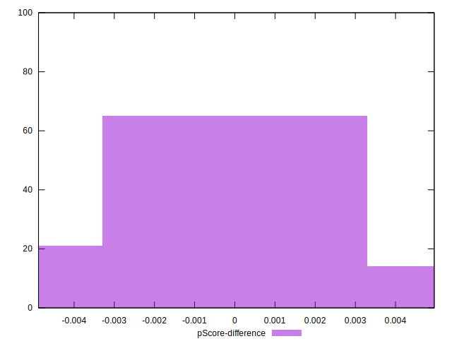