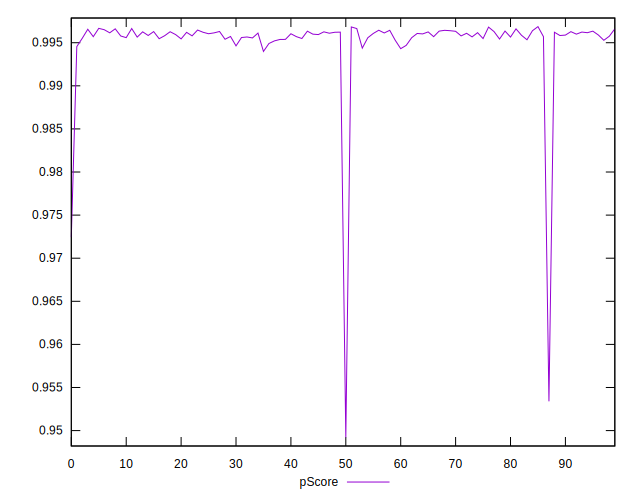

# //mainthread-work-breakdown/samples/astro-inner-cached

[→ Parent](../..)


## Raw


```yaml
p90min: 938.6720000000004
p90max: 1045.5320000000006
p90range: 106.86000000000024
p90mean: 973.9901276595743
median: 970.0919999999998
p90stdev: 22.38672430079648
mad: 14.72400000000033
stdevBySn: 22.96232039999948
lfitCenter: 980.8307705690285
lfitStdev: 30.556577730211444
mfitCenter: 980.8307705690285
mfitStdev: 38.296990895790046
mfitConfidence: 3.8296990895790044
p90skewness: 0.8760480189634948
p90eccentricity: 1.0000000000000004
p90discretization: 1
outlandishness: 1.0348237621075844

```


## Score


```yaml
p90min: 0.99
p90max: 1
p90range: 0.010000000000000009
p90mean: 0.9992553191489363
median: 1
p90stdev: 0.002625311208351716
mad: 0
stdevBySn: 0
lfitCenter: 0.9989981391931361
lfitStdev: 0.0023790716890785143
mfitCenter: 0.9989981391931361
mfitStdev: 0.002981724184609506
mfitConfidence: 0.0002981724184609506
p90skewness: -3.2417635938925753
p90eccentricity: 1.0000000000000002
p90discretization: 47
outlandishness: 0.9974890688603176

```


## Raw Estimate


## Score Estimate


## P Score


```yaml
p90min: 0.9939881213085704
p90max: 0.9966686022112946
p90range: 0.002680480902724214
p90mean: 0.9958807937674933
median: 0.995994656701154
p90stdev: 0.0005436710495889386
mad: 0.00034065720812231914
stdevBySn: 0.0005280204663791706
lfitCenter: 0.9953950023242507
lfitStdev: 0.001416621910733033
mfitCenter: 0.9953950023242507
mfitStdev: 0.0017754722697391624
mfitConfidence: 0.00017754722697391624
p90skewness: -1.1482278936641328
p90eccentricity: 0.9999999999999994
p90discretization: 1
outlandishness: 0.9977976277940396

```


## Score Difference


```yaml
p90min: 0
p90max: 0
p90range: 0
p90mean: 0
median: 0
p90stdev: 0
mad: 0
stdevBySn: 0
lfitCenter: 1.0470608452365924e-18
lfitStdev: 2.5998395675404994e-18
mfitCenter: 1.0470608452365924e-18
mfitStdev: 3.2584156880294808e-18
mfitConfidence: 3.258415688029481e-19
p90skewness: .nan
p90eccentricity: .nan
p90discretization: 94
outlandishness: .inf

```


## P Score Difference


```yaml
p90min: -0.004655221566393641
p90max: 0.004552068791302988
p90range: 0.00920729035769663
p90mean: -0.003421964919252097
median: -0.0038630165351524193
p90stdev: 0.001968779843194974
mad: 0.0003502544455489809
stdevBySn: 0.0005280204663791706
lfitCenter: -0.0035423139521875567
lfitStdev: 0.0009753619405302212
mfitCenter: -0.0035423139521875567
mfitStdev: 0.0012224349102960724
mfitConfidence: 0.00012224349102960724
p90skewness: 3.2797670925448785
p90eccentricity: 0.9999999999999997
p90discretization: 1
outlandishness: 0.8834976910561917

```

