# //mainthread-work-breakdown/samples/astro-inner

[→ Parent](../..)


## Raw


```yaml
p90min: 1007.4720000000008
p90max: 1074.8399999999995
p90range: 67.36799999999869
p90mean: 1041.0438723404257
median: 1041.2760000000007
p90stdev: 16.744040819420686
mad: 14.564000000000192
stdevBySn: 20.96948579999922
lfitCenter: 1040.6159390984621
lfitStdev: 15.242081872525176
mfitCenter: 1040.6159390984621
mfitStdev: 19.103116712178483
mfitConfidence: 1.9103116712178483
p90skewness: 0.054976655799379756
p90eccentricity: 0.9999999999999997
p90discretization: 1
outlandishness: 0.9988819883421044

```

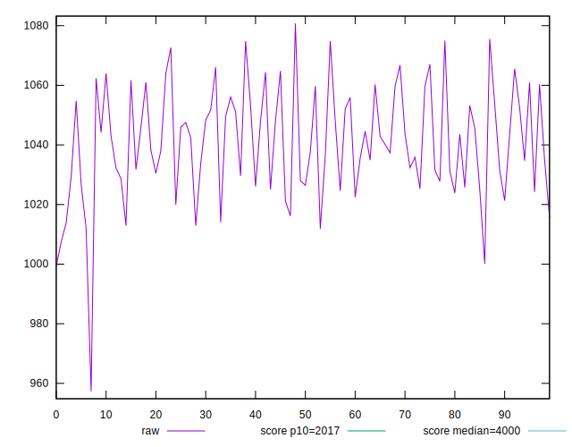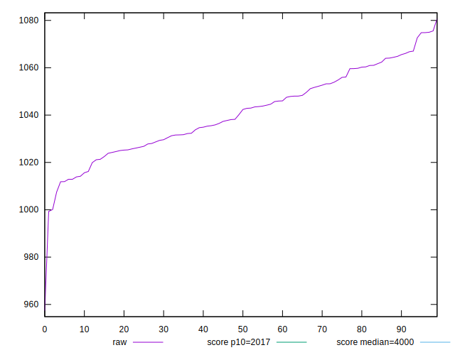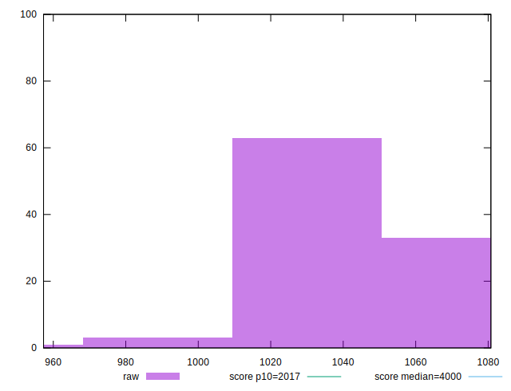
## Score


```yaml
p90min: 0.99
p90max: 1
p90range: 0.010000000000000009
p90mean: 0.9901063829787222
median: 0.99
p90stdev: 0.001025920293722653
mad: 0
stdevBySn: 0
lfitCenter: 0.9901937476034176
lfitStdev: 0.0004762438065841929
mfitCenter: 0.9901937476034176
mfitStdev: 0.0005968830962015268
mfitConfidence: 0.00005968830962015268
p90skewness: 9.539955591523423
p90eccentricity: 1.0000000000000049
p90discretization: 47
outlandishness: 1.000593189908747

```

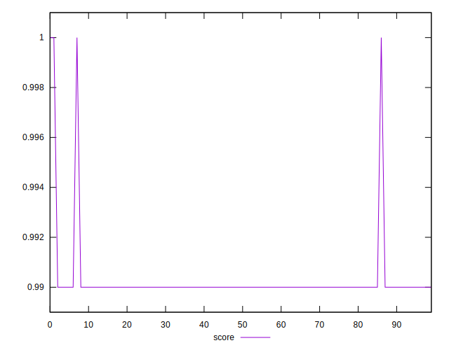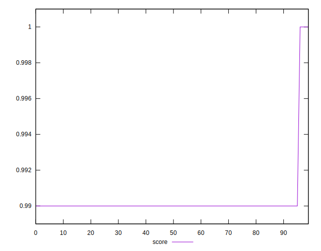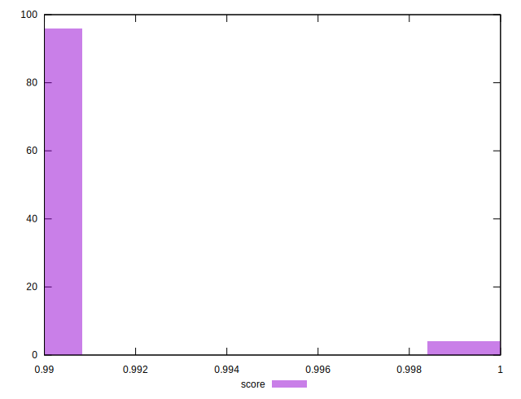
## Raw Estimate

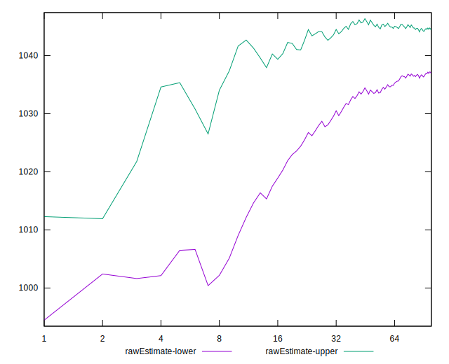
## Score Estimate

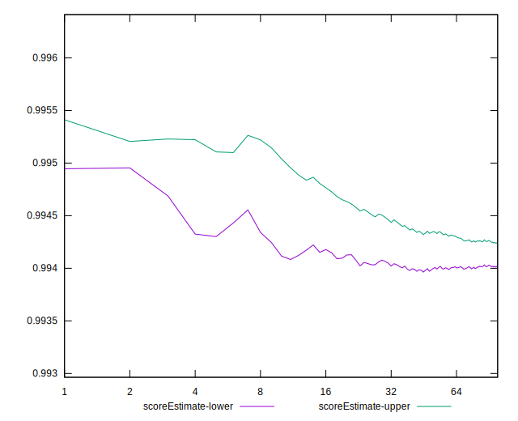
## P Score


```yaml
p90min: 0.9930473560146094
p90max: 0.9950721657903026
p90range: 0.0020248097756931926
p90mean: 0.994108867796391
median: 0.9941168563842037
p90stdev: 0.0005038410182707595
mad: 0.0004289467944314507
stdevBySn: 0.000618011908943977
lfitCenter: 0.9941233556779436
lfitStdev: 0.000455859545185552
mfitCenter: 0.9941233556779436
mfitStdev: 0.0005713352131861682
mfitConfidence: 0.000057133521318616825
p90skewness: -0.15067542739155276
p90eccentricity: 0.9999999999999997
p90discretization: 1
outlandishness: 1.0000218680084858

```

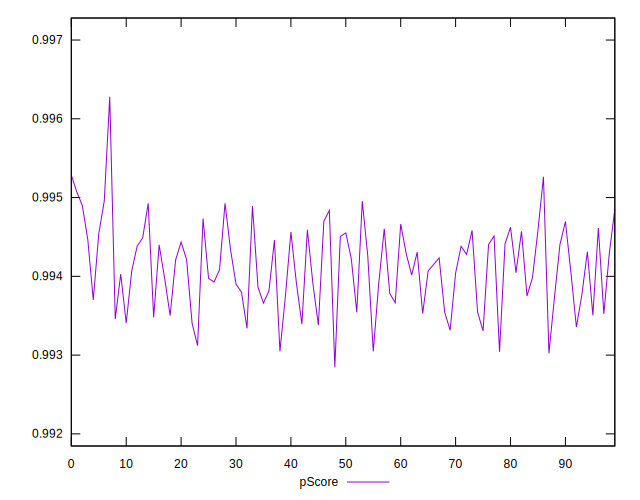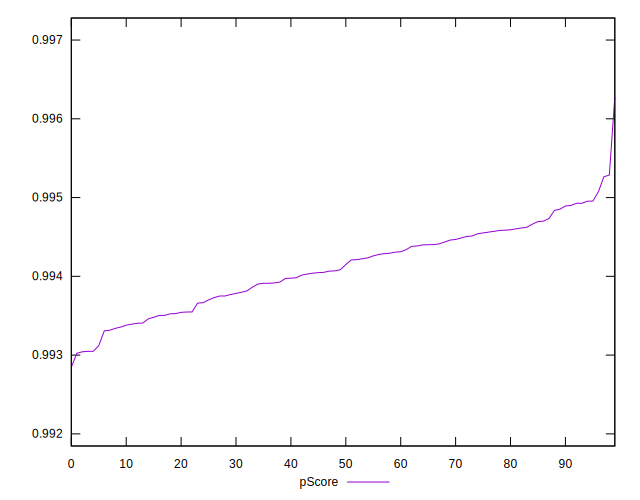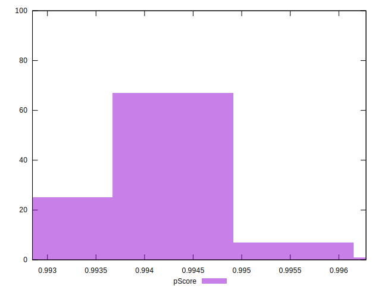
## Score Difference


```yaml
p90min: 0
p90max: 0
p90range: 0
p90mean: 0
median: 0
p90stdev: 0
mad: 0
stdevBySn: 0
lfitCenter: 0
lfitStdev: 0
mfitCenter: 0
mfitStdev: 0
mfitConfidence: 0
p90skewness: .nan
p90eccentricity: .nan
p90discretization: 94
outlandishness: .nan

```


## P Score Difference


```yaml
p90min: -0.0037203496030197014
p90max: 0.004926951942239466
p90range: 0.008647301545259167
p90mean: 0.003952295401790794
median: 0.004048950096071202
p90stdev: 0.0009438498733461273
mad: 0.00046008135115693793
stdevBySn: 0.0006206301260279212
lfitCenter: 0.003892442267717984
lfitStdev: 0.0006676701964233973
mfitCenter: 0.003892442267717984
mfitStdev: 0.0008368004970836849
mfitConfidence: 0.0000836800497083685
p90skewness: -5.683106918166565
p90eccentricity: 0.9999999999999996
p90discretization: 1
outlandishness: 0.8857797582039637

```

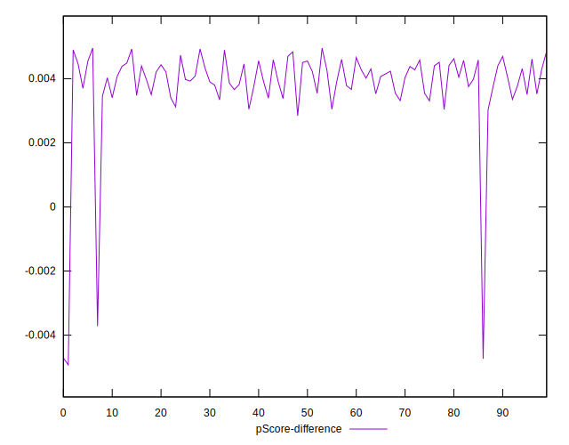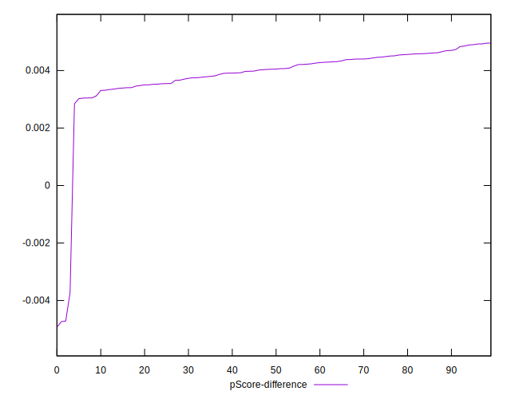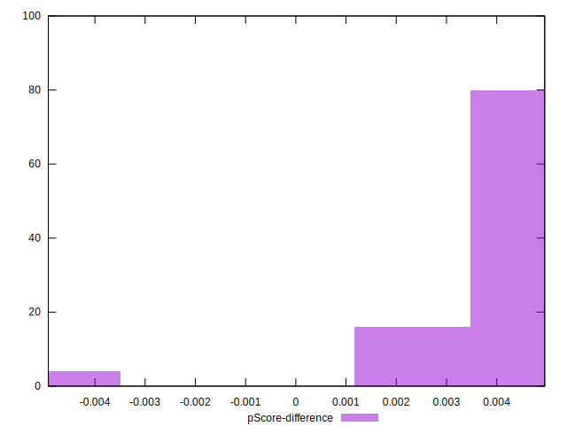