# //mainthread-work-breakdown/samples/astro

[→ Parent](../..)


## Raw


```yaml
p90min: 2021.188000000001
p90max: 2148.9199999999996
p90range: 127.7319999999986
p90mean: 2080.48055319149
median: 2080.5279999999993
p90stdev: 29.84087518881466
mad: 21.396000000000186
stdevBySn: 32.94915279999897
lfitCenter: 2083.9153483850196
lfitStdev: 29.752360897254597
mfitCenter: 2083.9153483850196
mfitStdev: 37.2890545685639
mfitConfidence: 3.7289054568563897
p90skewness: 0.056611935651955145
p90eccentricity: 1.0000000000000002
p90discretization: 1
outlandishness: 1.007006929668322

```

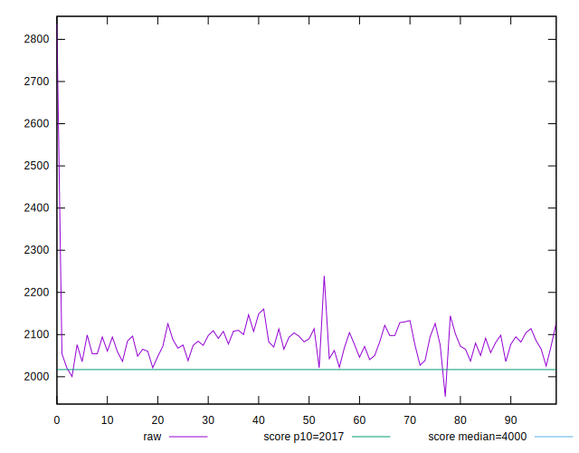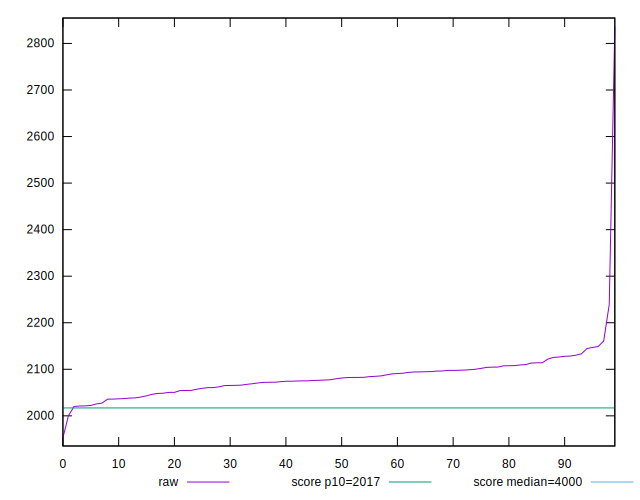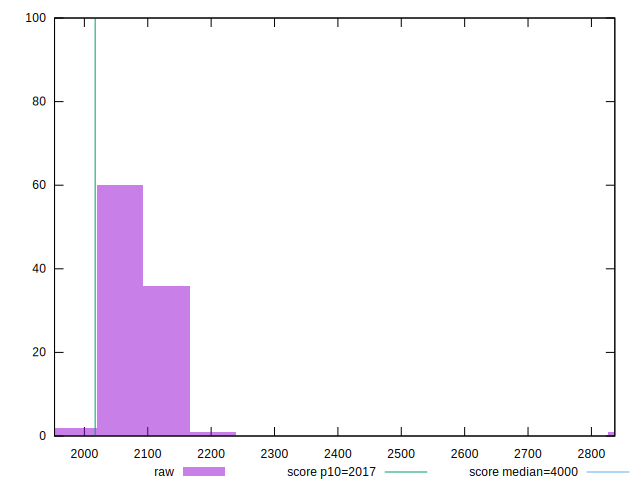
## Score


```yaml
p90min: 0.88
p90max: 0.9
p90range: 0.020000000000000018
p90mean: 0.8895744680851069
median: 0.89
p90stdev: 0.005819061417522284
mad: 0
stdevBySn: 0
lfitCenter: 0.8889883506044983
lfitStdev: 0.00480888566349621
mfitCenter: 0.8889883506044983
mfitStdev: 0.006027044392858298
mfitConfidence: 0.0006027044392858297
p90skewness: 0.003812784029293575
p90eccentricity: 0.9999999999999968
p90discretization: 31.333333333333332
outlandishness: 0.9966877508879619

```

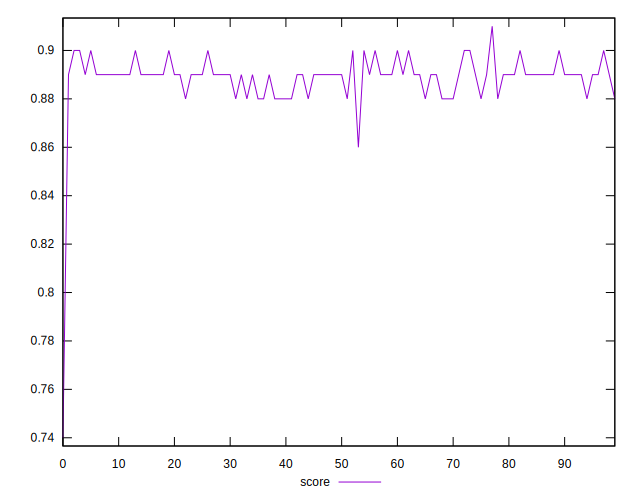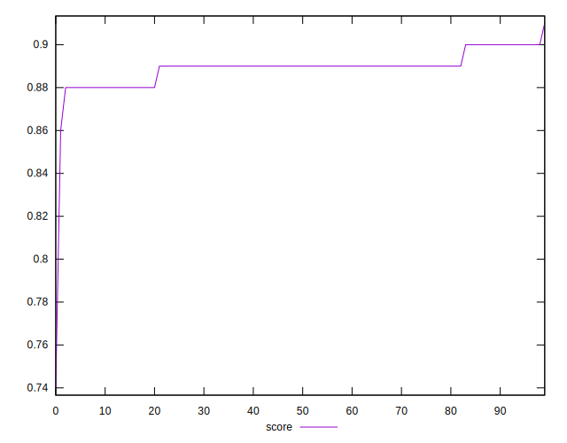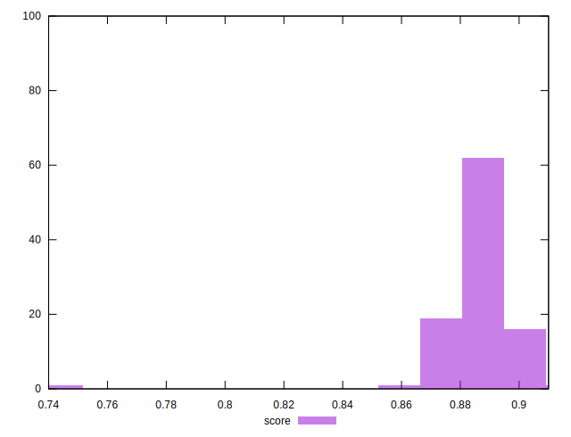
## Raw Estimate

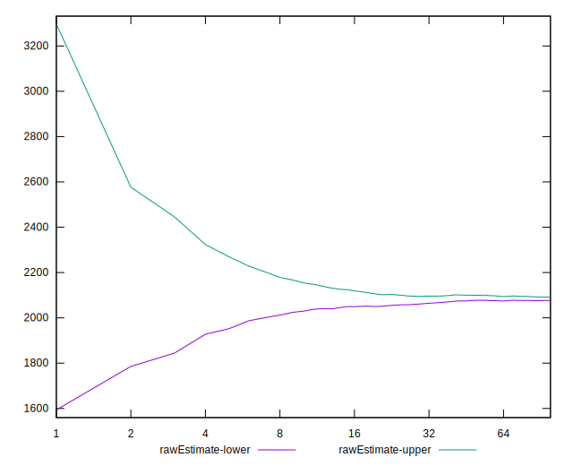
## Score Estimate

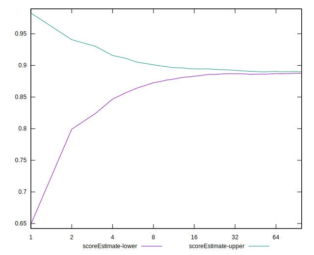
## P Score


```yaml
p90min: 0.8775788689196236
p90max: 0.8993168859953093
p90range: 0.02173801707568579
p90mean: 0.889392192434502
median: 0.8894309500227378
p90stdev: 0.0050682210010744595
mad: 0.0036328237001598263
stdevBySn: 0.005565278790429602
lfitCenter: 0.8887143444472457
lfitStdev: 0.005208599882963252
mfitCenter: 0.8887143444472457
mfitStdev: 0.006528011875506467
mfitConfidence: 0.0006528011875506467
p90skewness: -0.09934263042622565
p90eccentricity: 1.0000000000000004
p90discretization: 1
outlandishness: 0.9966889348275064

```

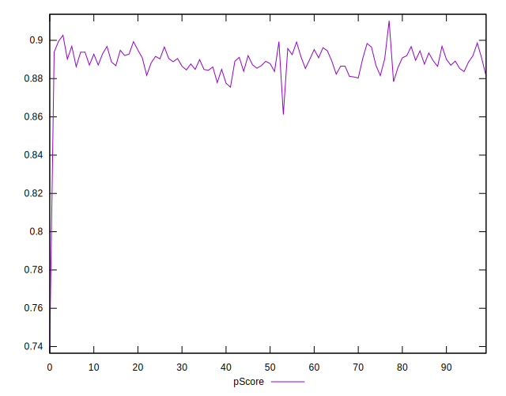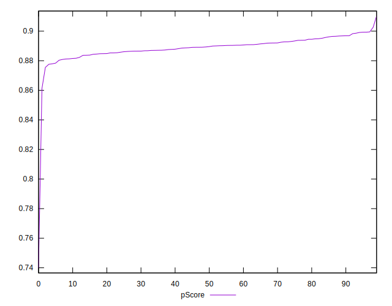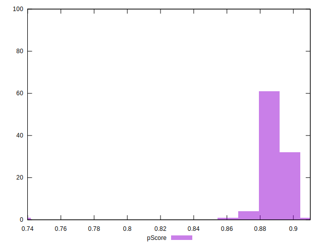
## Score Difference


```yaml
p90min: 0
p90max: 0
p90range: 0
p90mean: 0
median: 0
p90stdev: 0
mad: 0
stdevBySn: 0
lfitCenter: 0
lfitStdev: 0
mfitCenter: 0
mfitStdev: 0
mfitConfidence: 0
p90skewness: .nan
p90eccentricity: .nan
p90discretization: 94
outlandishness: .nan

```


## P Score Difference


```yaml
p90min: -0.004588647860878092
p90max: 0.004778912099683952
p90range: 0.009367559960562044
p90mean: -0.00019600056529766796
median: -0.00007461569339767271
p90stdev: 0.0026218611398576277
mad: 0.002358176042466076
stdevBySn: 0.0031585659557374374
lfitCenter: -0.0002252989737491141
lfitStdev: 0.0022743122876333847
mfitCenter: -0.0002252989737491141
mfitStdev: 0.002850427745629499
mfitConfidence: 0.0002850427745629499
p90skewness: 0.17686477600138698
p90eccentricity: 0.9999999999999997
p90discretization: 1
outlandishness: 0.8570002009758884

```

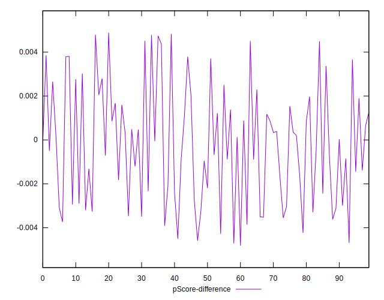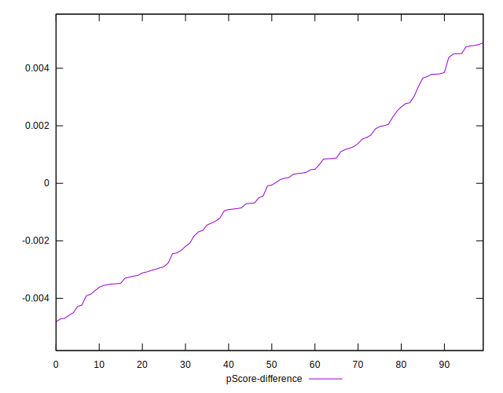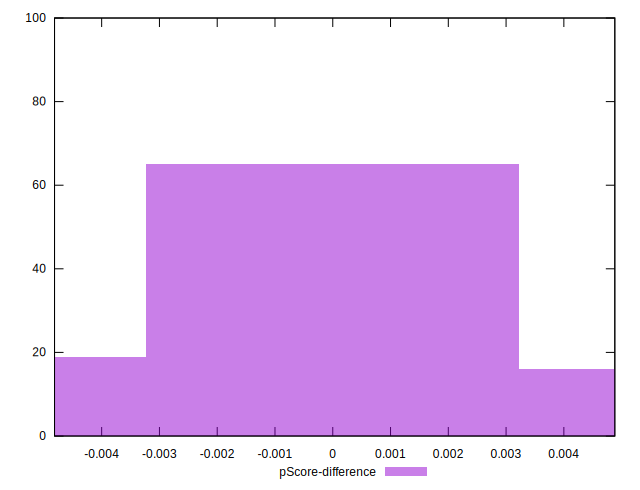