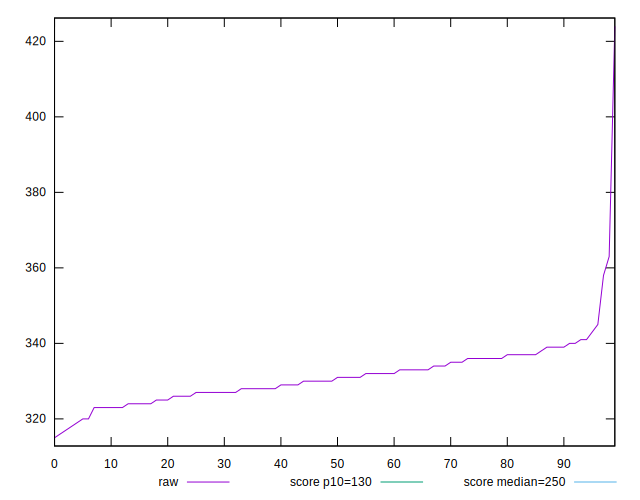

# //max-potential-fid/samples/astro-cached

[→ Parent](../..)


## Raw


```yaml
p90min: 318
p90max: 345
p90range: 27
p90mean: 330.7659574468085
median: 330.5
p90stdev: 5.745350630773517
mad: 4.5
stdevBySn: 7.155600000000001
lfitCenter: 331.2083974600824
lfitStdev: 5.665155831773607
mfitCenter: 331.2083974600824
mfitStdev: 7.100219901201756
mfitConfidence: 0.7100219901201756
p90skewness: 0.09748167451834132
p90eccentricity: 0.9999999999999997
p90discretization: 3.9166666666666665
outlandishness: 1.0065654819259682

```


## Score


```yaml
p90min: 0.26
p90max: 0.32
p90range: 0.06
p90mean: 0.29255319148936165
median: 0.29
p90stdev: 0.012198375389978
mad: 0.010000000000000009
stdevBySn: 0.011926000000000011
lfitCenter: 0.2917786718564351
lfitStdev: 0.01161820360555409
mfitCenter: 0.2917786718564351
mfitStdev: 0.014561258843703016
mfitConfidence: 0.0014561258843703016
p90skewness: -0.07443825797341952
p90eccentricity: 1.0000000000000002
p90discretization: 13.428571428571429
outlandishness: 0.9887301145917354

```


## Raw Estimate


## Score Estimate


## P Score


```yaml
p90min: 0.26395071099972167
p90max: 0.3186403684439367
p90range: 0.054689657444215
p90mean: 0.2918364344807083
median: 0.2921689352610761
p90stdev: 0.011668711620744879
mad: 0.00929422858121387
stdevBySn: 0.01434800558683062
lfitCenter: 0.2911579008559551
lfitStdev: 0.011104771308834143
mfitCenter: 0.2911579008559551
mfitStdev: 0.013917766887022032
mfitConfidence: 0.0013917766887022033
p90skewness: -0.020598239820049127
p90eccentricity: 0.9999999999999999
p90discretization: 3.9166666666666665
outlandishness: 0.9891805240925908

```


## Score Difference


```yaml
p90min: 0
p90max: 0
p90range: 0
p90mean: 0
median: 0
p90stdev: 0
mad: 0
stdevBySn: 0
lfitCenter: 0
lfitStdev: 0
mfitCenter: 0
mfitStdev: 0
mfitConfidence: 0
p90skewness: .nan
p90eccentricity: .nan
p90discretization: 94
outlandishness: .nan

```


## P Score Difference


```yaml
p90min: -0.004762995021792837
p90max: 0.0035644432717110153
p90range: 0.008327438293503853
p90mean: -0.0006648431069406886
median: -0.0008045950432371551
p90stdev: 0.0025650937642092727
mad: 0.0019610939594444377
stdevBySn: 0.002711624086653999
lfitCenter: -0.000669163827945083
lfitStdev: 0.0021669543670262753
mfitCenter: -0.000669163827945083
mfitStdev: 0.0027158745458444205
mfitConfidence: 0.00027158745458444203
p90skewness: 0.03515827903985888
p90eccentricity: 0.9999999999999997
p90discretization: 3.4814814814814814
outlandishness: 0.9459254327344423

```

