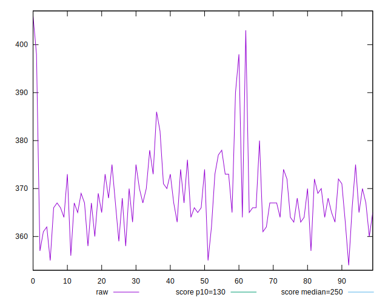

# //max-potential-fid/samples/astro-inner-cached

[→ Parent](../..)


## Raw


```yaml
p90min: 356
p90max: 398
p90range: 42
p90mean: 368.24468085106383
median: 367
p90stdev: 6.755118107244671
mad: 4
stdevBySn: 5.963000000000001
lfitCenter: 368.1465090697064
lfitStdev: 5.304576386953979
mfitCenter: 368.1465090697064
mfitStdev: 6.648300584929202
mfitConfidence: 0.6648300584929202
p90skewness: 1.378455302623856
p90eccentricity: 0.9999999999999991
p90discretization: 3.357142857142857
outlandishness: 1.0033446958791814

```


## Score


```yaml
p90min: 0.18
p90max: 0.24
p90range: 0.06
p90mean: 0.22436170212765968
median: 0.23
p90stdev: 0.010774132797041872
mad: 0.009999999999999981
stdevBySn: 0.011925999999999978
lfitCenter: 0.22491951821188655
lfitStdev: 0.009810862375529118
mfitCenter: 0.22491951821188655
mfitStdev: 0.012296092526880227
mfitConfidence: 0.0012296092526880226
p90skewness: -1.238309751128133
p90eccentricity: 1.0000000000000013
p90discretization: 13.428571428571429
outlandishness: 0.9932215780053465

```


## Raw Estimate


## Score Estimate


## P Score


```yaml
p90min: 0.18107392804818812
p90max: 0.24424168649718153
p90range: 0.06316775844899342
p90mean: 0.2241685792718337
median: 0.22591689812763605
p90stdev: 0.010444370741379128
mad: 0.006421497525167519
stdevBySn: 0.009572678430071105
lfitCenter: 0.2243229818930725
lfitStdev: 0.008224912488086156
mfitCenter: 0.2243229818930725
mfitStdev: 0.010308399109873934
mfitConfidence: 0.0010308399109873934
p90skewness: -1.1256124502152463
p90eccentricity: 1.0000000000000002
p90discretization: 3.357142857142857
outlandishness: 0.993001401311958

```


## Score Difference


```yaml
p90min: 0
p90max: 0
p90range: 0
p90mean: 0
median: 0
p90stdev: 0
mad: 0
stdevBySn: 0
lfitCenter: 0
lfitStdev: 0
mfitCenter: 0
mfitStdev: 0
mfitConfidence: 0
p90skewness: .nan
p90eccentricity: .nan
p90discretization: 94
outlandishness: .nan

```


## P Score Difference


```yaml
p90min: -0.0040831018723639645
p90max: 0.004701745187188605
p90range: 0.00878484705955257
p90mean: -0.0002548612161985199
median: -0.00041801480798633883
p90stdev: 0.002741569133956867
mad: 0.0028429950503350288
stdevBySn: 0.0033905558970295556
lfitCenter: -0.0002436845171645597
lfitStdev: 0.0025409778091270313
mfitCenter: -0.0002436845171645597
mfitStdev: 0.0031846434139883987
mfitConfidence: 0.0003184643413988399
p90skewness: 0.07705794786389247
p90eccentricity: 1.0000000000000004
p90discretization: 3.1333333333333333
outlandishness: 0.7265007877113963

```

