# //max-potential-fid/samples/astro-inner

[→ Parent](../..)


## Raw


```yaml
p90min: 350
p90max: 368
p90range: 18
p90mean: 357.3723404255319
median: 357
p90stdev: 3.7472941799843382
mad: 3
stdevBySn: 3.5778000000000003
lfitCenter: 357.320544761714
lfitStdev: 3.217293206794729
mfitCenter: 357.320544761714
mfitStdev: 4.032279064022406
mfitConfidence: 0.4032279064022406
p90skewness: 0.5401432472872474
p90eccentricity: 1.0000000000000002
p90discretization: 5.222222222222222
outlandishness: 1.0013304812471526

```

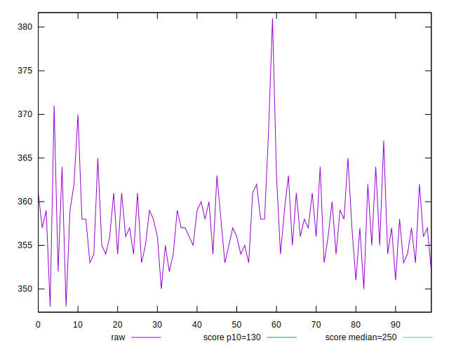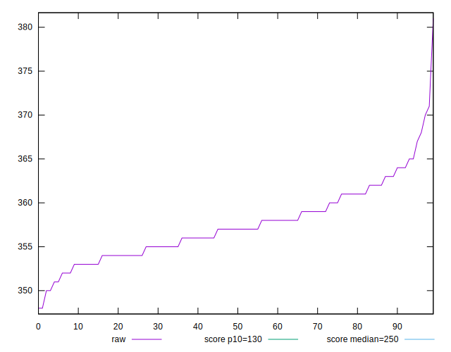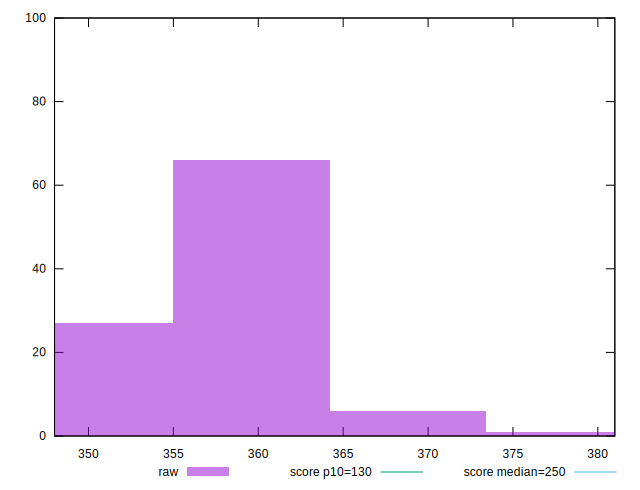
## Score


```yaml
p90min: 0.22
p90max: 0.25
p90range: 0.03
p90mean: 0.24191489361702123
median: 0.24
p90stdev: 0.007037376769592008
mad: 0.009999999999999981
stdevBySn: 0.011925999999999978
lfitCenter: 0.24166683785126003
lfitStdev: 0.006192599028957068
mfitCenter: 0.24166683785126003
mfitStdev: 0.007761271917527853
mfitConfidence: 0.0007761271917527854
p90skewness: -0.4701700045878832
p90eccentricity: 1.0000000000000018
p90discretization: 23.5
outlandishness: 0.9965728622050799

```

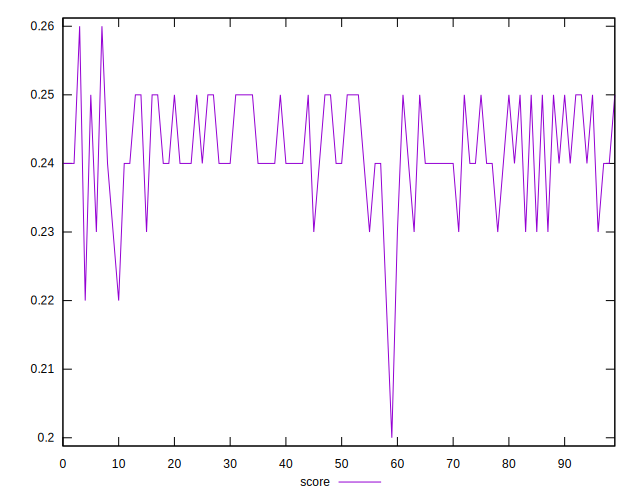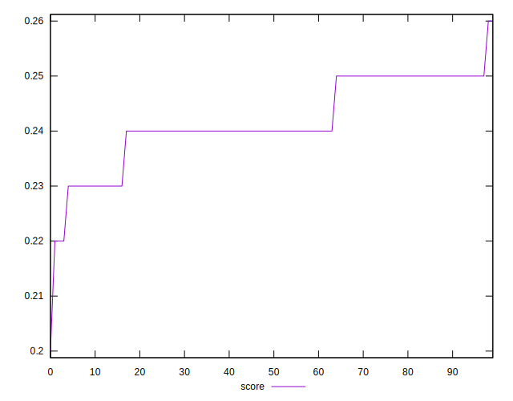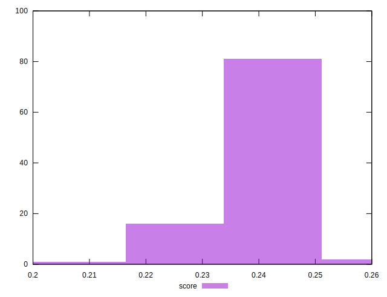
## Raw Estimate

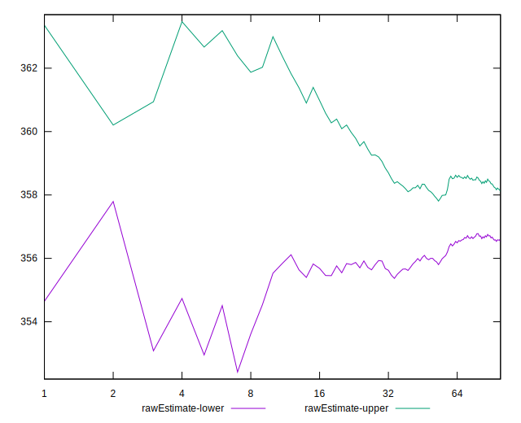
## Score Estimate

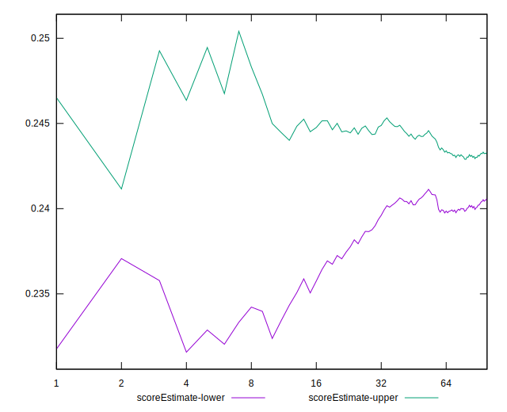
## P Score


```yaml
p90min: 0.22431707702691028
p90max: 0.2548157701001122
p90range: 0.03049869307320191
p90mean: 0.2419609858413779
median: 0.2425197073059409
p90stdev: 0.006374606497438383
mad: 0.005200317796956733
stdevBySn: 0.0062638963567841
lfitCenter: 0.24204959506510834
lfitStdev: 0.005460641628456635
mfitCenter: 0.24204959506510834
mfitStdev: 0.006843899358644859
mfitConfidence: 0.0006843899358644859
p90skewness: -0.4814593726307162
p90eccentricity: 0.9999999999999996
p90discretization: 5.222222222222222
outlandishness: 0.9971196367273351

```

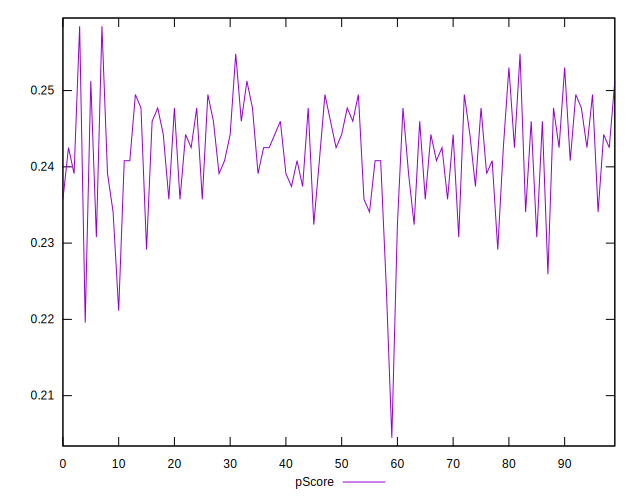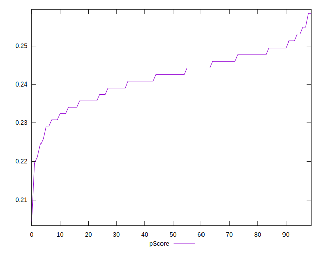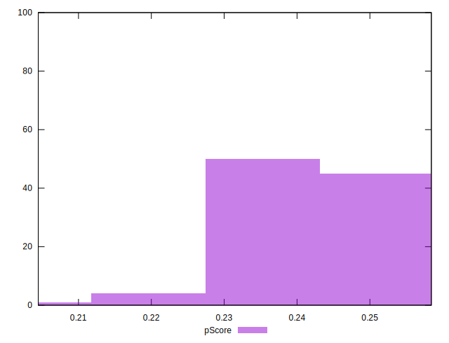
## Score Difference


```yaml
p90min: 0
p90max: 0
p90range: 0
p90mean: 0
median: 0
p90stdev: 0
mad: 0
stdevBySn: 0
lfitCenter: 0
lfitStdev: 0
mfitCenter: 0
mfitStdev: 0
mfitConfidence: 0
p90skewness: .nan
p90eccentricity: .nan
p90discretization: 94
outlandishness: .nan

```


## P Score Difference


```yaml
p90min: -0.00425490840780729
p90max: 0.004317077026910282
p90range: 0.008571985434717572
p90mean: 0.00010512120756143256
median: 0.00018175602239825506
p90stdev: 0.0027136670548701036
mad: 0.002399841101521638
stdevBySn: 0.003120905940699155
lfitCenter: 0.00011504762760918199
lfitStdev: 0.002428708652317982
mfitCenter: 0.00011504762760918199
mfitStdev: 0.0030439348924335397
mfitConfidence: 0.00030439348924335397
p90skewness: -0.027235771132685587
p90eccentricity: 0.9999999999999996
p90discretization: 4.7
outlandishness: 1.1405698028987326

```

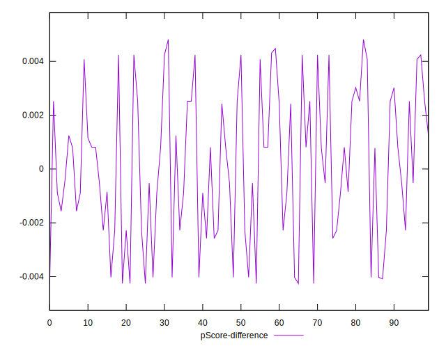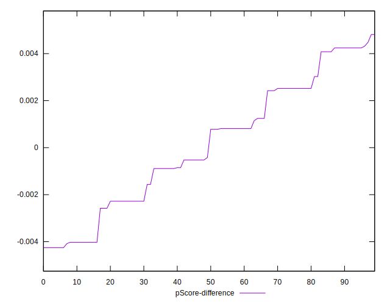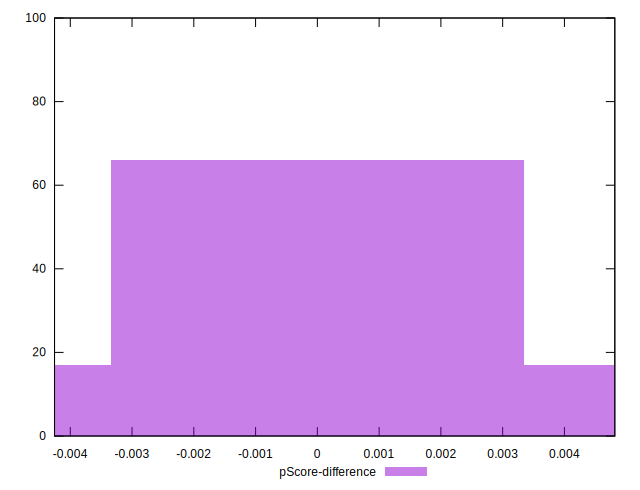