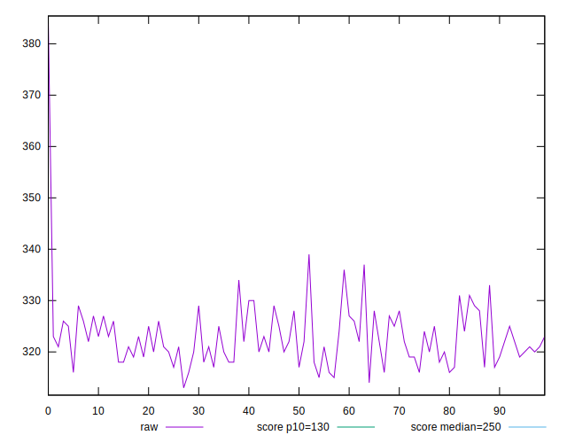
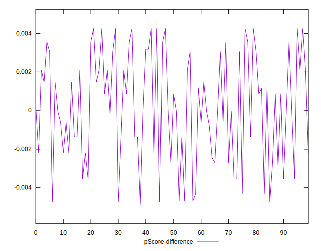

# //max-potential-fid/samples/astro

[→ Parent](../..)


## Raw


```yaml
p90min: 315
p90max: 336
p90range: 21
p90mean: 322.5
median: 322
p90stdev: 4.568043484534251
mad: 3.5
stdevBySn: 5.068550000000543
lfitCenter: 322.57523218419186
lfitStdev: 4.231704192582517
mfitCenter: 322.57523218419186
mfitStdev: 5.3036546948377055
mfitConfidence: 0.5303654694837705
p90skewness: 0.6150520482497804
p90eccentricity: 0.9999999999999999
p90discretization: 4.2727272727272725
outlandishness: 1.0041593548464636

```


## Score


```yaml
p90min: 0.28
p90max: 0.33
p90range: 0.04999999999999999
p90mean: 0.3087234042553191
median: 0.31
p90stdev: 0.00947943379146616
mad: 0.010000000000000009
stdevBySn: 0.011926000000000011
lfitCenter: 0.30854203456630347
lfitStdev: 0.008315456771313776
mfitCenter: 0.30854203456630347
mfitStdev: 0.010421879540210397
mfitConfidence: 0.0010421879540210397
p90skewness: -0.4178163487450005
p90eccentricity: 1.0000000000000002
p90discretization: 15.666666666666666
outlandishness: 0.9933810785213838

```


## Raw Estimate


## Score Estimate


## P Score


```yaml
p90min: 0.2811564989162073
p90max: 0.32530032843910134
p90range: 0.04414382952289403
p90mean: 0.3090112302575089
median: 0.3099465791610012
p90stdev: 0.009696878771208691
mad: 0.007491945134085937
stdevBySn: 0.010822969582409189
lfitCenter: 0.30892888668132845
lfitStdev: 0.008839181464909644
mfitCenter: 0.30892888668132845
mfitStdev: 0.011078271103415816
mfitConfidence: 0.0011078271103415816
p90skewness: -0.5535785022824785
p90eccentricity: 0.9999999999999994
p90discretization: 4.2727272727272725
outlandishness: 0.9924571990093642

```


## Score Difference


```yaml
p90min: 0
p90max: 0
p90range: 0
p90mean: 0
median: 0
p90stdev: 0
mad: 0
stdevBySn: 0
lfitCenter: 0
lfitStdev: 0
mfitCenter: 0
mfitStdev: 0
mfitConfidence: 0
p90skewness: .nan
p90eccentricity: .nan
p90discretization: 94
outlandishness: .nan

```


## P Score Difference


```yaml
p90min: -0.004762995021792837
p90max: 0.004267011239608043
p90range: 0.00903000626140088
p90mean: 0.00016990032238938942
median: -0.00005342083899878558
p90stdev: 0.00271685255803772
mad: 0.0021536206765588872
stdevBySn: 0.0031836014966530653
lfitCenter: 0.00020518255115932883
lfitStdev: 0.0023623960405850727
mfitCenter: 0.00020518255115932883
mfitStdev: 0.002960824358582741
mfitConfidence: 0.0002960824358582741
p90skewness: -0.1685489974559866
p90eccentricity: 0.9999999999999997
p90discretization: 3.4814814814814814
outlandishness: 0.7145567289037822

```

