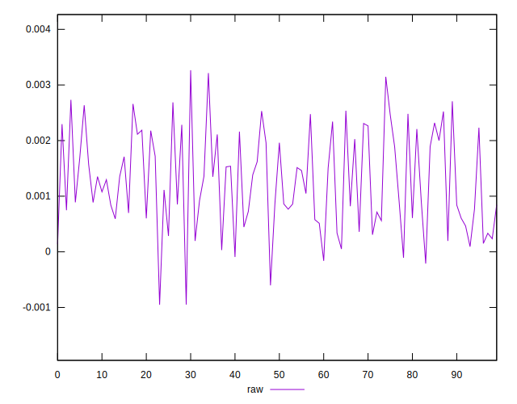
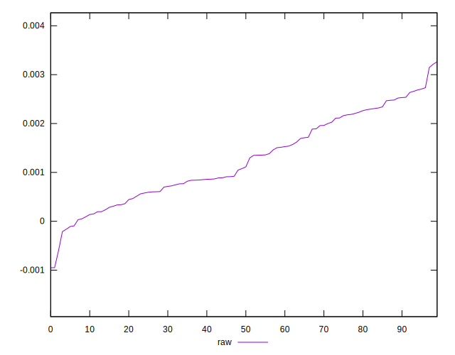
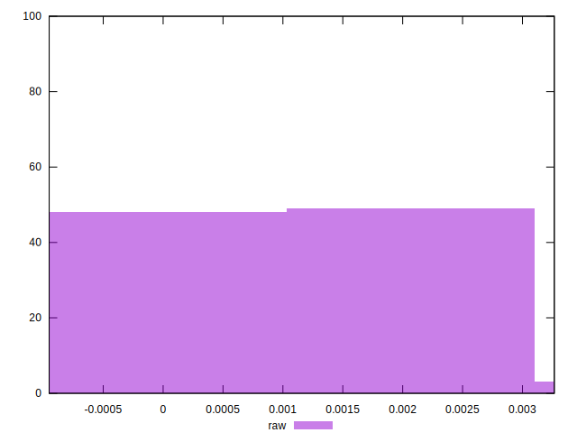

# //meta/pScore-difference/samples/astro-cached

[→ Parent](../..)


## Raw


```yaml
p90min: -0.00021131806849295106
p90max: 0.0027324944183449652
p90range: 0.0029438124868379164
p90mean: 0.0012679545241442874
median: 0.0010958117045417994
p90stdev: 0.0008411634709929942
mad: 0.0007751680766748552
stdevBySn: 0.0011687695133443846
lfitCenter: 0.0012430601572559945
lfitStdev: 0.0007982133560163798
mfitCenter: 0.0012430601572559945
mfitStdev: 0.0010004120846960364
mfitConfidence: 0.00010004120846960364
p90skewness: 0.1316351812078925
p90eccentricity: 0.9999999999999997
p90discretization: 1
outlandishness: 0.9923594280545469

```

