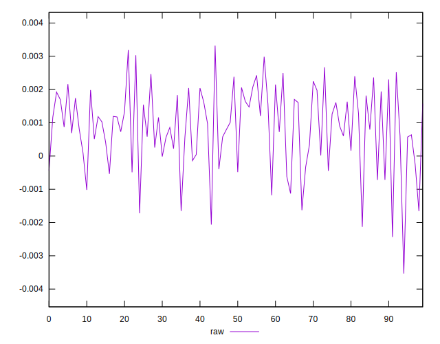
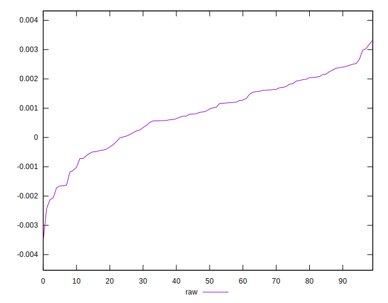
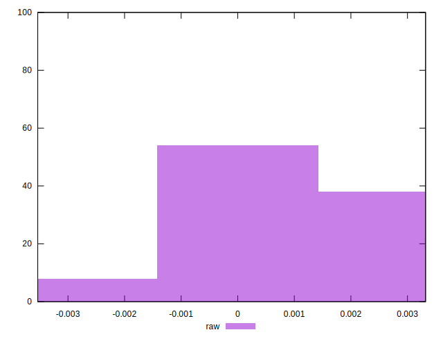

# //meta/pScore-difference/samples/astro-inner-cached

[→ Parent](../..)


## Raw


```yaml
p90min: -0.0020615579170432333
p90max: 0.002985559720118397
p90range: 0.00504711763716163
p90mean: 0.0008621624651782939
median: 0.0009368754555146741
p90stdev: 0.0011552058579483064
mad: 0.0008944235962442607
stdevBySn: 0.0013160494510666386
lfitCenter: 0.0008910727360029055
lfitStdev: 0.0009725112807621736
mfitCenter: 0.0008910727360029055
mfitStdev: 0.0012188621381045068
mfitConfidence: 0.00012188621381045069
p90skewness: -0.5019612877710641
p90eccentricity: 1.0000000000000013
p90discretization: 1
outlandishness: 0.9153509402639152

```

