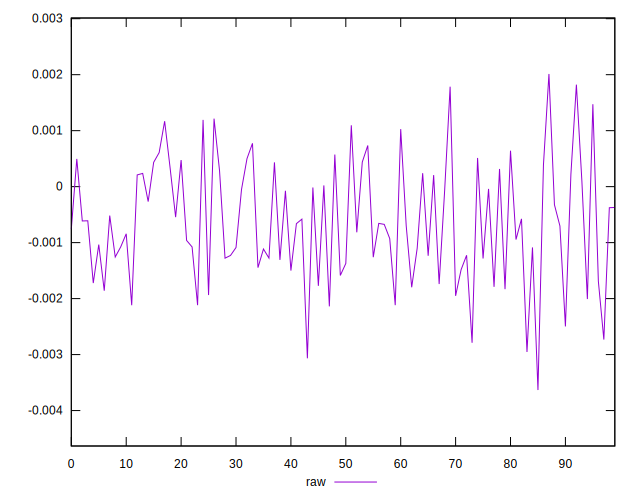
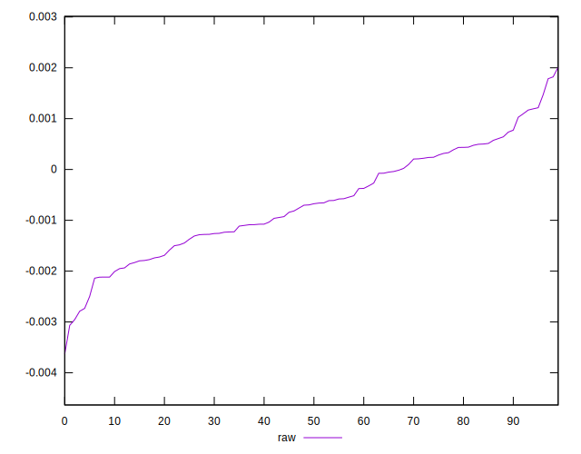
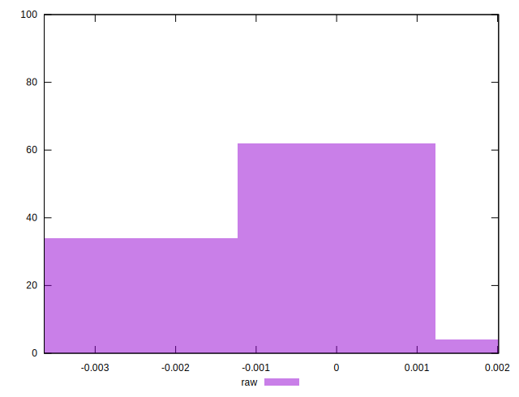

# //meta/pScore-difference/samples/astro-inner

[→ Parent](../..)


## Raw


```yaml
p90min: -0.00278861160107857
p90max: 0.0014725002453031288
p90range: 0.004261111846381699
p90mean: -0.0006410416553567736
median: -0.0006856852301365449
p90stdev: 0.0009986965554291793
mad: 0.0008979108546536968
stdevBySn: 0.0012455147942520377
lfitCenter: -0.0006543589741965668
lfitStdev: 0.000880806456620871
mfitCenter: -0.0006543589741965668
mfitStdev: 0.001103927185432528
mfitConfidence: 0.00011039271854325281
p90skewness: 0.0474307666625155
p90eccentricity: 0.9999999999999994
p90discretization: 1
outlandishness: 1.0058290977997237

```

