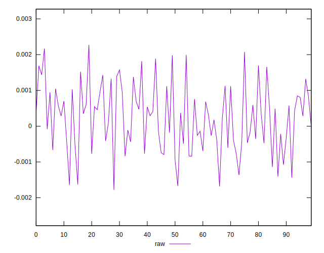
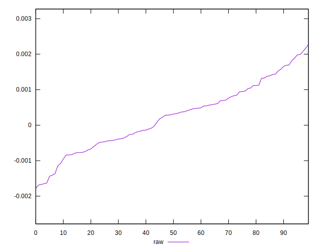
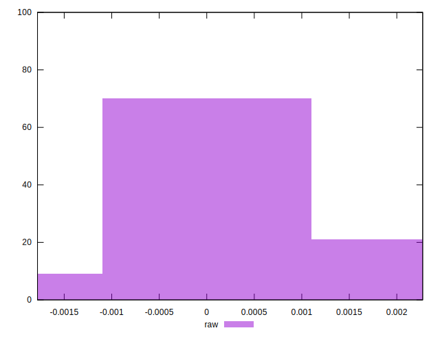

# //meta/pScore-difference/samples/astro

[→ Parent](../..)


## Raw


```yaml
p90min: -0.0016468770651427522
p90max: 0.0019915373688661826
p90range: 0.003638414434008935
p90mean: 0.00022608857992935825
median: 0.00030365241475664067
p90stdev: 0.0008941185043946549
mad: 0.0007377999738623957
stdevBySn: 0.001076831011523191
lfitCenter: 0.0002244209179314772
lfitStdev: 0.0007726990297681076
mfitCenter: 0.0002244209179314772
mfitStdev: 0.00096843461887282
mfitConfidence: 0.000096843461887282
p90skewness: 0.02132067859882973
p90eccentricity: 1
p90discretization: 1
outlandishness: 1.0019485607012044

```

