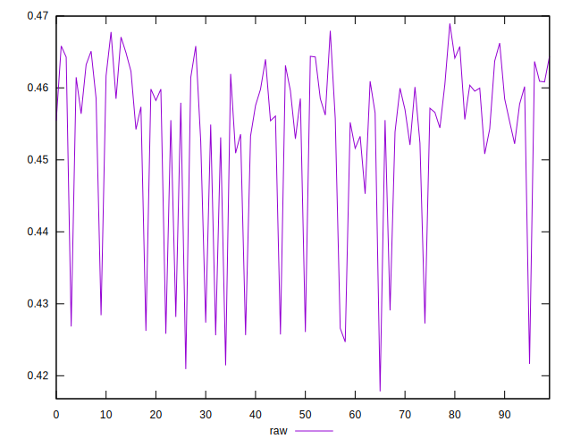
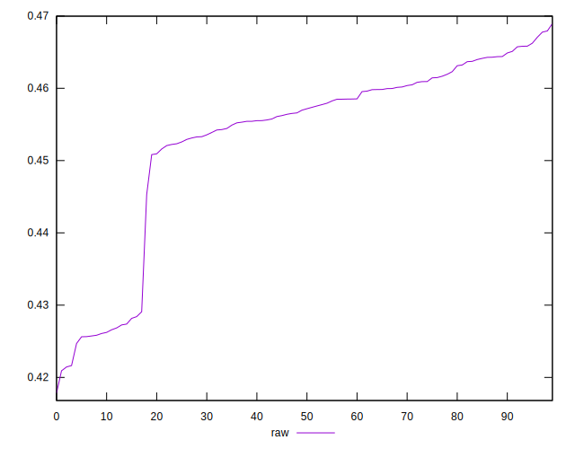
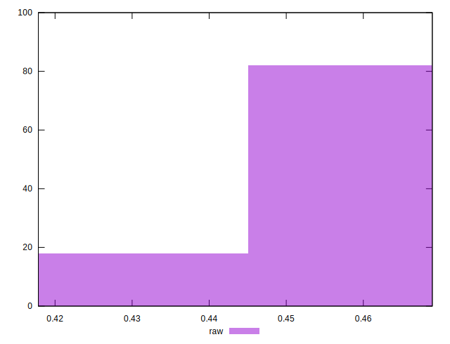

# //meta/pScore/samples/astro-cached

[→ Parent](../..)


## Raw


```yaml
p90min: 0.42164332385678877
p90max: 0.46706389807989346
p90range: 0.04542057422310469
p90mean: 0.45333215386398956
median: 0.45707092842813674
p90stdev: 0.012474215062455387
mad: 0.0043881162698342635
stdevBySn: 0.007404398377275983
lfitCenter: 0.45453868022281463
lfitStdev: 0.008508731827548325
mfitCenter: 0.45453868022281463
mfitStdev: 0.010664113900823355
mfitConfidence: 0.0010664113900823355
p90skewness: -1.4478771132389874
p90eccentricity: 1
p90discretization: 1
outlandishness: 0.9975688017477763

```

