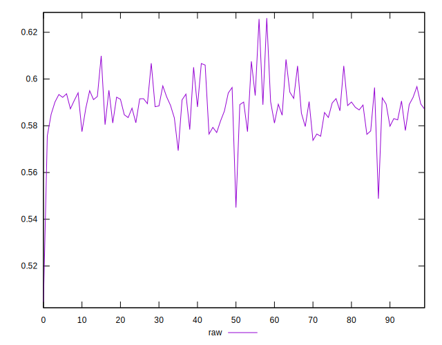
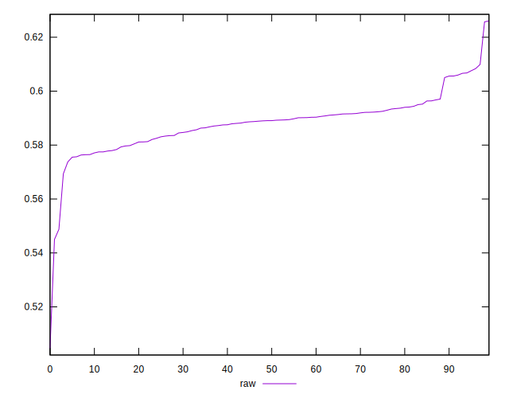
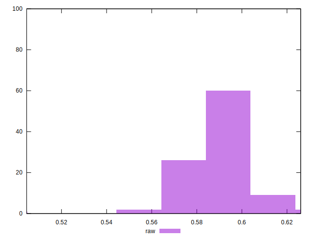

# //meta/pScore/samples/astro-inner-cached

[→ Parent](../..)


## Raw


```yaml
p90min: 0.5693483023302277
p90max: 0.6083831706343926
p90range: 0.039034868304164916
p90mean: 0.5885951486587383
median: 0.5890662458338763
p90stdev: 0.008045697924007663
mad: 0.004595406831337412
stdevBySn: 0.007869731202366139
lfitCenter: 0.5882696752832546
lfitStdev: 0.006913336328134517
mfitCenter: 0.5882696752832546
mfitStdev: 0.00866458216478649
mfitConfidence: 0.0008664582164786491
p90skewness: 0.3425421009375796
p90eccentricity: 1.0000000000000007
p90discretization: 1
outlandishness: 0.9975709995472917

```

