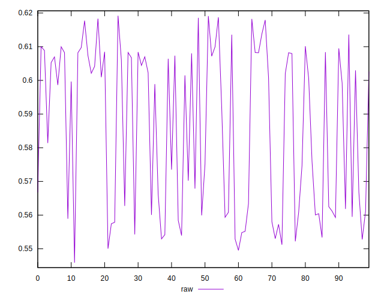
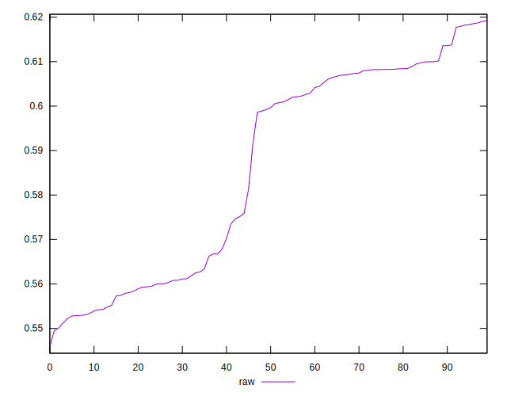
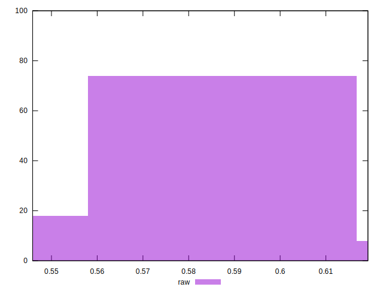

# //meta/pScore/samples/astro-inner

[→ Parent](../..)


## Raw


```yaml
p90min: 0.5512113883989214
p90max: 0.6185736790933692
p90range: 0.06736229069444788
p90mean: 0.5859972028743277
median: 0.5994392257501417
p90stdev: 0.023869760485011857
mad: 0.01884613794306572
stdevBySn: 0.02328212046768799
lfitCenter: 0.5871327027135042
lfitStdev: 0.026238246096132522
mfitCenter: 0.5871327027135042
mfitStdev: 0.03288476480373617
mfitConfidence: 0.003288476480373617
p90skewness: -0.19127997797515936
p90eccentricity: 1.0000000000000002
p90discretization: 1
outlandishness: 0.9995389241256429

```

