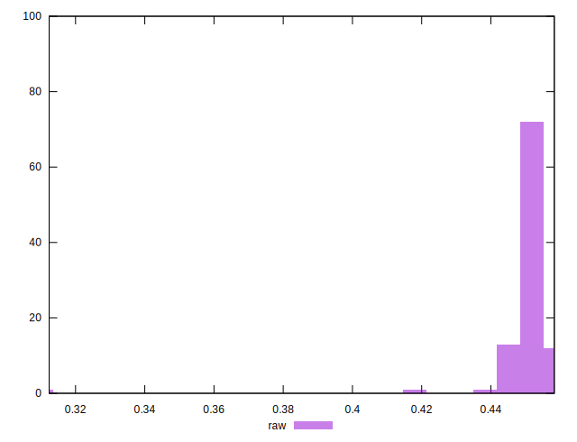

# //meta/pScore/samples/astro

[→ Parent](../..)


## Raw


```yaml
p90min: 0.44326547950952894
p90max: 0.45662137671293257
p90range: 0.013355897203403633
p90mean: 0.4515352711161443
median: 0.45189543457954173
p90stdev: 0.0027401791761213798
mad: 0.0019183205170038298
stdevBySn: 0.002813231741954201
lfitCenter: 0.4508574106738558
lfitStdev: 0.003480532876773351
mfitCenter: 0.4508574106738558
mfitStdev: 0.004362201064240861
mfitConfidence: 0.00043622010642408614
p90skewness: -0.5253386346415497
p90eccentricity: 0.9999999999999992
p90discretization: 1
outlandishness: 0.992533014780223

```

