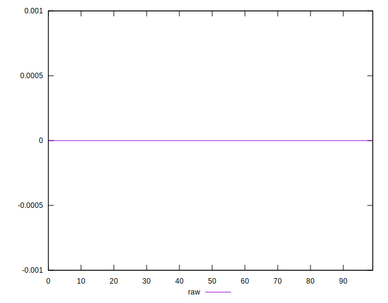

# //meta/score-difference/samples/astro-cached

[→ Parent](../..)


## Raw


```yaml
p90min: 0
p90max: 3.2653618371328135e-17
p90range: 3.2653618371328135e-17
p90mean: 5.55806270150266e-18
median: 0
p90stdev: 1.2271870164931907e-17
mad: 0
stdevBySn: 0
lfitCenter: 3.732930556737831e-18
lfitStdev: 8.287378039490712e-18
mfitCenter: 3.732930556737831e-18
mfitStdev: 1.038668806862325e-17
mfitConfidence: 1.038668806862325e-18
p90skewness: 1.7550294029241262
p90eccentricity: 0.9999999999999997
p90discretization: 47
outlandishness: 1.2460140625

```

