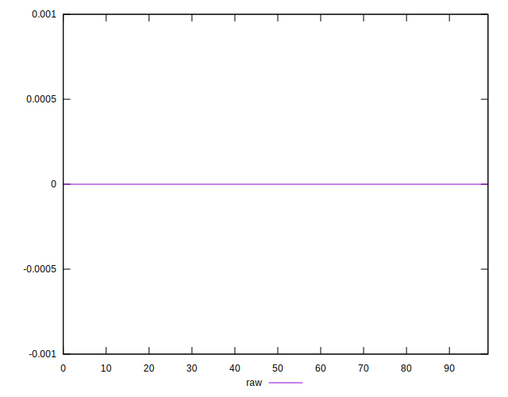

# //meta/score-difference/samples/astro-inner-cached

[→ Parent](../..)


## Raw


```yaml
p90min: 0
p90max: 2.7755575615628914e-17
p90range: 2.7755575615628914e-17
p90mean: 7.677074106450551e-18
median: 0
p90stdev: 1.2415480016191132e-17
mad: 0
stdevBySn: 0
lfitCenter: 5.7546618572183154e-18
lfitStdev: 1.147432997413503e-17
mfitCenter: 5.7546618572183154e-18
mfitStdev: 1.4380939987277146e-17
mfitConfidence: 1.4380939987277146e-18
p90skewness: 0.9988681377244384
p90eccentricity: 0.9999999999999997
p90discretization: 47
outlandishness: 1.14522925443787

```

