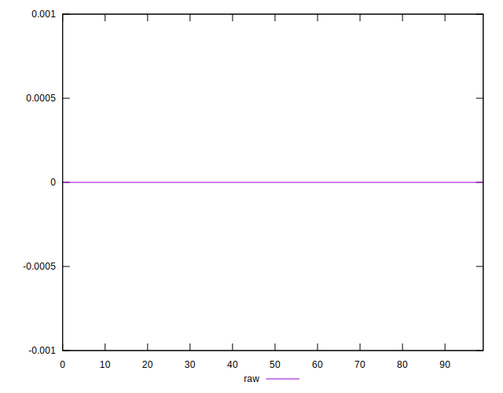

# //meta/score-difference/samples/astro-inner

[→ Parent](../..)


## Raw


```yaml
p90min: 0
p90max: 2.7755575615628914e-17
p90range: 2.7755575615628914e-17
p90mean: 1.9251739682329842e-17
median: 2.7755575615628914e-17
p90stdev: 1.264040431847902e-17
mad: 0
stdevBySn: 0
lfitCenter: 2.1389490933899473e-17
lfitStdev: 1.2383660912618017e-17
mfitCenter: 2.1389490933899473e-17
mfitStdev: 1.5520617309123034e-17
mfitConfidence: 1.5520617309123034e-18
p90skewness: -0.8452206464434878
p90eccentricity: 0.9999999999999997
p90discretization: 31.333333333333332
outlandishness: 1.0011045993451013

```

