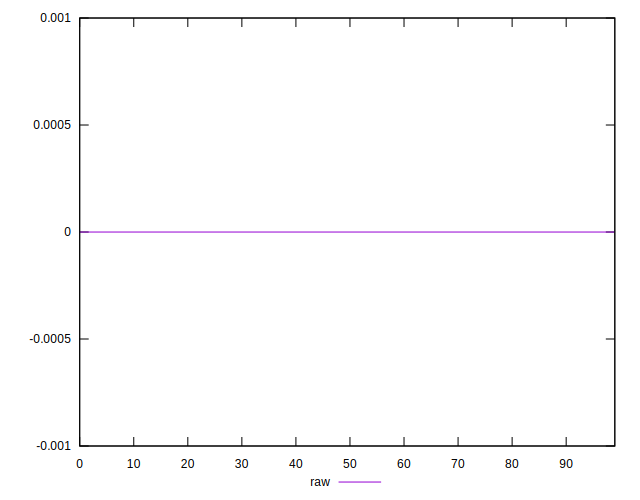

# //meta/score-difference/samples/astro

[→ Parent](../..)


## Raw


```yaml
p90min: 0
p90max: 0
p90range: 0
p90mean: 0
median: 0
p90stdev: 0
mad: 0
stdevBySn: 0
lfitCenter: 3.0795907212840954e-19
lfitStdev: 7.646586963354409e-19
mfitCenter: 3.0795907212840954e-19
mfitStdev: 9.583575553027883e-19
mfitConfidence: 9.583575553027883e-20
p90skewness: .nan
p90eccentricity: .nan
p90discretization: 94
outlandishness: .inf

```

