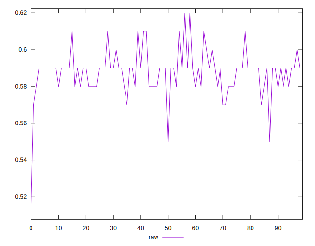
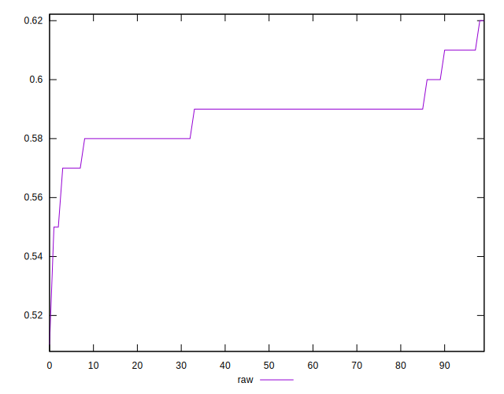
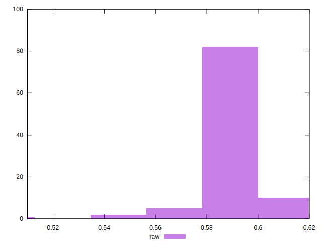

# //meta/score/samples/astro-inner-cached

[→ Parent](../..)


## Raw


```yaml
p90min: 0.57
p90max: 0.61
p90range: 0.040000000000000036
p90mean: 0.5881914893617026
median: 0.59
p90stdev: 0.008868155551645723
mad: 0
stdevBySn: 0
lfitCenter: 0.5880334247154189
lfitStdev: 0.007218213537189357
mfitCenter: 0.5880334247154189
mfitStdev: 0.009046689081424707
mfitConfidence: 0.0009046689081424707
p90skewness: 0.5440126997222958
p90eccentricity: 1.0000000000000002
p90discretization: 18.8
outlandishness: 0.9976501431590696

```

