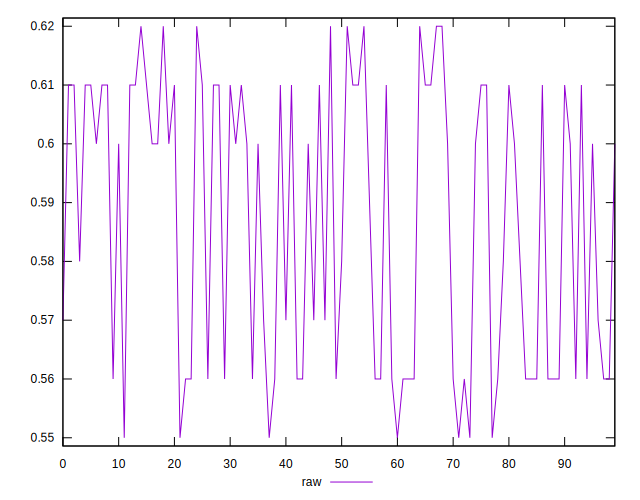
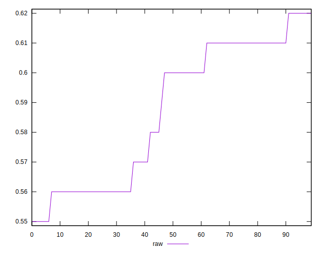
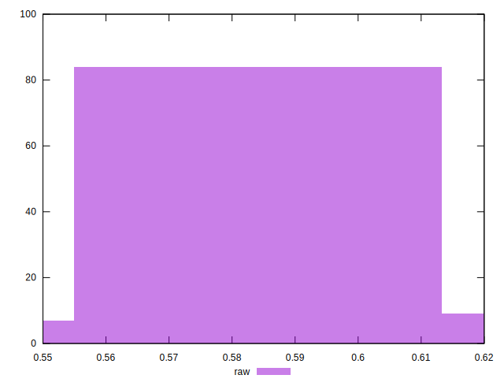

# //meta/score/samples/astro-inner

[→ Parent](../..)


## Raw


```yaml
p90min: 0.55
p90max: 0.62
p90range: 0.06999999999999995
p90mean: 0.587021276595745
median: 0.6
p90stdev: 0.023737473168238758
mad: 0.020000000000000018
stdevBySn: 0.023852000000000022
lfitCenter: 0.5879141354335737
lfitStdev: 0.025799762898025925
mfitCenter: 0.5879141354335737
mfitStdev: 0.032335207612020876
mfitConfidence: 0.0032335207612020876
p90skewness: -0.16400732990574546
p90eccentricity: 1.000000000000001
p90discretization: 11.75
outlandishness: 0.999586849496215

```

