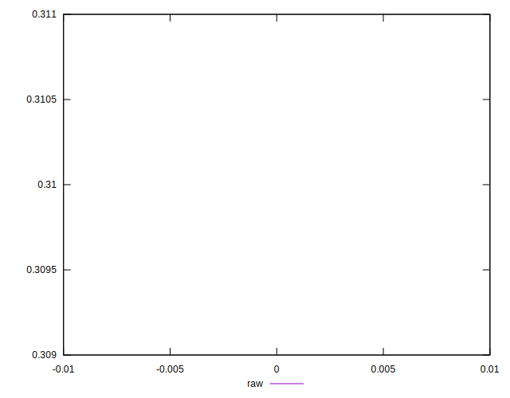
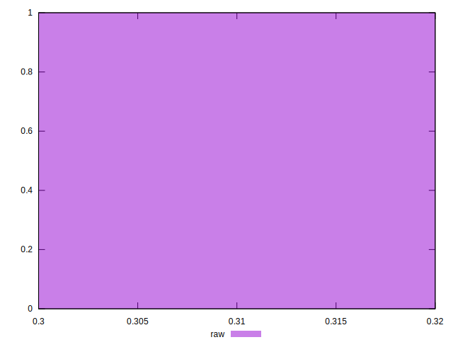

# //meta/score/samples/astro

[→ Parent](../..)


## Raw


```yaml
p90min: 0.31
p90max: 0.31
p90range: 0
p90mean: 0.31
median: 0.31
p90stdev: 0
mad: 0
stdevBySn: 0
lfitCenter: 0.31
lfitStdev: 0
mfitCenter: 0.31
mfitStdev: 0
mfitConfidence: 0
p90skewness: .nan
p90eccentricity: .nan
p90discretization: 1
outlandishness: 1

```

