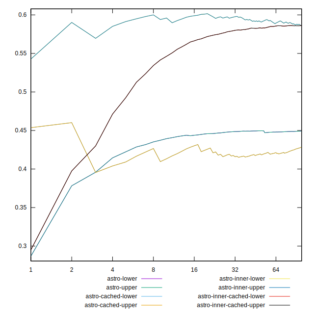
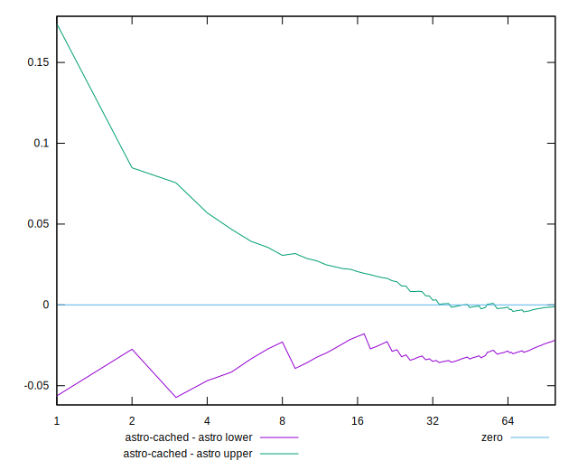
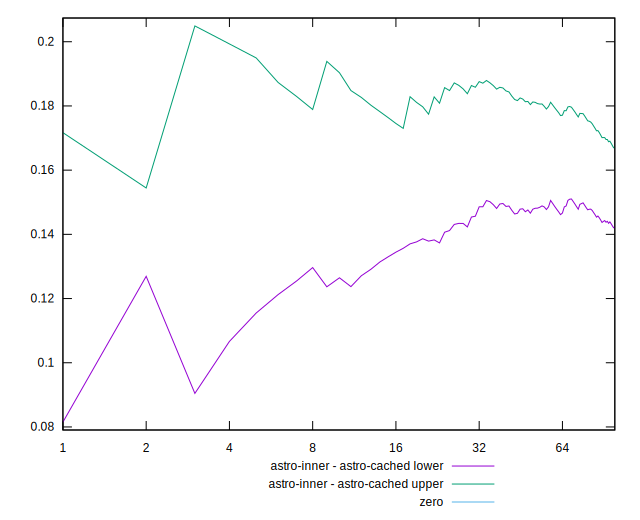
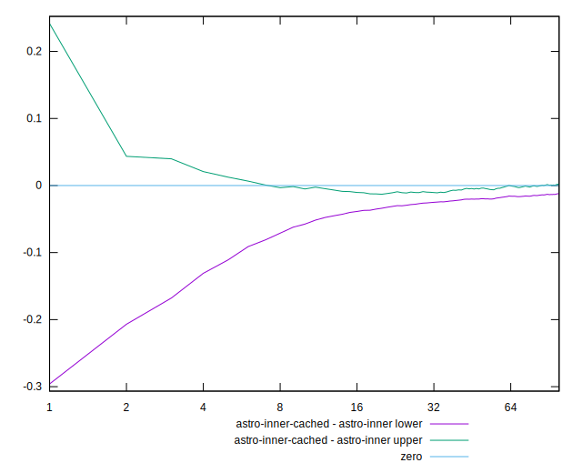
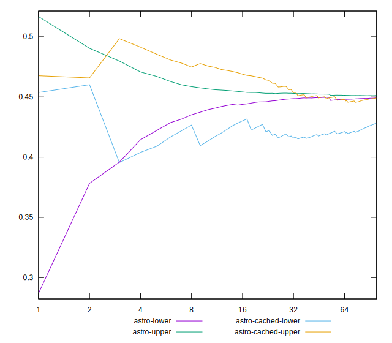
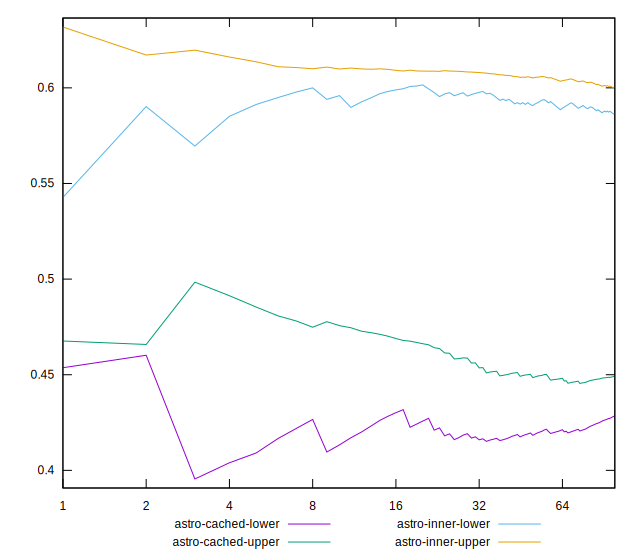
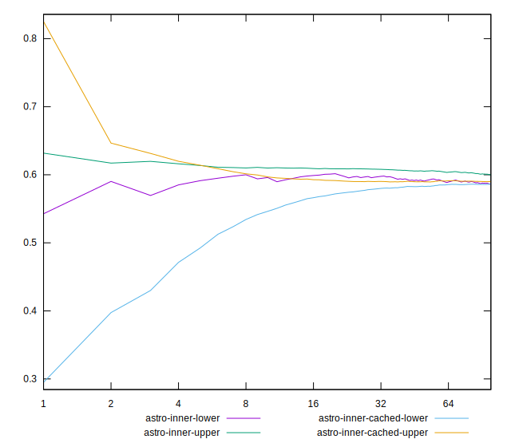

# //meta/scoreEstimate

[→ Parent](../..)

[0=astro](samples/astro)  
[1=astro-cached](samples/astro-cached)  
[2=astro-inner](samples/astro-inner)  
[3=astro-inner-cached](samples/astro-inner-cached)  

## Comparison

## Score Differentials

## Absolute value comparisons

