# //preload-lcp-image

[→ Parent](..)

[0=astro](samples/astro)  
[1=astro-cached](samples/astro-cached)  
[2=astro-inner](samples/astro-inner)  
[3=astro-inner-cached](samples/astro-inner-cached)  

## Progression

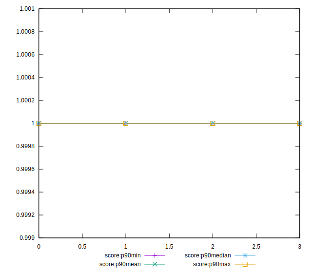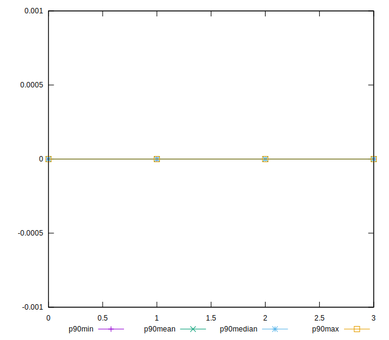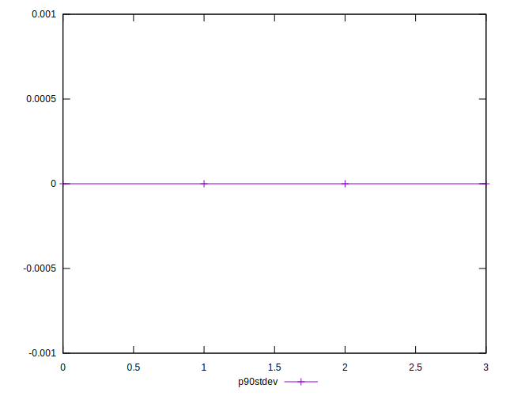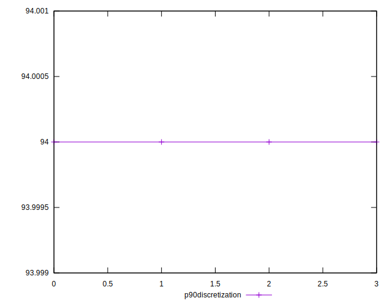
## Overall Histogram

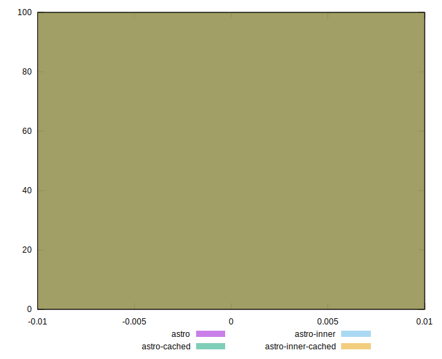
## Overall Sorted

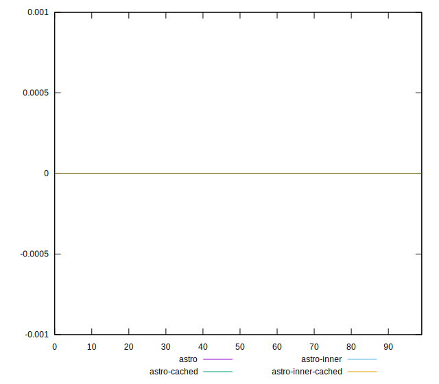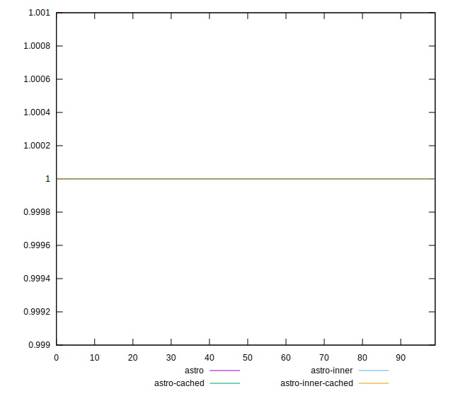
## Histogram comparison

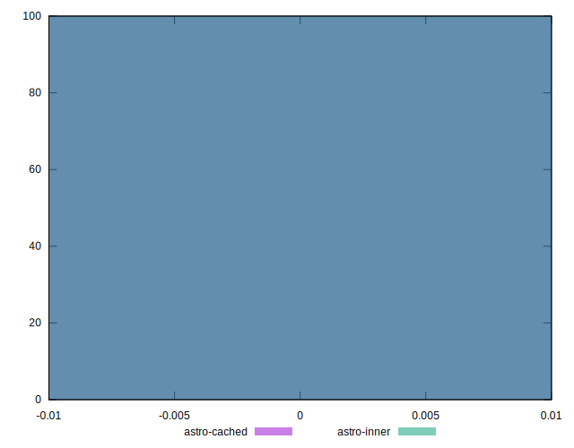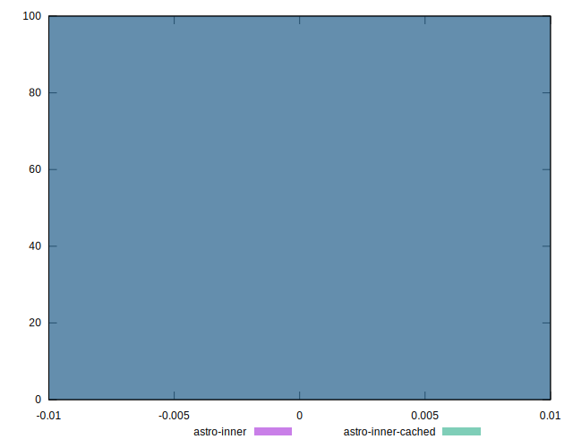
## Sorted comparisons

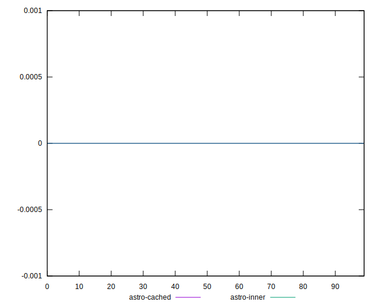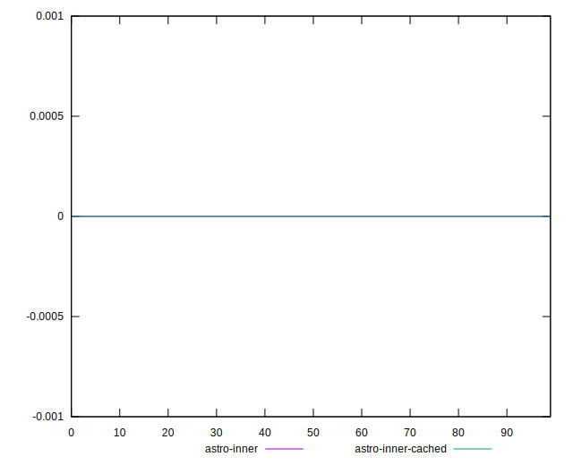
## Line plot comparisons

