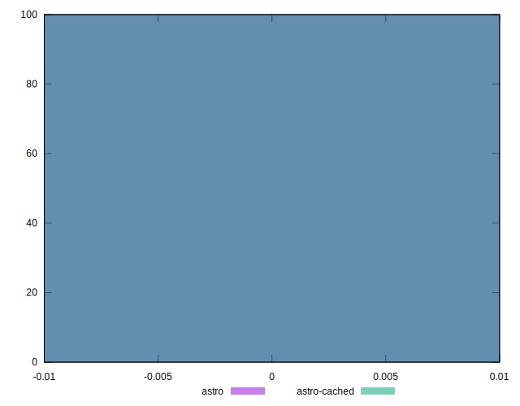
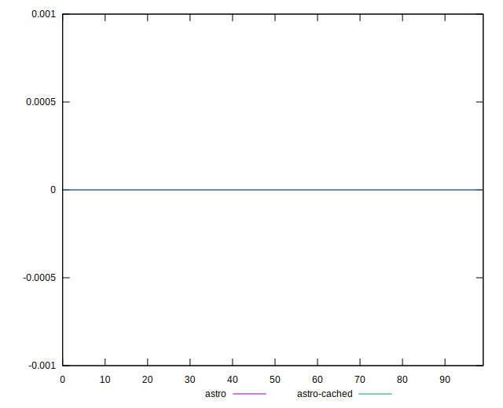

# //preload-lcp-image

[→ Parent](..)

[0=astro](samples/astro)  
[1=astro-cached](samples/astro-cached)  
[2=astro-inner](samples/astro-inner)  
[3=astro-inner-cached](samples/astro-inner-cached)  

## Progression

## Overall Histogram

## Overall Sorted

## Histogram comparison

## Sorted comparisons

## Line plot comparisons

