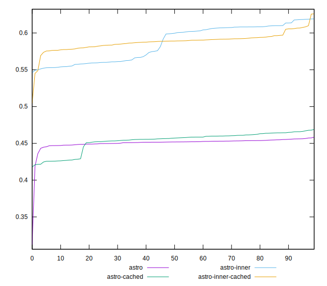

# Harmonicabsorber Mon Mar 01 2021 15:23:38 GMT+0100 (Central European Standard Time)

Comparing https://www.adobe.com/creativecloud/photography/hub/guides/camera-settings-for-astrophotography
to the inner CDN version.

```js
const maxWorkers = 1;
const E = (name, url) => [
  { name, url },
  { name: `${name}-cached`, url, intercept: cache },
];
const experiments = list(flat([
  E(`astro`, `https://www.adobe.com/creativecloud/photography/hub/guides/camera-settings-for-astrophotography`),
  E(`astro-inner`, `https://fedpub--adobe.hlx.live/creativecloud/photography/hub/guides/camera-settings-for-astrophotography`),
]));
```

Check out our [precise score](meta/pScore):



Conclusion: Enabling caching has minimal impact on score; the inner cdn
yields a much better score.

[Confidence intervals](meta/scoreEstimate) at two sigma (95% confidence, 1/20 false positives)
yield an effect size of around .15±.05 points pretty much immediately and
produce a more precise result of approx. .15±.03 points at a sample size of 100.
(Note that this result probably won't translate to other machines and even reproductions
of this experiment, but we can probably make the judgement here and say that disabling
the second cdn will produce an average increase in score of >5 points:
The second cdn has a large effect on scores for this site).


[Parent ../](../)

## Metas

[pScore](meta/pScore)  
[pScore-difference](meta/pScore-difference)  
[score](meta/score)  
[score-difference](meta/score-difference)  
[scoreEstimate](meta/scoreEstimate)  

## Measurements

[bootup-time](bootup-time)  
[cumulative-layout-shift](cumulative-layout-shift)  
[dom-size](dom-size)  
[duplicated-javascript](duplicated-javascript)  
[efficient-animated-content](efficient-animated-content)  
[estimated-input-latency](estimated-input-latency)  
[first-contentful-paint](first-contentful-paint)  
[first-cpu-idle](first-cpu-idle)  
[first-meaningful-paint](first-meaningful-paint)  
[font-display](font-display)  
[interactive](interactive)  
[largest-contentful-paint](largest-contentful-paint)  
[legacy-javascript](legacy-javascript)  
[mainthread-work-breakdown](mainthread-work-breakdown)  
[max-potential-fid](max-potential-fid)  
[metrics](metrics)  
[no-document-write](no-document-write)  
[offscreen-images](offscreen-images)  
[preload-lcp-image](preload-lcp-image)  
[redirects](redirects)  
[render-blocking-resources](render-blocking-resources)  
[screenshot-thumbnails](screenshot-thumbnails)  
[server-response-time](server-response-time)  
[speed-index](speed-index)  
[third-party-summary](third-party-summary)  
[timing-budget](timing-budget)  
[total-blocking-time](total-blocking-time)  
[total-byte-weight](total-byte-weight)  
[unminified-css](unminified-css)  
[unminified-javascript](unminified-javascript)  
[unsized-images](unsized-images)  
[unused-css-rules](unused-css-rules)  
[unused-javascript](unused-javascript)  
[uses-http2](uses-http2)  
[uses-long-cache-ttl](uses-long-cache-ttl)  
[uses-optimized-images](uses-optimized-images)  
[uses-passive-event-listeners](uses-passive-event-listeners)  
[uses-rel-preconnect](uses-rel-preconnect)  
[uses-rel-preload](uses-rel-preload)  
[uses-responsive-images](uses-responsive-images)  
[uses-text-compression](uses-text-compression)  
[uses-webp-images](uses-webp-images)  

## Variance/Correlation

[astro](correlation/astro)  
[astro-cached](correlation/astro-cached)  
[astro-inner](correlation/astro-inner)  
[astro-inner-cached](correlation/astro-inner-cached)  
