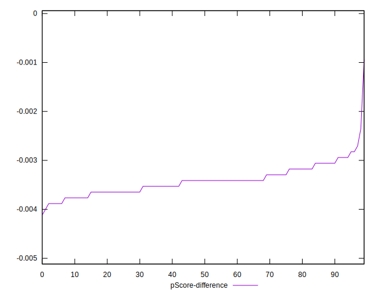

# //render-blocking-resources/samples/astro-cached

[→ Parent](../..)


## Raw


```yaml
p90min: 1624
p90max: 1633
p90range: 9
p90mean: 1629.2446808510638
median: 1629
p90stdev: 2.097040316644702
mad: 2
stdevBySn: 2.3852
lfitCenter: 1629.5312058938423
lfitStdev: 2.132020169633728
mfitCenter: 1629.5312058938423
mfitStdev: 2.672091022332514
mfitConfidence: 0.2672091022332514
p90skewness: -0.3112501983082931
p90eccentricity: 1.0000000000000016
p90discretization: 9.4
outlandishness: 1.00065724577756

```


## Score


```yaml
p90min: 0.4
p90max: 0.4
p90range: 0
p90mean: 0.39999999999999925
median: 0.4
p90stdev: 7.771561172376096e-16
mad: 0
stdevBySn: 0
lfitCenter: 0.39995346398647436
lfitStdev: 0.00011610565185041531
mfitCenter: 0.39995346398647436
mfitStdev: 0.0001455168550327823
mfitConfidence: 0.000014551685503278231
p90skewness: 1
p90eccentricity: 1
p90discretization: 94
outlandishness: 0.9995000625

```


## Raw Estimate


## Score Estimate


## P Score


```yaml
p90min: 0.3961176470588235
p90max: 0.3971764705882353
p90range: 0.0010588235294117787
p90mean: 0.39655944931163967
median: 0.39658823529411763
p90stdev: 0.00024671062548760965
mad: 0.00023529411764705577
stdevBySn: 0.00028061176470587875
lfitCenter: 0.3965257404830775
lfitStdev: 0.0002508259023098132
mfitCenter: 0.3965257404830775
mfitStdev: 0.00031436364968613157
mfitConfidence: 0.000031436364968613154
p90skewness: 0.3112501983062108
p90eccentricity: 1.0000000000000002
p90discretization: 9.4
outlandishness: 0.9996823995867486

```


## Score Difference


```yaml
p90min: 0
p90max: 0
p90range: 0
p90mean: 0
median: 0
p90stdev: 0
mad: 0
stdevBySn: 0
lfitCenter: 0
lfitStdev: 0
mfitCenter: 0
mfitStdev: 0
mfitConfidence: 0
p90skewness: .nan
p90eccentricity: .nan
p90discretization: 94
outlandishness: .nan

```


## P Score Difference


```yaml
p90min: -0.0038823529411765034
p90max: -0.0028235294117647247
p90range: 0.0010588235294117787
p90mean: -0.0034292866082603537
median: -0.003411764705882392
p90stdev: 0.0002504255065821098
mad: 0.00023529411764705577
stdevBySn: 0.00028061176470587875
lfitCenter: -0.0034234714495308045
lfitStdev: 0.00020796641717108302
mfitCenter: -0.0034234714495308045
mfitStdev: 0.0002606472509896457
mfitConfidence: 0.00002606472509896457
p90skewness: 0.38011173371788476
p90eccentricity: 0.9999999999999991
p90discretization: 9.4
outlandishness: 0.9850345165432359

```

