# //render-blocking-resources/samples/astro-inner-cached

[→ Parent](../..)


## Raw


```yaml
p90min: 1624
p90max: 1637
p90range: 13
p90mean: 1630.4255319148936
median: 1630
p90stdev: 3.068332979038948
mad: 2
stdevBySn: 3.5778000000000003
lfitCenter: 1630.6249372964728
lfitStdev: 3.070543598592662
mfitCenter: 1630.6249372964728
mfitStdev: 3.848355705232173
mfitConfidence: 0.38483557052321726
p90skewness: 0.19260330711536588
p90eccentricity: 1.0000000000000004
p90discretization: 6.714285714285714
outlandishness: 1.0007293512616464

```

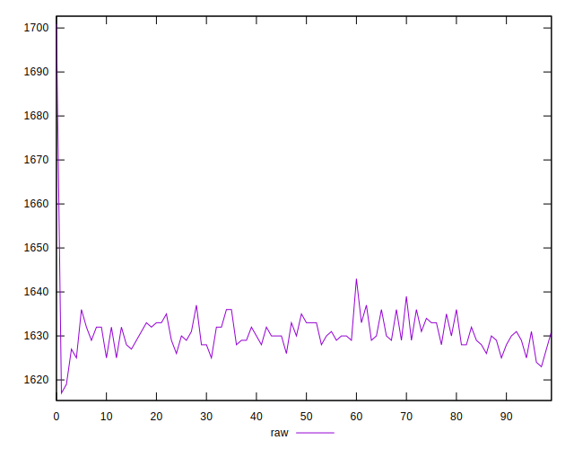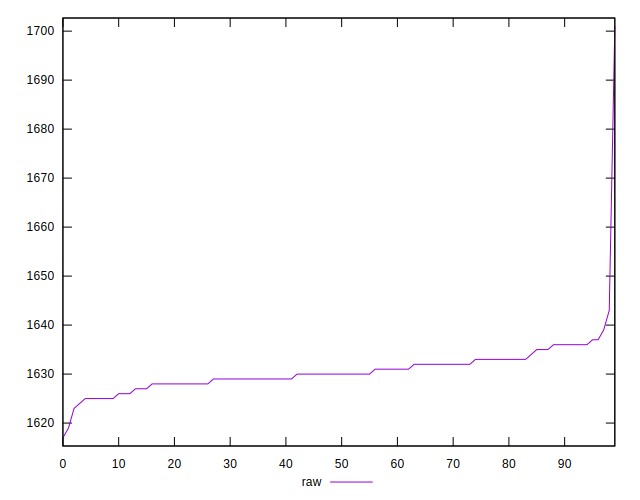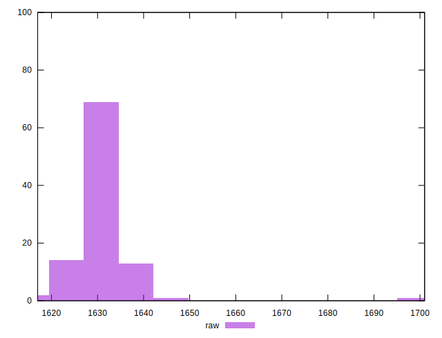
## Score


```yaml
p90min: 0.4
p90max: 0.4
p90range: 0
p90mean: 0.39999999999999925
median: 0.4
p90stdev: 7.771561172376096e-16
mad: 0
stdevBySn: 0
lfitCenter: 0.399905689143351
lfitStdev: 0.00023417273015219158
mfitCenter: 0.399905689143351
mfitStdev: 0.00029349199356883354
mfitConfidence: 0.000029349199356883354
p90skewness: 1
p90eccentricity: 1
p90discretization: 94
outlandishness: 0.9990002500000001

```

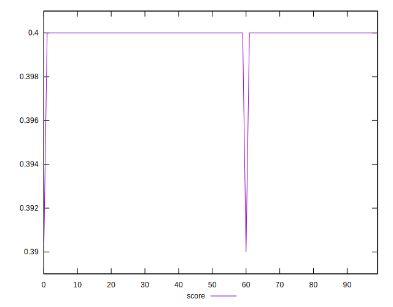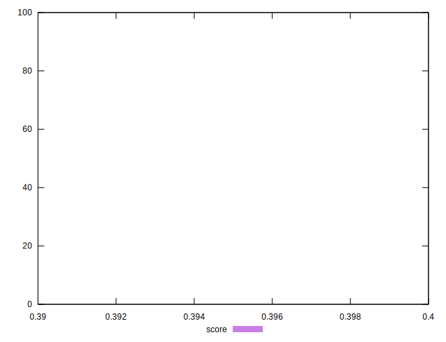
## Raw Estimate

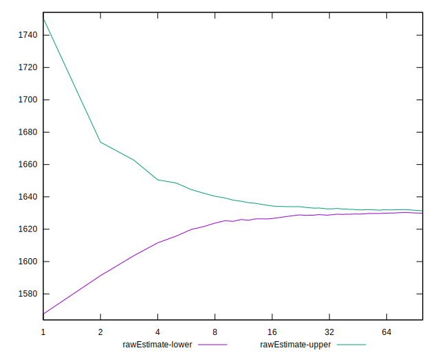
## Score Estimate

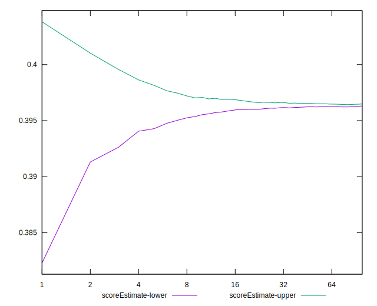
## P Score


```yaml
p90min: 0.3956470588235294
p90max: 0.3971764705882353
p90range: 0.0015294117647058902
p90mean: 0.39642052565707137
median: 0.39647058823529413
p90stdev: 0.00036098035047517265
mad: 0.00023529411764705577
stdevBySn: 0.000420917647058785
lfitCenter: 0.39639706620041526
lfitStdev: 0.000361240423363769
mfitCenter: 0.39639706620041526
mfitStdev: 0.0004527477300272222
mfitConfidence: 0.000045274773002722217
p90skewness: -0.19260330711286625
p90eccentricity: 1.0000000000000007
p90discretization: 6.714285714285714
outlandishness: 0.9996471865204213

```

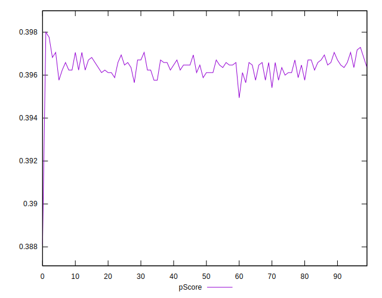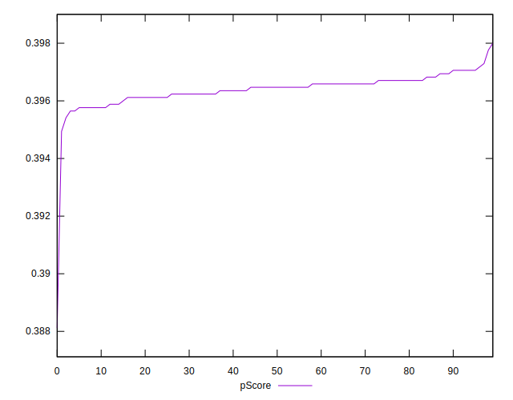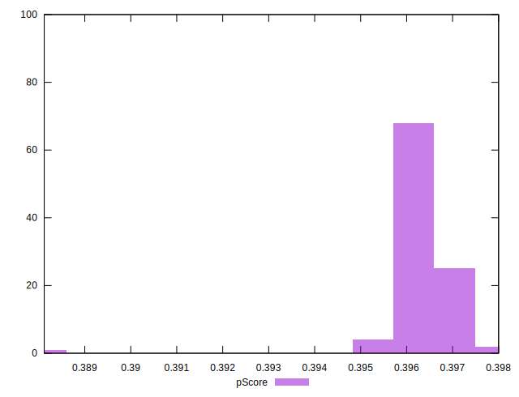
## Score Difference


```yaml
p90min: 0
p90max: 0
p90range: 0
p90mean: 0
median: 0
p90stdev: 0
mad: 0
stdevBySn: 0
lfitCenter: 0
lfitStdev: 0
mfitCenter: 0
mfitStdev: 0
mfitConfidence: 0
p90skewness: .nan
p90eccentricity: .nan
p90discretization: 94
outlandishness: .nan

```


## P Score Difference


```yaml
p90min: -0.004235294117647115
p90max: -0.002235294117647113
p90range: 0.0020000000000000018
p90mean: -0.0035394242803504653
median: -0.003529411764705892
p90stdev: 0.00037856876766449645
mad: 0.00023529411764705577
stdevBySn: 0.000420917647058785
lfitCenter: -0.003496816720524306
lfitStdev: 0.0003506961982663165
mfitCenter: -0.003496816720524306
mfitStdev: 0.0004395325036322504
mfitConfidence: 0.00004395325036322504
p90skewness: 0.3028643136931844
p90eccentricity: 1.0000000000000004
p90discretization: 6.266666666666667
outlandishness: 0.9497839555545776

```

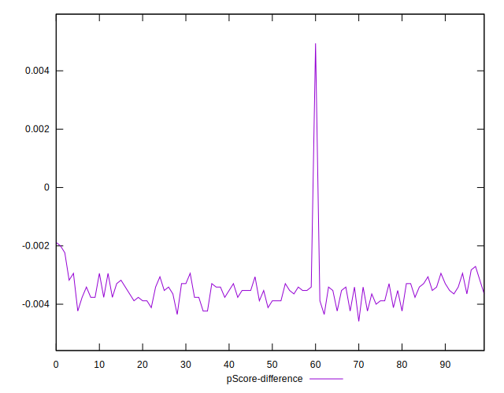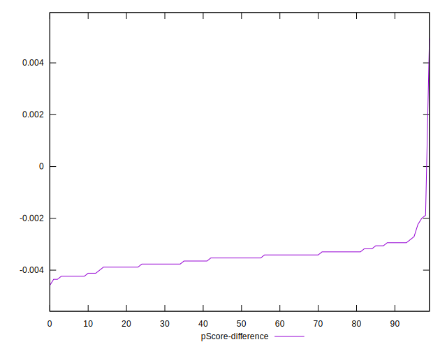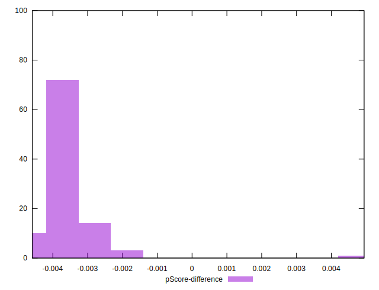