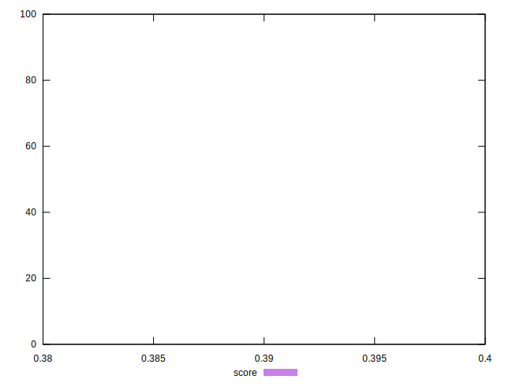

# //render-blocking-resources/samples/astro-inner

[→ Parent](../..)


## Raw


```yaml
p90min: 1683
p90max: 1714
p90range: 31
p90mean: 1697.1382978723404
median: 1693.5
p90stdev: 9.824633677140104
mad: 7.5
stdevBySn: 10.733400000000001
lfitCenter: 1696.5785727576088
lfitStdev: 9.619594218681383
mfitCenter: 1696.5785727576088
mfitStdev: 12.056373441643467
mfitConfidence: 1.2056373441643466
p90skewness: 0.3312771349109247
p90eccentricity: 1.0000000000000002
p90discretization: 3.1333333333333333
outlandishness: 1.0001080696903286

```


## Score


```yaml
p90min: 0.39
p90max: 0.39
p90range: 0
p90mean: 0.3900000000000004
median: 0.39
p90stdev: 3.885780586188048e-16
mad: 0
stdevBySn: 0
lfitCenter: 0.3900000000000004
lfitStdev: 0
mfitCenter: 0.3900000000000004
mfitStdev: 0
mfitConfidence: 0
p90skewness: -1
p90eccentricity: 1
p90discretization: 94
outlandishness: 1

```


## Raw Estimate


## Score Estimate


## P Score


```yaml
p90min: 0.3865882352941177
p90max: 0.39023529411764707
p90range: 0.003647058823529392
p90mean: 0.38857196495619517
median: 0.389
p90stdev: 0.0011558392561341305
mad: 0.0008823529411764452
stdevBySn: 0.0012627529411764875
lfitCenter: 0.3886378149696933
lfitStdev: 0.0011317169669036392
mfitCenter: 0.3886378149696933
mfitStdev: 0.0014183968754874004
mfitConfidence: 0.00014183968754874005
p90skewness: -0.3312771349104524
p90eccentricity: 1
p90discretization: 3.1333333333333333
outlandishness: 0.9999444718774801

```


## Score Difference


```yaml
p90min: 0
p90max: 0
p90range: 0
p90mean: 0
median: 0
p90stdev: 0
mad: 0
stdevBySn: 0
lfitCenter: 0
lfitStdev: 0
mfitCenter: 0
mfitStdev: 0
mfitConfidence: 0
p90skewness: .nan
p90eccentricity: .nan
p90discretization: 94
outlandishness: .nan

```


## P Score Difference


```yaml
p90min: -0.0034117647058823364
p90max: 0.00023529411764705577
p90range: 0.003647058823529392
p90mean: -0.0014280350438047726
median: -0.0010000000000000009
p90stdev: 0.0011558392561341303
mad: 0.0008823529411764452
stdevBySn: 0.0012627529411764875
lfitCenter: -0.0013621850303069134
lfitStdev: 0.0011317169669036891
mfitCenter: -0.0013621850303069134
mfitStdev: 0.0014183968754874628
mfitConfidence: 0.00014183968754874628
p90skewness: -0.33127713491092314
p90eccentricity: 1.0000000000000013
p90discretization: 3.1333333333333333
outlandishness: 1.0151666276718068

```

