# //render-blocking-resources/samples/astro

[→ Parent](../..)


## Raw


```yaml
p90min: 1687
p90max: 1712
p90range: 25
p90mean: 1699.127659574468
median: 1699
p90stdev: 8.074433044523529
mad: 8
stdevBySn: 10.733400000000001
lfitCenter: 1699.0388406562233
lfitStdev: 8.285869823742093
mfitCenter: 1699.0388406562233
mfitStdev: 10.384797800501483
mfitConfidence: 1.0384797800501482
p90skewness: 0.02919598900603149
p90eccentricity: 0.9999999999999989
p90discretization: 3.9166666666666665
outlandishness: 0.9998732806647979

```

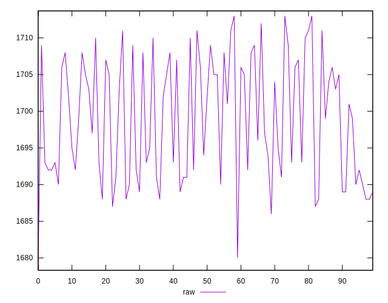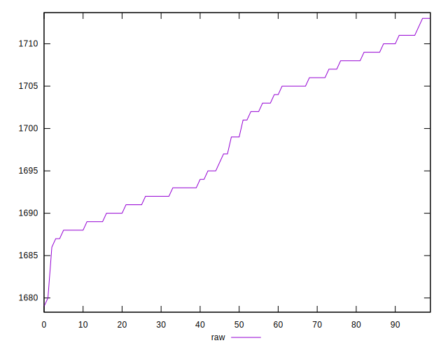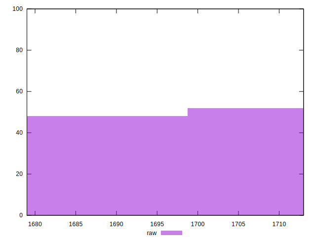
## Score


```yaml
p90min: 0.39
p90max: 0.39
p90range: 0
p90mean: 0.3900000000000004
median: 0.39
p90stdev: 3.885780586188048e-16
mad: 0
stdevBySn: 0
lfitCenter: 0.3900000000000004
lfitStdev: 0
mfitCenter: 0.3900000000000004
mfitStdev: 0
mfitConfidence: 0
p90skewness: -1
p90eccentricity: 1
p90discretization: 94
outlandishness: 1

```

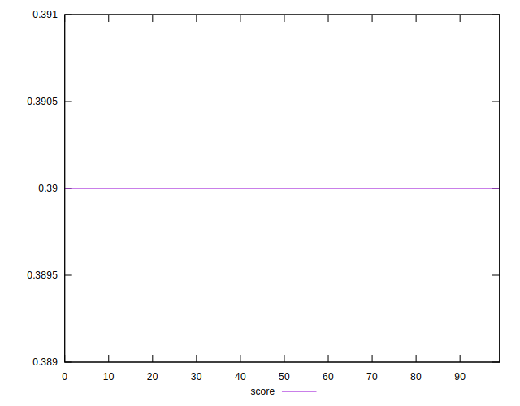
## Raw Estimate

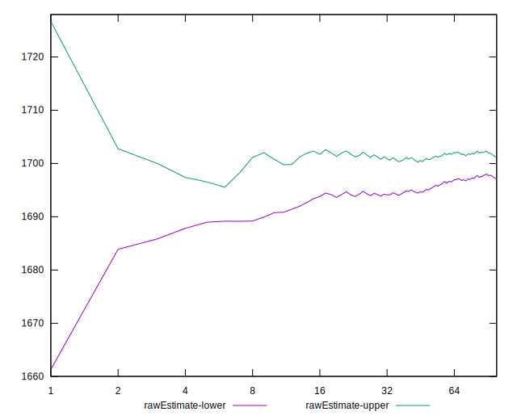
## Score Estimate

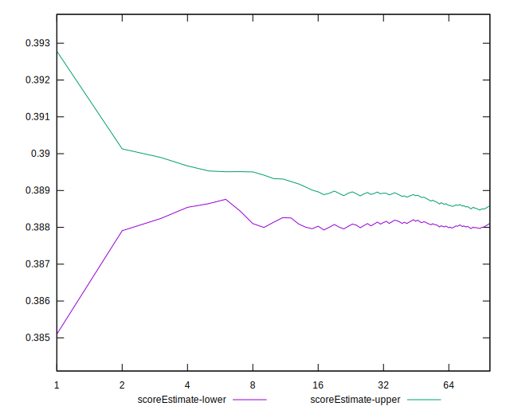
## P Score


```yaml
p90min: 0.3868235294117647
p90max: 0.38976470588235296
p90range: 0.0029411764705882804
p90mean: 0.38833792240300385
median: 0.38835294117647057
p90stdev: 0.0009499332993557102
mad: 0.0009411764705882231
stdevBySn: 0.0012627529411764875
lfitCenter: 0.3883483716875031
lfitStdev: 0.0009748082145578959
mfitCenter: 0.3883483716875031
mfitStdev: 0.00122174091770606
mfitConfidence: 0.000122174091770606
p90skewness: -0.029195989005621835
p90eccentricity: 1.0000000000000002
p90discretization: 3.9166666666666665
outlandishness: 1.0000652320471972

```

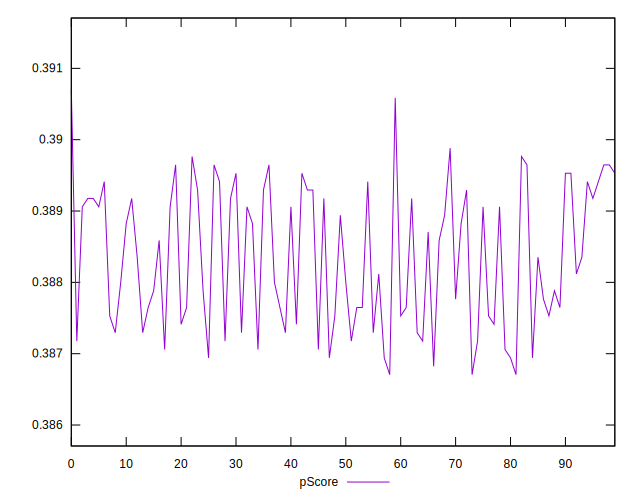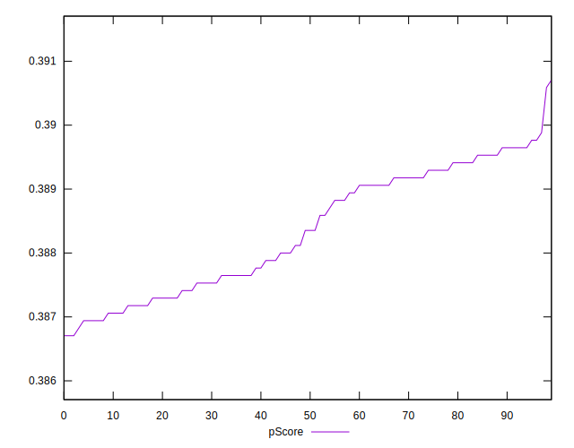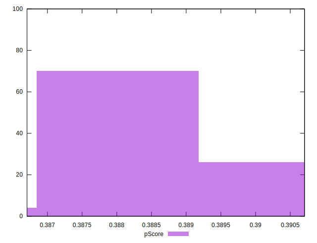
## Score Difference


```yaml
p90min: 0
p90max: 0
p90range: 0
p90mean: 0
median: 0
p90stdev: 0
mad: 0
stdevBySn: 0
lfitCenter: 0
lfitStdev: 0
mfitCenter: 0
mfitStdev: 0
mfitConfidence: 0
p90skewness: .nan
p90eccentricity: .nan
p90discretization: 94
outlandishness: .nan

```


## P Score Difference


```yaml
p90min: -0.003176470588235336
p90max: -0.00023529411764705577
p90range: 0.0029411764705882804
p90mean: -0.0016620775969962626
median: -0.0016470588235294459
p90stdev: 0.0009499332993557106
mad: 0.0009411764705882231
stdevBySn: 0.0012627529411764875
lfitCenter: -0.0016516283124968665
lfitStdev: 0.0009748082145578925
mfitCenter: -0.0016516283124968665
mfitStdev: 0.0012217409177060557
mfitConfidence: 0.00012217409177060556
p90skewness: -0.029195989005995064
p90eccentricity: 0.9999999999999997
p90discretization: 3.9166666666666665
outlandishness: 0.9848171078893894

```

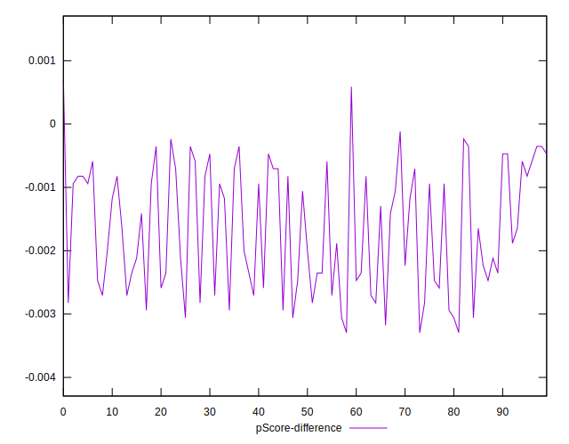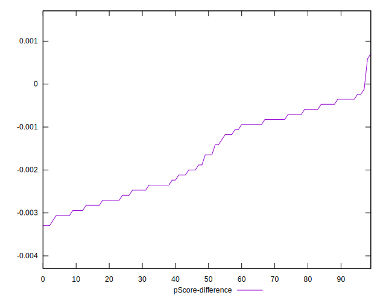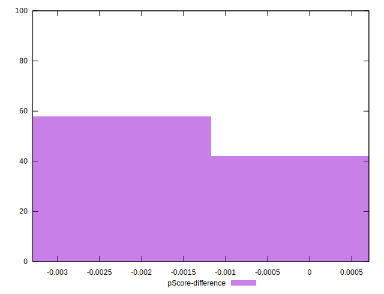