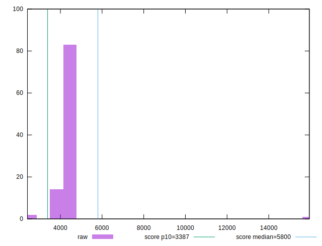
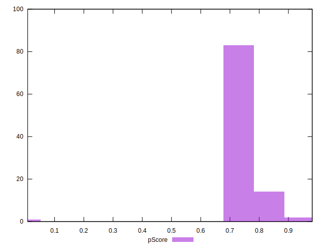

# //speed-index/samples/astro-inner-cached

[→ Parent](../..)


## Raw


```yaml
p90min: 3672.3270027475824
p90max: 4601.028072361616
p90range: 928.7010696140337
p90mean: 4325.267325552135
median: 4406.918942046686
p90stdev: 258.86228276325824
mad: 83.68626777588452
stdevBySn: 135.24685566918072
lfitCenter: 4392.296767323623
lfitStdev: 234.1558356268085
mfitCenter: 4392.296767323623
mfitStdev: 293.4708194213064
mfitConfidence: 29.347081942130636
p90skewness: -1.6690384621107193
p90eccentricity: 0.9999999999999997
p90discretization: 1
outlandishness: 1.0361757232585318

```


## Score


```yaml
p90min: 0.71
p90max: 0.86
p90range: 0.15000000000000002
p90mean: 0.7569148936170209
median: 0.74
p90stdev: 0.04272690606145532
mad: 0.020000000000000018
stdevBySn: 0.023852000000000022
lfitCenter: 0.7506464079914538
lfitStdev: 0.03240795329790364
mfitCenter: 0.7506464079914538
mfitStdev: 0.04061734607059402
mfitConfidence: 0.004061734607059402
p90skewness: 1.6033495185502198
p90eccentricity: 0.9999999999999996
p90discretization: 10.444444444444445
outlandishness: 0.9923127923991413

```


## Raw Estimate


## Score Estimate


## P Score


```yaml
p90min: 0.709431061767174
p90max: 0.8618914312571838
p90range: 0.15246036949000985
p90mean: 0.756560866189881
median: 0.7435782198054997
p90stdev: 0.04237025864386759
mad: 0.014567587509398239
stdevBySn: 0.023496696653774653
lfitCenter: 0.7502726628619444
lfitStdev: 0.03242886557058136
mfitCenter: 0.7502726628619444
mfitStdev: 0.04064355571761078
mfitConfidence: 0.004064355571761078
p90skewness: 1.61195685827904
p90eccentricity: 0.9999999999999996
p90discretization: 1
outlandishness: 0.9921561241721681

```


## Score Difference


```yaml
p90min: 0
p90max: 0
p90range: 0
p90mean: 0
median: 0
p90stdev: 0
mad: 0
stdevBySn: 0
lfitCenter: 5.166535369026208e-19
lfitStdev: 1.2890316797319448e-18
mfitCenter: 5.166535369026208e-19
mfitStdev: 1.6155616292812394e-18
mfitConfidence: 1.6155616292812395e-19
p90skewness: .nan
p90eccentricity: .nan
p90discretization: 94
outlandishness: .inf

```


## P Score Difference


```yaml
p90min: -0.004432347388146685
p90max: 0.004243208073096527
p90range: 0.008675555461243212
p90mean: -0.0004244545369599424
median: -0.0008348113489595743
p90stdev: 0.0024543279914764527
mad: 0.002151534142819711
stdevBySn: 0.002796036055827316
lfitCenter: -0.00047090091246295974
lfitStdev: 0.002092573897212334
mfitCenter: -0.00047090091246295974
mfitStdev: 0.0026226524513926347
mfitConfidence: 0.00026226524513926346
p90skewness: 0.17911802453303508
p90eccentricity: 0.9999999999999992
p90discretization: 1
outlandishness: 0.9429082108005813

```

