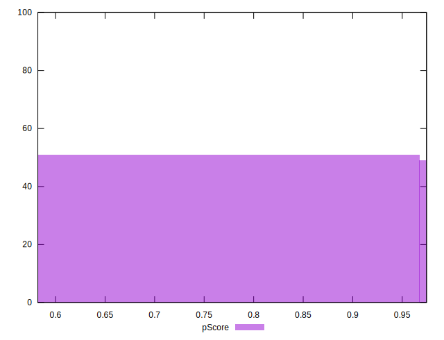

# //speed-index/samples/astro-inner

[→ Parent](../..)


## Raw


```yaml
p90min: 2558.2239999999993
p90max: 5141.353574402594
p90range: 2583.1295744025947
p90mean: 3643.571685737127
median: 2697.43205773819
p90stdev: 1139.8014561627574
mad: 139.53255773819
stdevBySn: 177.45844629620507
lfitCenter: 3566.357332115159
lfitStdev: 1337.463951853398
mfitCenter: 3566.357332115159
mfitStdev: 1676.2624806944477
mfitConfidence: 167.62624806944478
p90skewness: 0.22076171841309963
p90eccentricity: 1
p90discretization: 1
outlandishness: 1.0083020894474837

```


## Score


```yaml
p90min: 0.61
p90max: 0.97
p90range: 0.36
p90mean: 0.8282978723404252
median: 0.965
p90stdev: 0.15562255414037895
mad: 0.0050000000000000044
stdevBySn: 0.008944500000000008
lfitCenter: 0.8408870292076398
lfitStdev: 0.18123269801743722
mfitCenter: 0.8408870292076398
mfitStdev: 0.22714150279764433
mfitConfidence: 0.022714150279764433
p90skewness: -0.25939076731083127
p90eccentricity: 1
p90discretization: 5.222222222222222
outlandishness: 0.9934963525264079

```


## Raw Estimate


## Score Estimate


## P Score


```yaml
p90min: 0.6130142739191277
p90max: 0.9744204454515569
p90range: 0.36140617153242927
p90mean: 0.8294383993484841
median: 0.9659046547672615
p90stdev: 0.15724320151925392
mad: 0.008533790958836163
stdevBySn: 0.010905245039527636
lfitCenter: 0.8419351531595068
lfitStdev: 0.18263219023642485
mfitCenter: 0.8419351531595068
mfitStdev: 0.22889550618252952
mfitConfidence: 0.02288955061825295
p90skewness: -0.25992282287938073
p90eccentricity: 0.9999999999999996
p90discretization: 1
outlandishness: 0.993676955333643

```


## Score Difference


```yaml
p90min: 0
p90max: 1.1102230246251565e-16
p90range: 1.1102230246251565e-16
p90mean: 1.1810883240693154e-18
median: 0
p90stdev: 1.139000331521095e-17
mad: 0
stdevBySn: 0
lfitCenter: 2.1510305028010703e-18
lfitStdev: 5.2873683940481196e-18
mfitCenter: 2.1510305028010703e-18
mfitStdev: 6.626733564123762e-18
mfitConfidence: 6.626733564123762e-19
p90skewness: 9.539955591519908
p90eccentricity: 0.9999999999999997
p90discretization: 47
outlandishness: 14.137600000000003

```


## P Score Difference


```yaml
p90min: -0.004588465385186091
p90max: 0.004433260306294651
p90range: 0.009021725691480742
p90mean: 0.0012962146752844607
median: 0.002118531956324776
p90stdev: 0.0026029645198776047
mad: 0.0018526510073710867
stdevBySn: 0.002709402112472785
lfitCenter: 0.0014682127170669243
lfitStdev: 0.0023733639696331605
mfitCenter: 0.0014682127170669243
mfitStdev: 0.002974570619129615
mfitConfidence: 0.0002974570619129615
p90skewness: -0.5997921335457691
p90eccentricity: 0.9999999999999997
p90discretization: 1
outlandishness: 0.8742137981725688

```

