# //total-blocking-time/samples/astro-cached

[→ Parent](../..)


## Raw


```yaml
p90min: 318.5
p90max: 389.5
p90range: 71
p90mean: 362.3670212765957
median: 366.9999999999998
p90stdev: 19.082293164182406
mad: 11.5
stdevBySn: 19.528825
lfitCenter: 363.93832992346285
lfitStdev: 15.322763764423634
mfitCenter: 363.93832992346285
mfitStdev: 19.204236468021932
mfitConfidence: 1.9204236468021931
p90skewness: -0.888120337887118
p90eccentricity: 0.9999999999999994
p90discretization: 1.5161290322580645
outlandishness: 1.0015348270040783

```

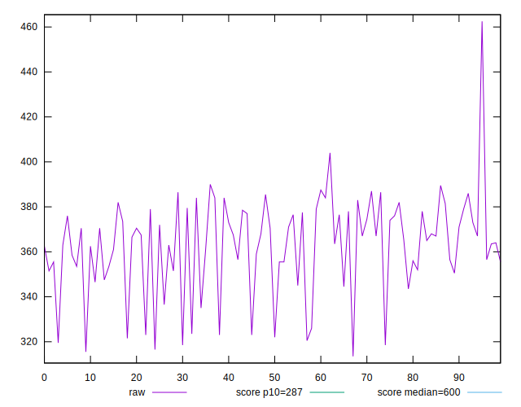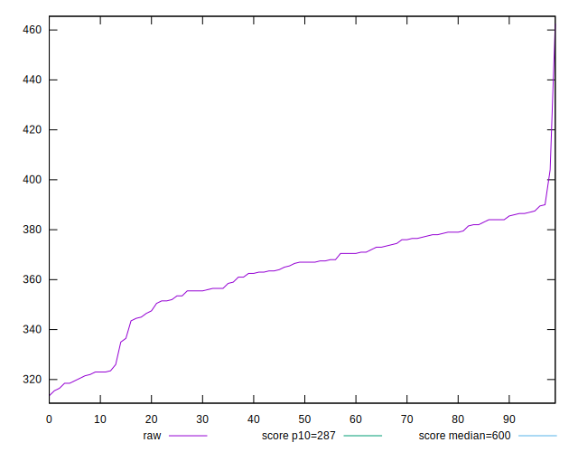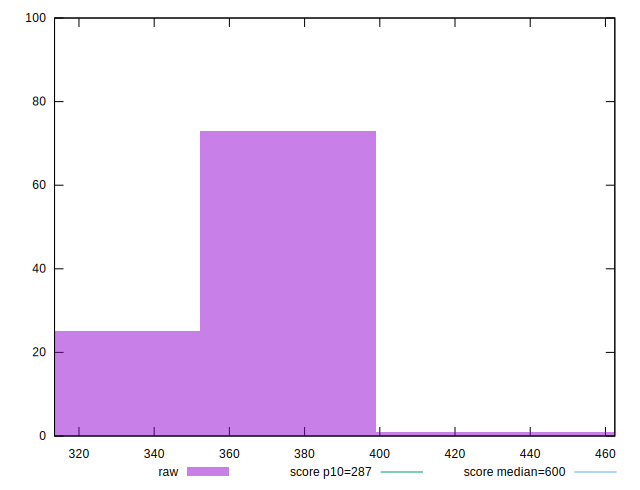
## Score


```yaml
p90min: 0.77
p90max: 0.86
p90range: 0.08999999999999997
p90mean: 0.8088297872340421
median: 0.8
p90stdev: 0.024182655248097693
mad: 0.019999999999999907
stdevBySn: 0.023852000000000022
lfitCenter: 0.8068748821417454
lfitStdev: 0.02032102914592317
mfitCenter: 0.8068748821417454
mfitStdev: 0.025468633139013454
mfitConfidence: 0.0025468633139013454
p90skewness: 0.8185457041199258
p90eccentricity: 0.9999999999999978
p90discretization: 10.444444444444445
outlandishness: 0.9986904198241383

```

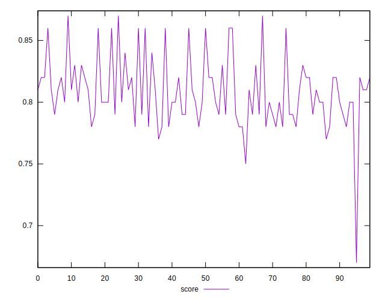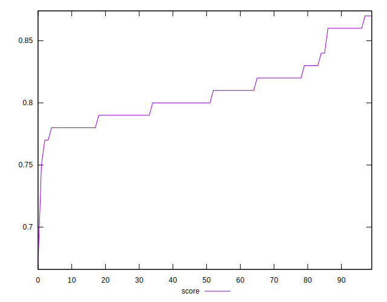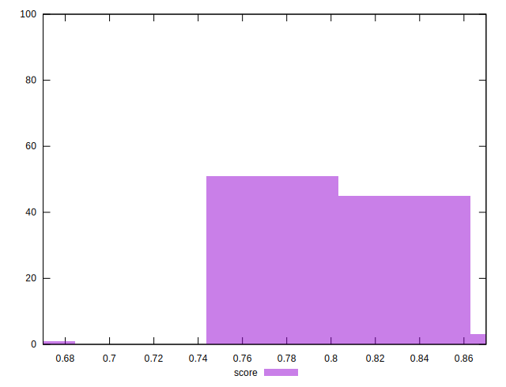
## Raw Estimate

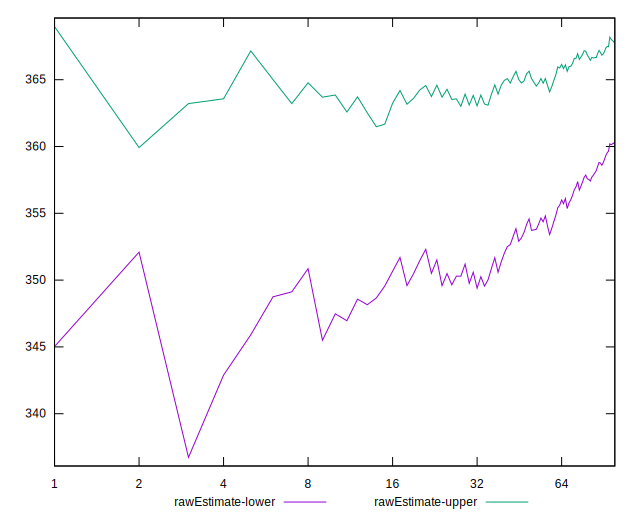
## Score Estimate

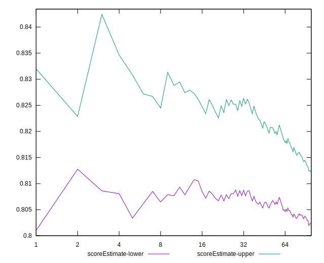
## P Score


```yaml
p90min: 0.7736294901172684
p90max: 0.8644589997305396
p90range: 0.09082950961327119
p90mean: 0.80919823913459
median: 0.8035186874875311
p90stdev: 0.024452598937392014
mad: 0.015074737116365367
stdevBySn: 0.025676810815312187
lfitCenter: 0.8072269730716839
lfitStdev: 0.019807447332045265
mfitCenter: 0.8072269730716839
mfitStdev: 0.02482495379036444
mfitConfidence: 0.002482495379036444
p90skewness: 0.8315061037848268
p90eccentricity: 0.9999999999999997
p90discretization: 1.5161290322580645
outlandishness: 0.9988017792551339

```

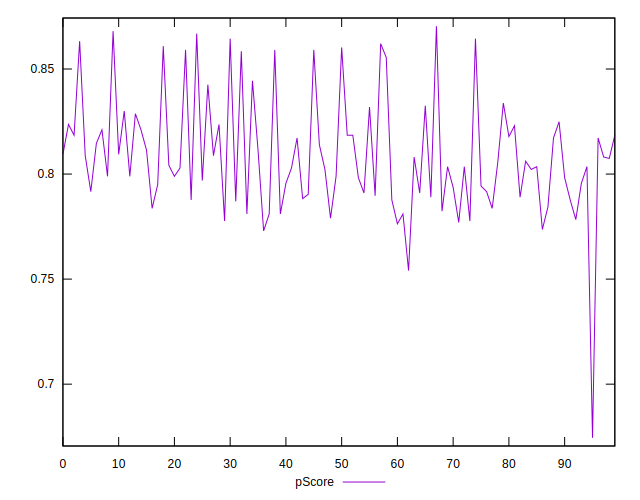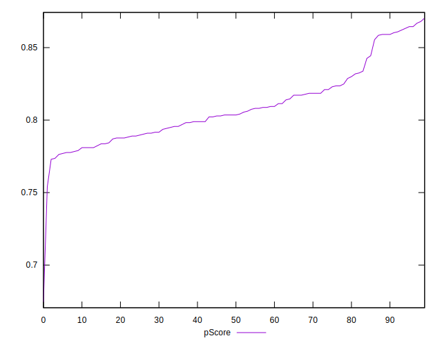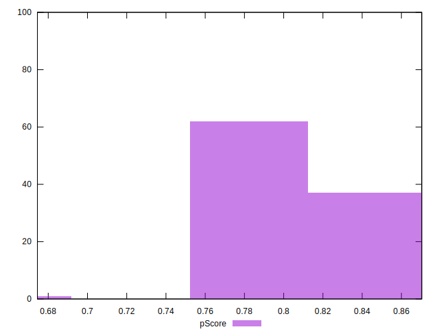
## Score Difference


```yaml
p90min: 0
p90max: 1.1102230246251565e-16
p90range: 1.1102230246251565e-16
p90mean: 1.8897413185109047e-17
median: 0
p90stdev: 4.172435856076854e-17
mad: 0
stdevBySn: 0
lfitCenter: 1.2691963892908624e-17
lfitStdev: 2.817708533426843e-17
mfitCenter: 1.2691963892908624e-17
mfitStdev: 3.531473943331906e-17
mfitConfidence: 3.531473943331906e-18
p90skewness: 1.7550294029241171
p90eccentricity: 0.9999999999999971
p90discretization: 47
outlandishness: 1.2460140625

```

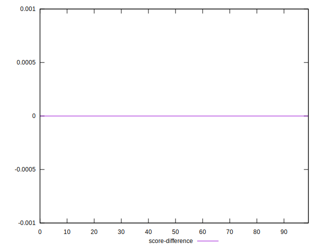
## P Score Difference


```yaml
p90min: -0.004380633428979319
p90max: 0.004482687641497285
p90range: 0.008863321070476604
p90mean: 0.0004288381051893985
median: 0.0003013040529620814
p90stdev: 0.0025037769946597557
mad: 0.0022430719953710487
stdevBySn: 0.003144676611789285
lfitCenter: 0.00036003975170718867
lfitStdev: 0.002376364699353256
mfitCenter: 0.00036003975170718867
mfitStdev: 0.002978331476113858
mfitConfidence: 0.0002978331476113858
p90skewness: 0.11416969940881709
p90eccentricity: 1
p90discretization: 1.492063492063492
outlandishness: 0.9288232368890244

```

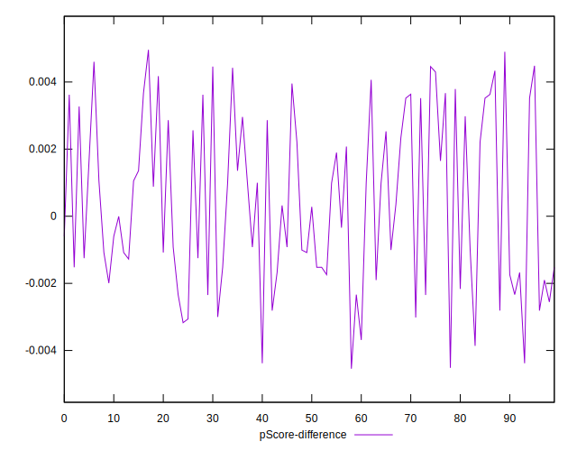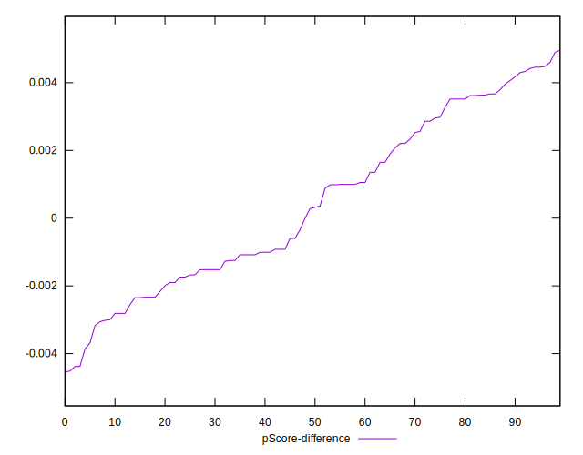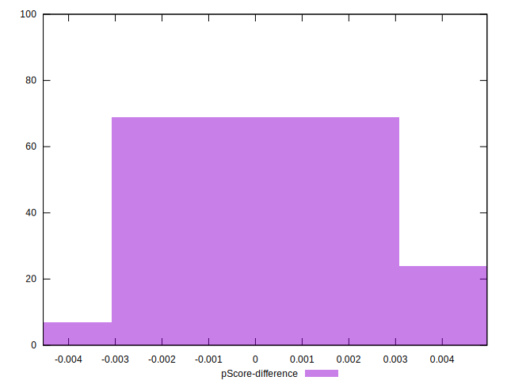