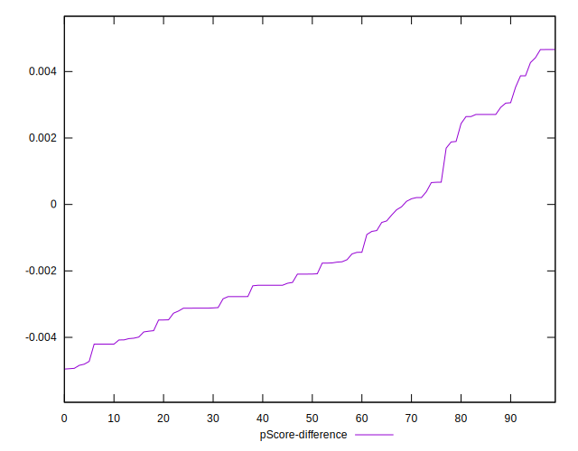

# //total-blocking-time/samples/astro-inner-cached

[→ Parent](../..)


## Raw


```yaml
p90min: 157
p90max: 272.9999999999991
p90range: 115.99999999999909
p90mean: 191.99602340425534
median: 170.97074999999995
p90stdev: 35.34870194266722
mad: 7.970749999999953
stdevBySn: 13.101158225000516
lfitCenter: 189.6657209805716
lfitStdev: 37.98979960898558
mfitCenter: 189.6657209805716
mfitStdev: 47.61315297163487
mfitConfidence: 4.7613152971634864
p90skewness: 0.7884006441326724
p90eccentricity: 0.9999999999999997
p90discretization: 1.1325301204819278
outlandishness: 1.0614393050063584

```


## Score


```yaml
p90min: 0.91
p90max: 0.99
p90range: 0.07999999999999996
p90mean: 0.9734042553191479
median: 0.99
p90stdev: 0.021809289036445863
mad: 0
stdevBySn: 0
lfitCenter: 0.9736143424638676
lfitStdev: 0.025687954257590014
mfitCenter: 0.9736143424638676
mfitStdev: 0.032195076262147515
mfitConfidence: 0.0032195076262147514
p90skewness: -0.8884435682802346
p90eccentricity: 1.0000000000000022
p90discretization: 13.428571428571429
outlandishness: 0.9860685345229773

```


## Raw Estimate


## Score Estimate


## P Score


```yaml
p90min: 0.9144159850101896
p90max: 0.9900934683498566
p90range: 0.07567748333966695
p90mean: 0.9721687560435233
median: 0.9854322441162505
p90stdev: 0.02120133738684448
mad: 0.0028051223578458573
stdevBySn: 0.004496275179062493
lfitCenter: 0.9723952939061661
lfitStdev: 0.025220330336393745
mfitCenter: 0.9723952939061661
mfitStdev: 0.03160899659017558
mfitConfidence: 0.0031608996590175584
p90skewness: -0.9121597376348702
p90eccentricity: 0.9999999999999994
p90discretization: 1.1325301204819278
outlandishness: 0.9862439942693048

```


## Score Difference


```yaml
p90min: 0
p90max: 1.1102230246251565e-16
p90range: 1.1102230246251565e-16
p90mean: 3.0708296425802203e-17
median: 0
p90stdev: 4.9661920064764527e-17
mad: 0
stdevBySn: 0
lfitCenter: 2.2708655306731685e-17
lfitStdev: 4.5279220695042594e-17
mfitCenter: 2.2708655306731685e-17
mfitStdev: 5.67490874808288e-17
mfitConfidence: 5.67490874808288e-18
p90skewness: 0.9988681377244384
p90eccentricity: 0.9999999999999997
p90discretization: 47
outlandishness: 1.0992715976331358

```


## P Score Difference


```yaml
p90min: -0.004842125827874022
p90max: 0.004660887594568841
p90range: 0.009503013422442863
p90mean: -0.001204859739725958
median: -0.0020954633137412193
p90stdev: 0.0025822952929221168
mad: 0.0017589168981209102
stdevBySn: 0.002439083351066266
lfitCenter: -0.0014019128161070439
lfitStdev: 0.002215228274555941
mfitCenter: -0.0014019128161070439
mfitStdev: 0.0027763769166756916
mfitConfidence: 0.00027763769166756915
p90skewness: 0.6963467773085894
p90eccentricity: 1.0000000000000002
p90discretization: 1.1325301204819278
outlandishness: 0.8967712147702716

```

