# //total-blocking-time/samples/astro-inner

[→ Parent](../..)


## Raw


```yaml
p90min: 153.9999999999991
p90max: 265
p90range: 111.00000000000091
p90mean: 229.68716063829783
median: 233
p90stdev: 25.129269310984508
mad: 5
stdevBySn: 7.307358350001089
lfitCenter: 230.95638967027955
lfitStdev: 13.234026401689686
mfitCenter: 230.95638967027955
mfitStdev: 16.586392399534194
mfitConfidence: 1.6586392399534193
p90skewness: -1.8877262541965267
p90eccentricity: 0.9999999999999997
p90discretization: 1.146341463414634
outlandishness: 0.9906360130393851

```

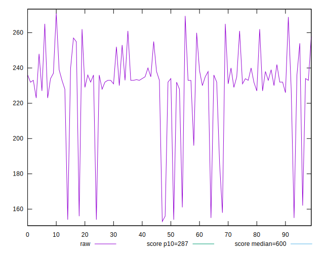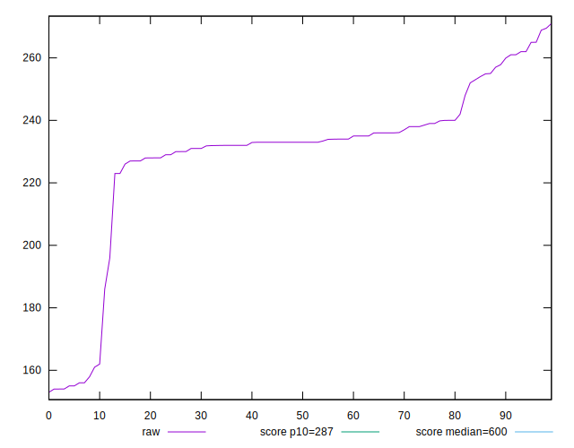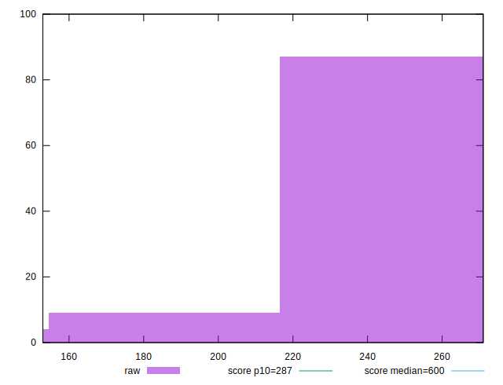
## Score


```yaml
p90min: 0.92
p90max: 0.99
p90range: 0.06999999999999995
p90mean: 0.9504255319148948
median: 0.95
p90stdev: 0.015152760693416888
mad: 0
stdevBySn: 0
lfitCenter: 0.9501618604898603
lfitStdev: 0.007162704576766124
mfitCenter: 0.9501618604898603
mfitStdev: 0.008977118916508578
mfitConfidence: 0.0008977118916508578
p90skewness: 1.1204687507976077
p90eccentricity: 1
p90discretization: 11.75
outlandishness: 1.0005776522345868

```

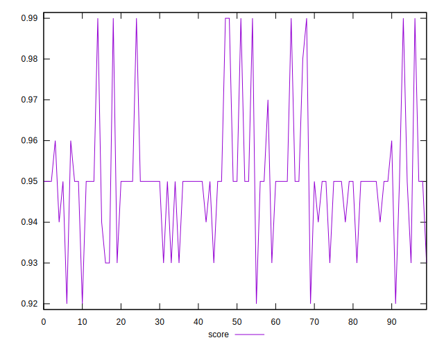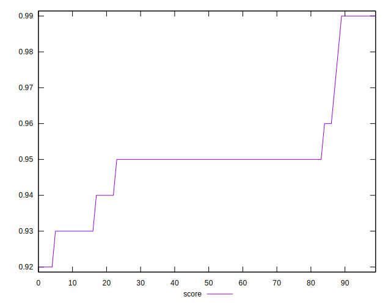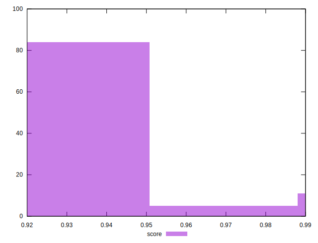
## Raw Estimate

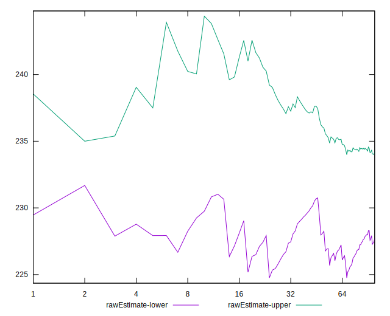
## Score Estimate

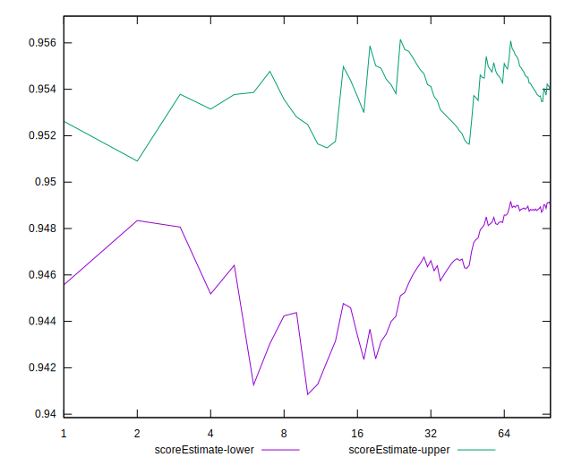
## P Score


```yaml
p90min: 0.9222174953399462
p90max: 0.9909458736013544
p90range: 0.06872837826140821
p90mean: 0.950424049629422
median: 0.9498901670316494
p90stdev: 0.015256798828518853
mad: 0.0037825899421030096
stdevBySn: 0.0057172702956887565
lfitCenter: 0.9500433543182634
lfitStdev: 0.008220002009870758
mfitCenter: 0.9500433543182634
mfitStdev: 0.010302244738099403
mfitConfidence: 0.0010302244738099402
p90skewness: 1.0919950208087146
p90eccentricity: 1.0000000000000007
p90discretization: 1.146341463414634
outlandishness: 1.0004909465238037

```

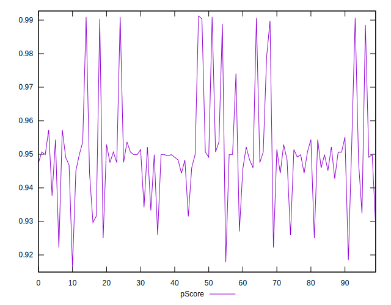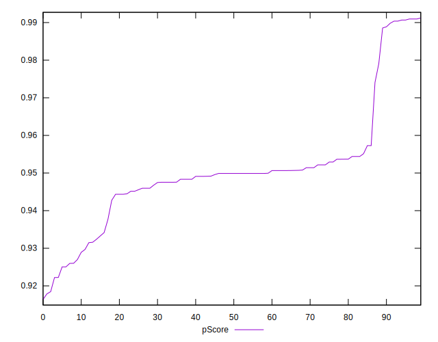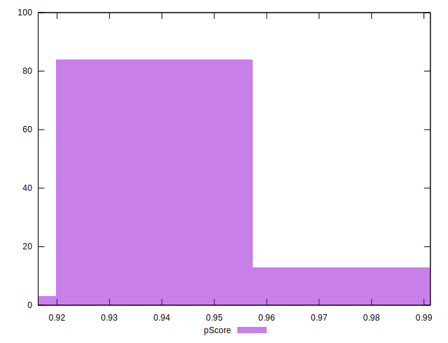
## Score Difference


```yaml
p90min: 0
p90max: 1.1102230246251565e-16
p90range: 1.1102230246251565e-16
p90mean: 7.558965274043619e-17
median: 1.1102230246251565e-16
p90stdev: 5.1752697399898874e-17
mad: 0
stdevBySn: 0
lfitCenter: 8.341920662876666e-17
lfitStdev: 5.198805301519692e-17
mfitCenter: 8.341920662876666e-17
mfitStdev: 6.515736188101814e-17
mfitConfidence: 6.515736188101814e-18
p90skewness: -0.7759402897989862
p90eccentricity: 0.9999999999999994
p90discretization: 47
outlandishness: 0.9683790039062501

```

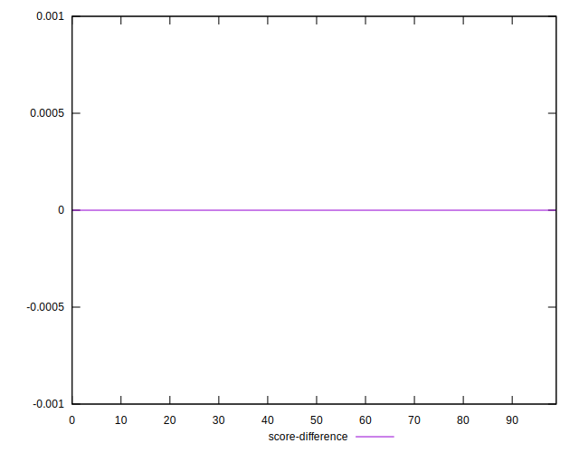
## P Score Difference


```yaml
p90min: -0.004843094273022541
p90max: 0.004402433092654534
p90range: 0.009245527365677075
p90mean: -0.00002986656460425238
median: -0.00010792579783791556
p90stdev: 0.00233750705845061
mad: 0.0015553247990810481
stdevBySn: 0.002722932377704484
lfitCenter: -0.000028595525950801072
lfitStdev: 0.0017990128057053369
mfitCenter: -0.000028595525950801072
mfitStdev: 0.002254728184870925
mfitConfidence: 0.0002254728184870925
p90skewness: -0.015028717647688485
p90eccentricity: 1
p90discretization: 1.1604938271604939
outlandishness: 2.0416569080703115

```

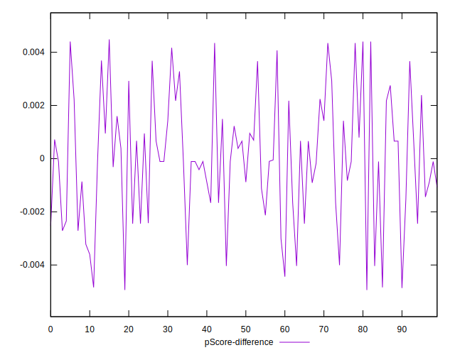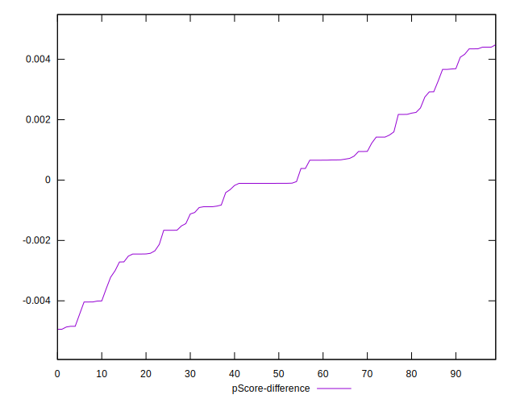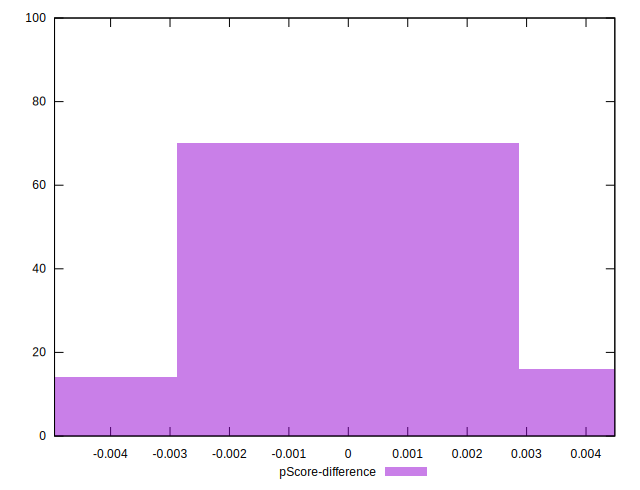